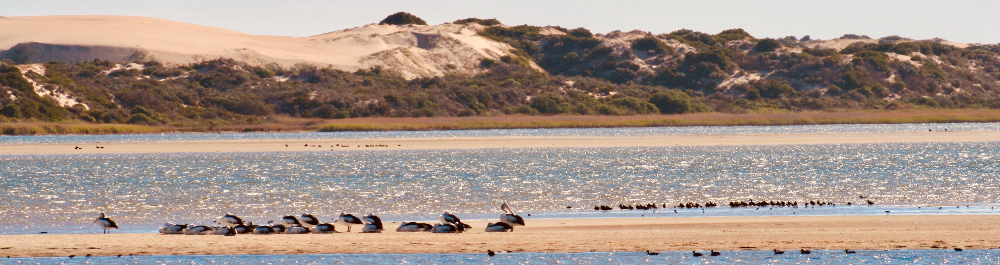

# CDM : Coorong Dynamics Model

[](https://www.repostatus.org/#active)
[](https://aquatic.science.uwa.edu.au/research/models/AED/quickstart.html)
[](https://tuflow.com/products/tuflow-fv/)
[](https://aquatic.science.uwa.edu.au/research/models/AED/quickstart.html)
[](http://perso.crans.org/besson/LICENSE.html)


<br>

This is the repository for relevant **data, models and scripts** for environmental modelling of the [Coorong](https://en.wikipedia.org/wiki/Coorong,_South_Australia). It is a simulation platform developed as part of the [Healthy Coorong Healthy Basin](https://www.environment.sa.gov.au/topics/coorong/healthy-coorong-healthy-basin) program for assisting in management of the iconic Australian ecosystem.

For an overview of the CDM model, refer to the [CDM Documentation](https://aquaticecodynamics.github.io/cdm-science/).

<br>

## Repository organisation


**Figure 1. Design schematic for the CDM repository**

<br>

## Cloning the repo with all submodule code/files

A basic clone will not include the code in the submodules so an extra argument is needed `--recurse-submodules`

### Cloning the latest bundle
```
git clone --recurse-submodules https://github.com/AquaticEcoDynamics/CDM.git
```

### Cloning a particular tag
```
git clone --recurse-submodules -b v1.1.0 https://github.com/AquaticEcoDynamics/CDM.git
```

<br>

## Archiving all code/files

If you want to create an archive of all the code (including the submodules), first clone the repository as described above and zip entire repository.  The zip file can be uploaded to Zenodo to get a DOI.  An automated integration with Zenodo will not archive the code from the submodules.

<br>

## Additional information

See repository Wiki for additional information on editing the repository and adding new content.

<br>

