```{r, include=FALSE}
knitr::knit_hooks$set(class = function(before, options, envir) {
  if(before){
    sprintf("<div class = '%s'>", options$class)
  }else{
    "</div>"
  }
})
```


# Welcome {-}

Welcome to the **Coorong Dynamics Model** ($\mathbf{CDM}$) information pages!


## Project background {-}

The Coorong is a unique coastal ecosystem that is important in supporting the local culture, economy, and environment, and is recognised globally by its Ramsar-listing. However, the state of the Coorong has degraded significantly over the past decade, primarily due to a reduction in freshwater flows and accumulation of nutrients and the resulting changes in water quality.

To avoid further degradation and to help restore the ecosystem, the [Healthy Coorong Healthy Basin](https://www.environment.sa.gov.au/topics/coorong/healthy-coorong-healthy-basin) (HCHB) program was established by the Commonwealth and South Australian Governments in 2019. The HCHB Program supports a number of scientific trials, investigations and on-ground works to help restore the balance to the Coorong and identify long term solutions.

As part of the HCHB program, the Coorong Dynamics Model (CDM) has been developed to gain insights in to the nutrient cycling the habitat changes within the Coorong ecosystem and to assist with  Coorong management and decision making. A previous version of the CDM has been developed and applied for assessing the environmental benefits of [Commonwealth Environmental Water](https://flow-mer.org.au/selected-area-lower-murray/) on the ecological habitat, and most recently the [Coorong Infrastructure Investigations Project](https://www.environment.sa.gov.au/topics/coorong/healthy-coorong-healthy-basin/coorong-infrastructure-investigations-project) (CIIP) to assess the environmental effect on water quality and habitat. Within the HCHB program, the key areas of the CDM development is to update core data inputs from other HCHB science investigations such as nutrient cycling studies and ecological habitats surveys, and to integrate these data with our best modelling tools to help improve the functional capability of the CDM in capturing the Coorong environmental conditions.

This report documents the development of the CDM, including the data integration with our knowledge generation activities within the HCHB program. Improvements in the model functional capability, detailed validation tests, and assessment of the management and climate scenarios are reported here.


## Report layout and guidance {-}

This documentation is structured to allow a systematic description of the model rationale, model description and testing, and the finally results from the model in the context of assessing management options. The document starts with an introduction to the site and general model approach, including an overview opf previous modelling work in the Coorong and the research challenges and knowledge gaps that motivated the present work. The second chapter “*The Coorong Dynamics Model*” describes the details of the CDM platforms, configuration and the approach to data-model integration. The third chapter “*Model Development and Testing*” describes the model integration and development with other HCHB science projects. This is followed by the integrated assessment of the CDM (“*Integrated assessment of CDM*”) with the available Coorong data. Finally, the section “*Scenario testing and management*” reports the outcomes from our process of scenario assessment, which considers the nutrient management scenarios, flow variation scenarios, and climate change scenarios as informed by other HCHB analyses Lastly, the major conclusions and recommendations from the current project are provided.


## Contributing {-}

### Coordinating authors {.unnumbered}

The CDM manual has been developed by the following project team:

-	Matthew Hipsey ǂ
-	Peisheng Huang ǂ
-	Brendan Busch ǂ
-	Daniel Paraska ǂ
-	Sherry Zhai ǂ
- Claire Sims \*
- Matt Gibbs \*

ǂ Aquatic Ecodynamics, UWA School of Agriculture & Environment, The University of Western Australia, Crawley WA 6009, Australia.
*

### Adding and updating content {.unnumbered}

The intent of the CDM Manual is that the model - *and its documentation* - can continually be updated; thus the correction, improvement and addition of material is encouraged. This online book is therefore open-source and interested stakeholders can further develop content.

The CDM documentation is available via GitHub and prepared in "R Mark Down" language. This is an implementation of mark down that can integrate with the R environment for enabling interactive content.

To access and edit the CDM manual you can [download the CDM repository](https://github.com/AquaticEcoDynamics/CDM) and work with the `CDM-manual` R project file in RStudio.


### Using RStudio's visual editor {.unnumbered}

If you're unfamiliar with writing `.Rmd` and `.md` files, the [RStudio IDE 1.4](https://blog.rstudio.com/2020/09/30/rstudio-v1-4-preview-visual-markdown-editing/) release implements a visual markdown editor that minimises the need to learn most syntax. To use this feature, open a `.Rmd` or `.md` file and click the visual editor button in the top right-hand corner of the editor window. You will now see a live-rendered version of your document and the addition of numerous buttons/menus that provide a GUI for formatting. Standard word processing functionality, such as buttons to **bold**, *italicise*, and [underline]{.ul} text are available, as well as shortcuts to features that can be more finicky in the basic source editor (e.g. citations, links, and simple tables). Returning to the source editor will reveal the formatting changes made are directly translated to the syntax of the raw file.

<center>
<video width="100%" height="100%" controls>
<source src="images/contributing/video1.mp4" type="video/mp4">
</video>
</center>

<br>
<br>

```{r logo1, echo=FALSE, out.width='25%', class = "text-image"}

knitr::include_graphics(c("images/contributing/aed-transparent-background.png","images/contributing/UWA-Full-Hor-CMYK.png"))

```

<br>

<!--chapter:end:index.Rmd-->

# Introduction

## Background and significance of the Coorong

### Importance of the Coorong

The Coorong has been recognised as a unique ecosystem that is essential to the overall health of the Murray–Darling Basin, and is recognised globally by its Ramsar-listing. The key functions of the Coorong include supporting a wide range of wild life as well as the local culture and economy. In recognition of the importance of the Ramsar-listed Coorong as well as the declining condition of the Coorong South Lagoon, the Commonwealth and South Australian Governments jointly funded the HCHB program to support the long-term health of the Coorong.

### Ecological Character of the Coorong

The Coorong is a shallow and narrow saline to hypersaline lagoon, which runs north-west to south-east, parallel to the South Australian coast for ~110 km and separated from the sea by a sand barrier (Figure 1). It has a constricted channel connection to the sea towards its north-western end, referred to as the Murray Mouth. The Mouth allows exchange with sea water into the main body of the Coorong. River Murray water also enters into Lake Alexandrina and is regulated to flow, under suitable conditions, out to the Murray Mouth-Coorong region via five barrage structures (Tauwitchere, Mundoo, Ewe Island, Boundary Creek and Goolwa).

The Coorong naturally splits about halfway into the North and South Lagoons at a narrow constriction (Hell's Gate and Parnka Channel) with width down to approximately 100 m. The average widths of the North and South Lagoons are 1.5 km and 2.5 km respectively, and the average depths are 1.2 m and 1.4 m respectively (Gibbs et al. 2018). The South Lagoon receives inputs of fresh to brackish water from a network of drains from the South-East region of South Australia, discharging at Salt Creek. This discharge can be regulated via structures in Morella Basin (immediately upstream from Salt Creek), and further up the drainage network. Groundwater discharge zones exist along the length of the Coorong, from both perched freshwater lenses and the regional unconfined aquifer, but hydraulic gradients are relatively low (Barnett 2018).
The Coorong system is an important habitat for waterbirds, supporting more than 1% of the global populations of nine waterbird taxa (Paton et al., 2009). The region is recognised as a Wetland of International Importance under the Ramsar Convention. Furthermore, the Lower Lakes and Coorong are an important refuge for waterbirds, hosting up to 90% of waterbirds counted at icon sites in the Murray-Darling Basin during drought (Kingsford and Porter, 2008). However, like other Australian estuaries and coastal wetlands (Kingsford, 2000), the Coorong is increasingly threatened and its ecological health has been eroded by river regulation and over extraction of water. Waterbird populations have declined by at least 30% since 1985 (Paton et al., 2009) and low flows have led to decreased fish abundance (Brookes et al., 2015). Freshwater flows to the Murray Mouth and Coorong help maintain an open Murray Mouth, maintain connectivity for diadromous fish and modify water level and salinity in the Coorong, which shapes the habitat for biota. Freshwater flows are important in maintaining estuarine habitat and ecosystem health and preventing extreme hyper-salinity (Brookes et al. 2009), which are influenced by flows through the barrages. Salinity has been identified as a key driver of fish distribution and assemblage structure by influencing the extent of estuarine fish habitat in the Coorong (Ye et al. 2011; 2016a; Bice et al. 2018; Brookes et al., 2021). Early summer flows are likely to be particularly beneficial as they delay the drop in water level in the South Lagoon and can prevent extreme salinities emerging, thereby improving habitat conditions for key fish species.

```{r intro-pic1, echo = FALSE, out.width='80%', class = "text-image",fig.align='center', fig.cap = "The Lower Lakes and Coorong. The freshwater in the lakes is isolated from the marine water by five barrages. Exchange with the ocean occurs through the Murray Mouth, which is located near Goolwa. The Coorong is comprised of the North and South lagoons. Source: ..."}

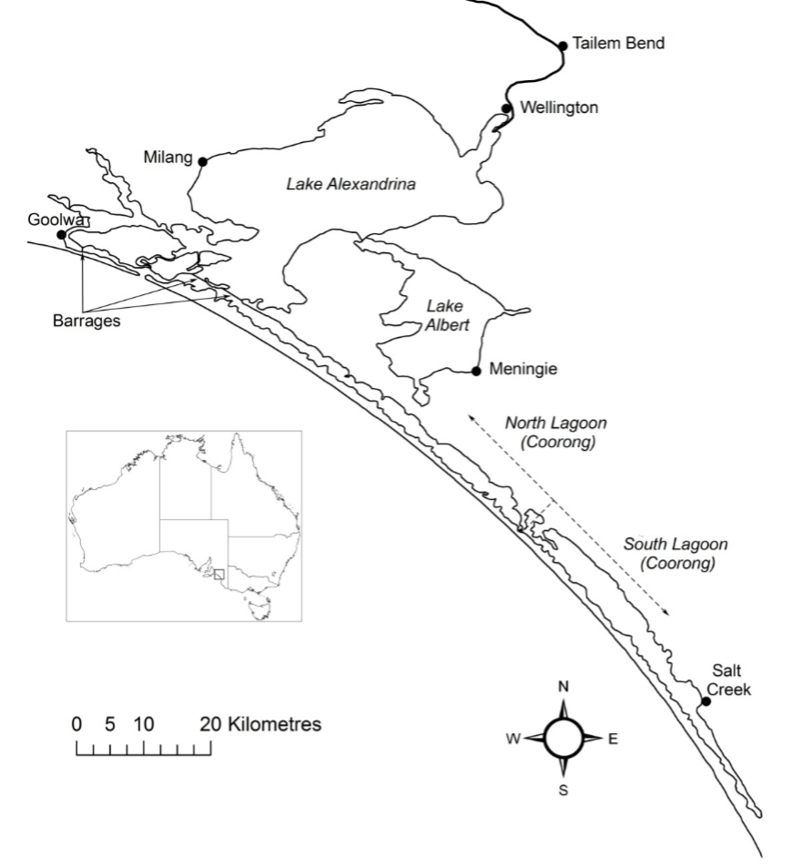

```

### Management challenges

The major management challenge of the Coorong is the long-term decline in its ecological condition due to reductions in inflows and restricted exchange with ocean. Whilst there has been recovery of some elements of the Coorong ecosystem associated with increased inflows since the Millennium Drought, the South Lagoon has not recovered to the levels expected. There has been a switch of the ecosystem from being dominated by aquatic plants to algae associated with eutrophication (nutrient enrichment), with subsequent impacts on invertebrates, fish and waterbirds. These changes in the ecosystem and the lack of recovery is likely caused by a number of complex, interacting factors, which are not well understood. This is limiting the capacity to forecast the ecological response to future management scenarios and therefore the capacity of water managers to identify management interventions required to improve the health of the Coorong.

## Need for an integrated model to support Coorong management

The use of water quality models in the management of coastal water has been well recognised. In the past years, the development of mathematical modelling has been rapid (Stolarska & Skrzypski, 2012) and many models have been utilized to date for coastal management. The development and application of water quality models can support decision making by identifying nutrient reduction targets (Kim et al., 2014; Waltham et al., 2014), controls on harmful algal blooms (Chung et al., 2014; Robson and Hamilton, 2004), public health risks (Hipsey et al., 2008), and the quality of aquatic habitat (Brown et al., 2013).

For the Coorong, the ongoing challenges of managing the degrading water quality and habitats in a drying climate, alongside other management objectives, have led to the following priority areas where model tools are needed to support management:

-	Whole estuary water balance and nutrient budgets
-	Nutrient paths and dynamics
-	Re-construction of historical changes in habitat changes
-	Assessment of scenarios related to management options and climate change

### Prior modelling

Various modelling tools have previously been developed to assist in management of the Coorong.  Coorong Hydrodynamic Model (CHM) ...

Additionally, an early version of the CDM was developed over the period 2018-2019. The model TUFLOW-FV was used to simulate the hydrodynamics, and this was coupled with the ecological model AED2 for simulation of nutrients, algae and habitat. TUFLOW-FV hydrodynamics has been validated for the system separately by BMT WBM (2017) and Collier et al. (2017). The model simulations run by Collier et al. (2017) also simulated turbidity (including particle resuspension and sediment redistribution), inorganic and organic nutrients, chlorophyll a (chl-a), and filamentous algae (Ulva); the validation of these components occurred by comparing model outputs against observed data for the period from 2014-2016 at multiple locations within the domain. These years were chosen based on recent data availability for validation (Mosley et al. 2017; Frahn and Gehrig, 2015), and also spanned a range of conditions including water levels that experienced a sharp decline resulting in poor Ruppia habitat, which a weir could be expected to improve. Most recently, the CDM was applied in the Coorong Infrastructure Investigations Project (CIIP) for modelling investigations of hydrodynamics, biogeochemistry, and habitat changes to a range of infrastructure options.

A list of the prior modelling work in the Coorong:

-	BMT WBM. 2017. Coorong Options Assessment. Brisbane: BMT WBM Pty Ltd
-	Collier C., van Dijk K-J, Erftemeijer P., Foster N., Hipsey M., O’Loughlin E., Ticli K. and Waycott M. 2017. Optimising Coorong Ruppia habitat: Analysis of management strategies to improve habitat conditions for Ruppia tuberosa in the Coorong (South Australia) based on literature review, manipulative experiments and predictive modelling. Report under review.
-	Mosley L.M., Hamilton B., Busch B., Hipsey M., and Taylor B. (2017). Assessment and modelling of the effects of the 2013-2016 Morella Basin releases on Coorong water quality. Report to the Department of Environment, Water and Natural Resources (DEWNR). University of Adelaide, South Australia.
-	Hipsey, M.R., Busch, B.D., Aldridge, K.T., 2017. Coorong Investigations Project: Ruppia habitat changes in response to augmented South East Flows scenarios and a regulating structure. AED Report #R39, The University of Western Australia, Perth, Australia. 72pp.
-	Teakle, I., et al. (2021). Coorong Infrastructure Investigations Project: Hydrodynamic, Biogeochemical and Habitat Modelling Study. Brisbane: BMT WBM Pty Ltd.
-	Hipsey MR, Busch BD and Aldridge KT (2017) Coorong Investigations Project: Ruppia habitat changes in response to augmented South East Flows scenarios and a regulating structure. AED Report #R39, The University of Western Australia, Perth, Australia. 72pp.


### Knowledge gaps and development needs

Previous studies on the Coorong have laid the foundations for the development of CDM, built on model software tools able to simulate hydrodynamics, water quality and ecological habitat conditions. Whilst these previous modelling efforts have assisted decision-making, the patchy data and restricted scope of previous modelling has left uncertainty as to their suitability in capturing nutrient and sediment budgets, and in particular, the responses of algae and *Ruppia tuberosa*.

Key knowledge gaps identified from the prior modelling work include:

-	nutrient loads from sediment vs recycling, and links to Ulva accumulation;
-	the role of wave-induced resuspension on turbidity and nutrient cycling;
-	spatial extent of both Ulva and Ruppia to provide a higher level of confidence to validate model predictions;
-	eco-physiological response of different Ruppia life stages to environmental conditions. In particular, a range of studies on adult plant growth have been undertaken but the present results indicated that the seed and flowering phases, where less information is available, are the most sensitive life stages.

With the development of the HCHB research program, many of these key knowledge and data gaps have been (or are being) addressed and able to inform improved model approaches. The findings and research outputs range across a range of scales and disciplines and there is therefore a complex integration process to ensure the new knowledge is matched by the model capability and accuracy.


## Aims and Scope

The existing platforms will be further developed to expand both the hydrodynamic and biogeochemical capabilities in accordance with the specification. The scope of the project tasks are summarised as per the requirement:

-	Coupling of the TUFLOW-FV hydrodynamic model with AED biogeochemical and habitat models, as required to support HCHB science and management goals.
-	Development of improved model representation of:
    -	external and internal nutrient loads
    - sediment loads, nutrient fluxes and recycling
    -	Ruppia habitat suitability
-	Linking the ecological model approaches to the above model framework, including:
    -	waterbird habitat suitability
    -	supporting food web modelling (incl. fish)
-	Testing, validation and scenarios using the improved and integrated models and framework.

<!--chapter:end:introduction.Rmd-->

# The Coorong Dynamics Model

<br>

## Overview

The Coorong Dynamics Model (CDM) is a spatially resolved model to simulate the environmental conditions within the Coorong, a large coastal lagoon located in South Australia. It is not a single model, but a system of models that can be configured, applied and coupled in various ways for different purposes. 

At its core, it consists of the hydrodynamic model TUFLOW-FV and the water quality model AED, which can be optionally linked with the SWAN wave model. Different model domain resolutions can be selected and/or time-periods of interest simulated. Different levels of model complexity (i.e., biogeochemical or ecological components) can be engaged within an environment with common input files and output analysis workflows. The flexibility allows a common approach to be used in different use-cases; for example, a long-term low-resolution simulation vs a high-resolution habitat restoration simulation can share common model settings, parameters and parameterisations. This provides decision-makers a single trusted tool that can be used to answer a diversity of questions that span from day-to-day management (e.g., barrage operation) to long-term policy settings (e.g, restoration and climate change adaptation strategies).

In general, the models are configured to resolve hydrodynamics and flushing, water temperature and salinity, and numerous water quality attributes including oxygen, nutrients (organic and inorganic), phytoplankton, macroalgae, and suspended sediment. The outputs from these modules are used to predict ecological attributes of interest, including seagrass, fish and benthic macro-invertebrates.

The CDM is also more the individual models. The model links a large volume of data from historical surveys, real-time data streams and recent experimental work. Complex integration workflows are implemented to process data for model inputs (e.g., boundary conditions) or model assessment (e.g., calibration or validation).

The CDM project is therefore a model-data ‘ecosystem’ that serves as a shared analytics platform. Model and data provenance is a high priority and all data and model products that are developed are under strict version control within the platform to ensure traceability and transparency in model use and assumptions (see Section 3).

The following sections describe the model platform, detail the CDM configuration, and summarise the different model generations being developed and used for decision support.

<br>

## Model platform

### Hydrodynamics: TUFLOW-FV

[TUFLOW-FV](https://www.tuflow.com/products/tuflow-fv/) is a finite volume hydrodynamic model, developed by BMT Global Pty Ltd (BMTWBM, 2019). It has flexible-mesh and accounts for variations in water level, salinity, temperature, and density in response to tides, inflows and surface thermodynamics. The current version has various use-ability features including integration with QGIS and optimisiation for operation on desktop GPU resources.

The TUFLOW-FV has been used extensively in the region for hydrological assessments. Within the CDM two(three) different model domains are applied with different levels of spatial resolution, including both 2D and 3D implementations.

### Waves: SWAN

The Simulating WAves Nearshore ([SWAN](https://www.tudelft.nl/en/ceg/about-faculty/departments/hydraulic-engineering/sections/environmental-fluid-mechanics/research/swan/)) model is a numerical wave model used to obtain realistic estimates of surface wave parameters in coastal areas, lakes, and estuaries from given wind, bottom, and current conditions. The model is based on the wave action balance equation (or energy balance in the absence of currents) with sources and sinks. SWAN is a third-generation wave model with first-, second-, and third-generation options.

### Water quality and habitat: AED

The Aquatic EcoDynamics ([AED](http://aed.see.uwa.edu.au/research/models/aed/) ) water quality model is a community-driven library of modules and algorithms for simulation of "aquatic ecodynamics" - water quality, aquatic biogeochemistry, biotic habitat and aquatic ecosystem dynamics, developed by the AED research group of UWA (Hipsey et al., 2019). Each module aims to be based on state-of-the-art science sourced from a wide variety of scientific literature, making the library one of the most advanced available to aquatic ecosystem modellers.

<br>

## CDM setup and configuration

The following sections describe the general setup and approach of the model and provide an overview. Speciic simulations decsribed in subsequent sections may use tailored or customised versions adapted from this description.

### Simulation domains

The CDM modelling domain spans from the Murray Mouth region to the south end of the Coorong, with a length of ~116 km and a total area of ~237 km^2^.

Two types of model mesh were developed to support different research purposes. The first is a fine-resolution mesh (26250 cells with mean cell size of ~1×10^4^ m^2^, Figure 2.1, left); this mesh was used for resolving the spatial heterogeneity of the water quality response, especially for the habitat predictions; the second is a relatively coarse resolution mesh (2202 cells with mean cell size of  ~1.3×10^5^ m^2^, Figure 2.1, right) for faster simulations of investigating water balance and other modelling experiments. The fine- and coarse-mesh models share the same boundary conditions and have been bench-marked with each other, and can be used in different stages of model development.


```{r cdm-pic1, echo = FALSE, out.width='100%', class = "text-image",fig.align='center', fig.cap = "Plan view of the Coorong Dynamics Model fine (left) and coarse (right) mesh."}

knitr::include_graphics("images/cdm/2_picture1.png")

```

```{r CDM-grid, echo=FALSE, message=FALSE, warning=FALSE}
library(knitr)
library(kableExtra)
library(readxl)
library(rmarkdown)
theSheet <- read_excel('tables/grids.xlsx', sheet = 1)
theSheet <- theSheet[theSheet$Table == "Data",]
theSheetGroups <- unique(theSheet$Group)


kbl(theSheet[,3:8], caption = "Grid Specifications", align = "l",) %>%
  pack_rows(theSheetGroups[1],
            min(which(theSheet$Group == theSheetGroups[1])),
            max(which(theSheet$Group == theSheetGroups[1])),
            background = '#ebebeb') %>%
  pack_rows(theSheetGroups[2],
            min(which(theSheet$Group == theSheetGroups[2])),
            max(which(theSheet$Group == theSheetGroups[2])),
            background = '#ebebeb') %>%
row_spec(0, background = "#14759e", bold = TRUE, color = "white") %>%
  kable_styling(full_width = F,font_size = 11) %>%
	column_spec(2, width_min = "7em") %>%
	column_spec(3, width_max = "19em") %>%
	column_spec(4, width_min = "10em") %>%
	column_spec(5, width_min = "5em") %>%
  column_spec(6, width_min = "10em") %>%
  scroll_box(width = "700px",
             fixed_thead = FALSE)
```
<br>


A range of bathymetry data is available and specified within the model(s).

- 2008 survey
- 2018 1m Lidar / Sentinel DEM
- 1999 - 2019 Murray Mouth Surveys

This is processe within the SMS software to generate a computational mesh suitable for TUFLOW-FV.

```{r cdm-pic2, echo = FALSE, out.width='100%', class = "text-image",fig.align='center', fig.cap = "Coorong bathymetry."}

knitr::include_graphics("images/cdm/HCHB 2dm.png")

```

### Boundary conditions

Regardless of the model domain / mesh option that is chosen, then CDM system manages several standard boundary conditions to allow the model to be forced by tidal, meteorological and inflow information, which is brought together from various data sources.

-	**Tidal conditions:** Set on the ocean side of the Murray Mouth, an open water level boundary is specified based on Barker Knoll / Victor Harbour tidal data, which are available at 10 minute resolution.
-	**Salk Creek inflow:** Inflow to the South Lagoon from the local catchment via Salt Creek was set based on available flow data from [water.data.sa.gov.au](water.data.sa.gov.au) (curated by the South Australian Department of Environment and Water). The nutrient boundary condition inputs are extrapolated based on field measurements at Salt Ck.
-	**Barrage flows:** Inflow boundary conditions at the five barrages are based off historical daily-interval measurements of flow rate, temperature, salinity. The nutrient boundary condition inputs are extrapolated based on field measurements at Lake Alexandrina, close to the barrages.
-	**Meteorology:** Meteorological conditions are collected from a range of sources. The main data used include that from Narrung weather station (Figure \@ref(fig:cdm-pic4)), and stations maintained on the Coorong by DEW. The spatially -resolved Bureau of Meteorology Atmospheric High-Resolution Regional Reanalysis for Australia (BARRA) climate model is also available and has been used, but we note this product is discontinued beyond 2019. A comparison of weather data sources is discussed [here](https://github.com/AquaticEcoDynamics/CDM/discussions/4).


```{r cdm-pic4, echo = FALSE, out.width='100%', class = "text-image",fig.align='center', fig.cap = "Summary locations where relevant boundary condition data is collected and/or applied."}

knitr::include_graphics("images/cdm/HCHB_Inflows with Met.png")

```

For each of the flow boundaries, the model requires specification of inflow nutrient and salt concentrations, to resolve the external loading into the domain. This is depicted in Figure \@ref(fig:cdm-pic6). Details on the specific simulated variables that must be specified are summarised in further detail below.

```{r cdm-pic6, echo = FALSE, out.width='100%', class = "text-image",fig.align='center', fig.cap = "Summary of inflow files used for boundary specification and the required input constituents."}

knitr::include_graphics("images/cdm/HCHB_Inflows.png")

```

### Hydrodynamic settings

The key hydrodynamic settings controlling the water transportation and mixing in the TUFLOW-FV model include:

-	**Bottom drag**: For hydrodynamic simulations the bed boundary resistance is described using a $K_S$ bottom drag model, which assumes a log-law velocity profile and requires specification of a surface roughness length-scale. A background roughness length-scale of 0.018 was applied in the CDM (*update to reflect zones*);
-	**Horizontal momentum mixing**: the Smagorinsky scheme was applied for the horizontal momentum mixing modelling, with default Smagorinsky coefficient of 0.2;
-	**Horizontal scalar mixing**: the horizontal non-isotropic scalar diffusivity is calculated according to the Elder model, with Global Horizontal Scalar Diffusivity was set to 250 m^2^/s and the coefficient was set to 25;
-	**Tidal input**: a `WL` (water level) boundary condition was applied to the Murray Mouth tidal input;
-	**Inflow input**: a `Q` (nodestring flow) boundary condition was applied to the barrage flows, and a `QC` (cell inflow) boundary condition was applied to the Salt Ck inflow;
-	**Meteorology**:
    -	The background shortwave radiation extinction coefficients was set to 2.0, with feedback from the AED model of TSS concentration altering the extinction coefficient;
    -	Longwave radiation heat transfer model was using the net downward long wave radiation input, based on cloud cover;
    -	The wind stress was calculated using the Wu (1982) wind stress model.
-	**Salinity correction on evaporation**: The effect of high salinity on evaporation is included, as outlined  [here](https://github.com/AquaticEcoDynamics/CDM/discussions/5).


### Water quality modules

The water quality model AED has been dynamically linked with TUFLOW-FV to simulate the mass balance and redistribution of carbon, nutrients and sediment, including partitioning between organic and inorganic forms and resolution of the relevant biotic components. This includes turbidity (including particle resuspension and sediment redistribution), chlorophyll a (chl-a), and filamentous algae (Ulva), plus habitat quality of Ruppia. Benthic and pelagic properties have been resolved.

A summary of simulated model variables is shown in Table 1. For detailed scientific documentation the reader is referred to the [AED Science Manual](https://aquaticecodynamics.github.io/aed-science/index.html).


```{r 2-varstable, echo=FALSE, message=FALSE, warning=FALSE}
library(knitr)
library(kableExtra)
library(readxl)
library(rmarkdown)
theSheet <- read_excel('tables/variable_summary.xlsx', sheet = 1)
theSheet <- theSheet[theSheet$Table == "Variable",]
theSheetGroups <- unique(theSheet$Group)
theSheet$Name <- paste0("`",theSheet$Name,"`")

for(i in seq_along(theSheet$Symbol)){
  if(!is.na(theSheet$Symbol[i])==TRUE){
    theSheet$Symbol[i] <- paste0("$$",theSheet$Symbol[i],"$$")
  } else {
    theSheet$Symbol[i] <- " "
  }
}
for(i in seq_along(theSheet$Units)){
  if(!is.na(theSheet$Units[i])==TRUE){
    theSheet$Units[i] <- paste0("$$\\small{",theSheet$Units[i],"}$$")
  } else {
    theSheet$Units[i] <- NA
  }
}

kbl(theSheet[,3:NCOL(theSheet)], caption = "CDM simulated variable summary", align = "l",) %>%
  pack_rows(theSheetGroups[1],
            min(which(theSheet$Group == theSheetGroups[1])),
            max(which(theSheet$Group == theSheetGroups[1])),
            background = '#ebebeb') %>%
  pack_rows(theSheetGroups[2],
            min(which(theSheet$Group == theSheetGroups[2])),
            max(which(theSheet$Group == theSheetGroups[2])),
            background = '#ebebeb') %>%
  pack_rows(theSheetGroups[3],
					  min(which(theSheet$Group == theSheetGroups[3])),
					  max(which(theSheet$Group == theSheetGroups[3])),
					  background = '#ebebeb') %>%
  pack_rows(theSheetGroups[4],
					  min(which(theSheet$Group == theSheetGroups[4])),
					  max(which(theSheet$Group == theSheetGroups[4])),
					  background = '#ebebeb') %>%
  pack_rows(theSheetGroups[5],
					  min(which(theSheet$Group == theSheetGroups[5])),
					  max(which(theSheet$Group == theSheetGroups[5])),
					  background = '#ebebeb') %>%
  row_spec(0, background = "#14759e", bold = TRUE, color = "white") %>%
  kable_styling(full_width = F,font_size = 11) %>%
	column_spec(2, width_min = "6em") %>%
	column_spec(3, width_max = "19em") %>%
	column_spec(4, width_min = "10em") %>%
	column_spec(5, width_min = "5em") %>%
  scroll_box(width = "700px", height = "2800px",
             fixed_thead = FALSE)
```
<br>


For the sediment and benthic related variables, the model allows for spatial variability in these properties, and this is captured through the definition of several *material zones*. This is explored in some detail in Chapter 4; though an example default material zone setup (used in Generation I simulations, see below) is shown below in Figure \@ref(fig:cdm-pic3).

```{r cdm-pic3, echo = FALSE, out.width='100%', class = "text-image",fig.align='center', fig.cap = "Different sediment zones used within the domain."}

knitr::include_graphics("images/cdm/HCHB 20 zones.png")

```


<br>

## Model generation summary

The CDM modelling project by its very nature has evolving capability over time, and different modelling capabilities have been developed for particular use-cases. For context, the range of pre-HCHB and HCHB simulation "generations" are summarised in Table \@ref(tab:2-simtable). As at Sept 2021, this document mainly reports on Generation 0 results and the development of Generation I and II which is underway.

```{r 2-simtable, echo=FALSE, message=FALSE, warning=FALSE}
library(knitr)
library(kableExtra)
library(readxl)
library(rmarkdown)
theSheet <- read_excel('tables/sim_summary.xlsx', sheet = 1)
theSheet <- theSheet[theSheet$Table == "Simulation",]
theSheetGroups <- unique(theSheet$Group)

theSheet$Name <- paste0("`",theSheet$Name,"`")

kbl(theSheet[,3:NCOL(theSheet)], caption = "CDM simulation summary", align = "l",) %>%
  pack_rows(theSheetGroups[1],
            min(which(theSheet$Group == theSheetGroups[1])),
            max(which(theSheet$Group == theSheetGroups[1])),
            background = '#ebebeb') %>%
  pack_rows(theSheetGroups[2],
            min(which(theSheet$Group == theSheetGroups[2])),
            max(which(theSheet$Group == theSheetGroups[2])),
            background = '#ebebeb') %>%
  pack_rows(theSheetGroups[3],
					  min(which(theSheet$Group == theSheetGroups[3])),
					  max(which(theSheet$Group == theSheetGroups[3])),
					  background = '#ebebeb') %>%
  pack_rows(theSheetGroups[4],
					  min(which(theSheet$Group == theSheetGroups[4])),
					  max(which(theSheet$Group == theSheetGroups[4])),
					  background = '#ebebeb') %>%
  row_spec(0, background = "#14759e", bold = TRUE, color = "white") %>%
  kable_styling(full_width = F,font_size = 11) %>%
	column_spec(2, width_min = "5em") %>%
	column_spec(3, width_max = "19em") %>%
	column_spec(4, width_max = "19em") %>%
	column_spec(5, width_max = "19em") %>%
	column_spec(6, width_max = "19em") %>%
	column_spec(7, width_max = "19em") %>%
  scroll_box(width = "700px", height = "1100px",
             fixed_thead = FALSE)
```
<br>


<!--chapter:end:cdm.Rmd-->

# CDM Model-Data Integration

<br>

The data requirements for the modelling are diverse and varied, spanning hydrological, meteorological, water and sediment quality (long-term monitoring, data from intensive campaigns and in situ sondes), plus ecological survey data. This creates an integration challenge for model setup, parameterisation and assessment (calibration and validation) (Figure \@ref(fig:cdm-pic5). 


```{r cdm-pic5, echo = FALSE, out.width='100%', class = "text-image",fig.align='center', fig.cap = "The Coorong model-data ecosystem and conceptual approach to model-data integration, accomodating data diversity and varied model requirements."}

knitr::include_graphics("images/cdm/2_picture2.png")
```

To enable the ongoing use and development of the CDM in this context, we have developed a **model-data integration framework** able to be used by DEW staff and project partners to co-ordinate the reference datasets needed for model development, and standardise the data integration and modelling workflows. The below sections describe how the CDM is organised, the tools and approaches used for model provenance and managing data streams, and model versioning.

<br>

## CDM structure and organisation

The CDM has been designed is such a way to both facilitate the sharing of data and models across various agencies and researchers, as well as providing a formalised structure to store, catalogue and process complex and unique datasets. Comparmentalised data structures have been implemented to allow for tracking and version control of data and models as they are utilised and upgraded throughout the project.

Data cataloguing via the "CDM Data Catalogue" (described in Section 3.4) has been designed with cross-agency usage in mind. Integration with the HCHB MEK Catalogue is essential to allow for the tracking of data changes and upgrades throughout the project. The "Point of Truth", "MEK Catalogue Classification" and "Status Notes" catagories have been included in the CDM Data Catalogue to track a dataset's evolution throughout the project.

Github has been chosen to house the repository based on it's mature version control systems and cross platform program support to aid all stakeholders accessing the data and models (https://github.com/). In addition, there is a [wide variety of documentation online](https://guides.github.com/activities/hello-world/) to assist users new to GitHub. 


###	**Online repository access**

The data and model files are stored in the Github [CDM Repository](https://github.com/AquaticEcoDynamics/CDM) and shared with HCHB research partners.


###	**Repository folder structure**

The folders structure follows the logic of data types and resources as shown in Figure 2.7. 

```{r cdm-pic7, echo = FALSE, out.width='100%', class = "text-image",fig.align='center', fig.cap = "CDM online data storage folder structure"}

knitr::include_graphics("images/cdm/2.4.1_Folder_Structure.png")

```

The root directories are listed and described below: 

```{r A-folders, echo=FALSE, message=FALSE, warning=FALSE}
library(knitr)
library(kableExtra)
library(readxl)
library(rmarkdown)
theSheet <- read_excel('tables/folders.xlsx', sheet = 1)
theSheet <- theSheet[theSheet$Table == "data",]
theSheetGroups <- unique(theSheet$Group)

kbl(theSheet[,2:3], caption = "CDM Root Folder Descriptions", align = "l",) %>%

row_spec(0, background = "#14759e", bold = TRUE, color = "white") %>%
  kable_styling(full_width = T,font_size = 10) %>%
    scroll_box(fixed_thead = FALSE)
```

###	**High level workflows** ###

The raw data collected from previous works and current HCHB component outcomes are stored in the ```data/incoming``` folder and classified by their sources. These raw data are then post-processed using standard scripts (stored in the ```scripts``` folder) to convert the raw data into ‘standard’ data format (stored in the ```data/store``` folder) for model configuration, calibration/validation, and reporting (see 2.4.2 Data organisation for more details). The data-model workflow is shown in Figure 2.9. 

```{r cdm-pic8, echo = FALSE, out.width='100%', class = "text-image",fig.align='center', fig.cap = "CDM conceptual diagram showing the flow of data through the system"}

knitr::include_graphics("images/cdm/2.4.1_Workflow.png")

```

<br>

## Data repository and management

### **Data catalogue**

All data that is uploaded to the CDM github repository is logged in the CDM Data Catalogue. The catalogue (found in the data directory) is comprised of a main data sheet ("CDM Data Catalogue") as well as summary sheets for all processed data. Every raw datafile is logged with the following information:

```{r A-metadata, echo=FALSE, message=FALSE, warning=FALSE}
library(knitr)
library(kableExtra)
library(readxl)
library(rmarkdown)
theSheet <- read_excel('tables/CDM_Classes.xlsx', sheet = 1)
theSheet <- theSheet[theSheet$Table == "Data",]
theSheetGroups <- unique(theSheet$Group)

kbl(theSheet[,3:4], caption = "CDM Catalogue Metadata", align = "l",) %>%

row_spec(0, background = "#14759e", bold = TRUE, color = "white") %>%
  kable_styling(full_width = T,font_size = 10) %>%
    scroll_box(fixed_thead = FALSE)
```
<br>

A catalogue of all data under management of the CDM is provided in [Appendix A](Appendix A : Data Catalogue).


### **Data organisation**

All raw data is initially uploaded into the ```data/incoming``` directory is filed under either it's Trials and Investigations (T&I) component, or the agency responsible for supplying the data.

Data is then imported into a common format via the scripts found in the ```scripts/dataimport``` directory and stored in the ```data/store``` directory. Although some imported data may contain extra fields, all imported data contains the following fields:

```{r CDM-datastore, echo=FALSE, message=FALSE, warning=FALSE}
library(knitr)
library(kableExtra)
library(readxl)
library(rmarkdown)
theSheet <- read_excel('tables/data_store_info.xlsx', sheet = 1)
theSheet <- theSheet[theSheet$Table == "Data",]
theSheetGroups <- unique(theSheet$Group)

kbl(theSheet[,3:4], caption = "CDM Stored Data", align = "l",) %>%
  pack_rows(theSheetGroups[1],
            min(which(theSheet$Group == theSheetGroups[1])),
            max(which(theSheet$Group == theSheetGroups[1])),
            background = '#ebebeb') %>%
  pack_rows(theSheetGroups[2],
            min(which(theSheet$Group == theSheetGroups[2])),
            max(which(theSheet$Group == theSheetGroups[2])),
            background = '#ebebeb') %>%
row_spec(0, background = "#14759e", bold = TRUE, color = "white") %>%
  kable_styling(full_width = T,font_size = 11) %>%
  scroll_box(fixed_thead = FALSE)
```
<br>

Once imported, the data is then summerised via a script in the ```scripts/dataimport/summary``` directory to create a standard set of plots and summary tables that can be found in the ```data/summary``` directory. ESRI shapefiles are also automatically produced and saved into the ```gis/summary``` directory to be used to create a stardarised site map of the data's sampling locations.

```{r cdm-pic10, echo = FALSE, out.width='100%', class = "text-image",fig.align='center', fig.cap = "Example GIS Map showing the sampling locations for the Water Data SA online data "}

knitr::include_graphics("images/cdm/DEW WaterDataSA Locations.png")
```

### **Data processing workflows**

The data processing scripts for the CDM are all contained within the ```scripts/``` directory, which has three subfodlers:

  + `dataimport`: All scripts that import data into the CDM, or process data into a common format
  + `datatools`: All scripts that use processed data to create additional datasets or model input files
  + `modeltools`: All scripts that use processed data and model output to create additional datasets, model validation images and analysis

Scripting has been predominately carried out utilising the [Matlab](https://au.mathworks.com/?s_tid=gn_logo) programming language, however there are scripts within the ```scripts``` directory using both [R](https://www.r-project.org/about.html) and [Python](https://www.python.org/). Users are able to add scripts in their preferred language; the repository core scripts for data storage and model plotting are currently in Matlab.
  
Below is an example workflow outlining how a meteorological boundary condition file for the TUFLOW-FV model is created (Figure \@ref(fig:cdm-pic9). Data is first downloaded and processed by scripts in the ```dataimport``` directory. A series of Matlab functions found in the ```datatools``` directory then read in the processed data (archived in the ```data/store``` directory) and use it to create the meteorological boundary condition file for the model. Both Matlab and R scripts were used in this example.


```{r cdm-pic9, echo = FALSE, out.width='100%', class = "text-image",fig.align='center', fig.cap = "CDM work flow diagram for met data"}

knitr::include_graphics("images/cdm/2.4.1_Met_Workflow.png")

```

<br>

## Model repository and management


### **Model catalogue**

All model files are stored in the `models` folder. As the model is developed over time, the model files are classified with project names and model generation identifiers. The ‘MER’ folder contains the model files used for assessing ‘eWater’ within the MER program; the ‘CIIP’ folder contains the model files developed for assessing CIIP scenarios, and the ‘HCHB’ folder contains the the core CDM files being updated throughout the HCHB project. 

Models within each project directory are separated via both *generation* and model *type*. Within the HCHB model folder there are currently 3 distinct models:

+ `hchb_swan_v1`
+ `hchb_tfvaed_v1`
+ `coorong-rapid`

The ```hchb_swan_v1``` is the first generation of the Coorong SWAN Wave model that has been developed (see Section 3.2). 

The ```coorong-rapid``` simulation folder and the ```hchb_tfvaed_v1``` simulation folder both contain TUFLOW-FV - AED simulations, but are kept separate as they constitute different generations, using different grids, simulation periods and BC files.

Each model folder may contain multiple simulation sets, but they will all rely on the same model base configuration, with minor differences or adujstments. Major changes to a model's configuration will constitute a change in generation numeber and these are stored in a separate folder. Note, models uploaded to the CDM repository may have been created by different agencies and researchers and should maintain a consistent naming convention.


### **TUFLOW-FV model organisation**

Each version of TUFLOW-FV models in the *CIIP* and *HCHB* sub-folders are organised with the following structure:

  + `Bc_dbase` (or `BCs`): boundary condition files, including tide and inflow boundary files; meteorological boundary files, and initial condition files;
  + `External`: AED model files linked with the TUFLOW-FV, and optionally the ‘GOTM’ vertical mixing model if the CDM is in 3D mode;
  + `Model`: TUFLOW-FV model structure files, including geometry and mesh files, and GIS files controlling the nodestrings and material zones;
  + `Run`: model control/configuration files;

The TUFLOW-FV model found in the MER project folder was created prior to the above structure being implemented and contains the following folder structure:

  + `BCs`: boundary condition files, including tide and inflow boundary files; meteorological boundary files, and initial condition files;
  + `External`: AED model files linked with the TUFLOW-FV, and optionally the ‘GOTM’ vertical mixing model if the CDM is in 3D mode;
  + `GEO`: TUFLOW-FV model structure files, including geometry and mesh files, and GIS files controlling the nodestrings and material zones;
  + `INPUT`: model control/configuration files;
  + `Plotting` : Directory to store model output images;
    

### **SWAN Wave Model organisation**

The SWAN Wave models found in the HCHB model directory have the following format:

  + `01_geometry` : Contains the bathymetry input files as well as a automatically generated image of the bathymetry and a matlab .mat file containing the bathymetry information;
  + `02_bc_dbase` : Contains the processed wind input files
  + `03_simulation` : Contains the INPUT control file required to run the simulation
  + `04_results` : Model output directory
  
The script required to create and configure a new SWAN wave model can be found in the ```scripts/datatools/wave``` directory.


### **Model processing toolbox**

The processing of any model output is predominately written and run in Matlab. Scripts that have been specifically developed for this project are contained within the ```scripts/modeltools``` directory. Scripts that have created Figures 3.9, 3.11 and 5.2 (among others) can be found here. 

Plotting and model processing types include:

  + Time-series plotting;
  + Transect plotting;
  + Model animation creation;
  + Error assessment;
  + Wave model plotting;
  + Habitat mapping (e.g., Ruppia & Fish HSI processing and mapping)
  + Scenario comparison and "DelMap" plotting;
  + Nutrient budget assessments.

In particular, the publicly available GitHub repository called [`aed_matlab_modeltools`](https://github.com/AquaticEcoDynamics/aed_matlab_modeltools) is used and contains a wide variety of matlab scripts and functions that are frequently used to process and visualise model output. `plottfv_polygon` and `plottfv_transect` are the main functions that are frequently used. Tables 7.3 and 7.6 in Appendix B are examples of output generated via the `plottfv_polygon` function found in the `aed_matlab_modeltools` repository. This plotting function uses data and gis files stored in the CDM repository, in addition to model output to create timeseries plots of the model (averaged within a polygon region) compared against field data. The plotting function will also automatically calculate a range of error statistics based on model output and field measured data.

```{r cdm-plottfvpolygon, echo = FALSE, out.width='100%', class = "text-image",fig.align='center', fig.cap = "Example output from plottfv_polygon with error matrix"}

knitr::include_graphics("images/cdm/0006_A4261209.png")

```

`plottfv_transect` can also be found in the `aed_matlab_modeltools` repository. This plots model data extracted along a transect line during a specified plotting period, and compares against the range of field data found within that period.

```{r cdm-plottfvtransect, echo = FALSE, out.width='100%', class = "text-image",fig.align='center', fig.cap = "Example output from plottfv_transect with distance from Goolwa Barrage (km) along the x-axis"}

knitr::include_graphics("images/cdm/example_Transect.png")

```

The `aed_matlab_modeltools` also houses scripts and functions for:

  + Curtain plotting;
  + Mesh manipulation tools;
  + Data exports;
  + Sheet plotting and animation tools;

Information on how to clone a publicly available GitHub repository can be found [here](https://docs.github.com/en/github/creating-cloning-and-archiving-repositories/cloning-a-repository-from-github/cloning-a-repository).


<!--chapter:end:cdm_integration.Rmd-->

# CDM Development & Testing

<br>

## Modelling development rationale

### Known gaps and model limitations

A significant component of the work tasks are allocated to customise and develop key modules of the AED platform to incorporate the specific science requirements of the model so it is compatible with the findings and details reported in the T&I research projects. These are identified in the specification as:

- Need to improve and validate hydrodynamic-biogeochemical-habitat models, including updating the Ruppia Habitat Suitability Model, to provide increased certainty in the forecasted responses to various management interventions, this includes improving and updating model representation of the following:
    - external and internal nutrient loads based on outputs from ‘Understanding Coorong nutrient dynamics' (T&I activity 1.2)
    - sediment loads, nutrient fluxes and cycling based on environmental data collected and outputs from ‘Understanding Coorong nutrient dynamics’ (T&I activity 1.3)
    - Ruppia habitat suitability model and filamentous algae preference model (within AED) based on environmental data collected and outputs from ‘Investigating the drivers and controls of filamentous algae and restoration of aquatic plants’ in the Coorong (T&I activities 2.4 and 2.5)
- Extended habitat models to incorporate the quantitative models developed through the food web and waterbird components, including:
    - Linking the quantitative food web models developed as part of ‘Restoring a functioning Coorong food web’ (T&I activity 3.4) to the existing TUFLOW FV – AED model framework to enable additional outcomes to be evaluated
    - Linking the habitat suitability models for priority waterbird species developed as part of ‘Maintaining viable waterbird populations’ (T&I activities 4.1 and 4.3) to the existing TUFLOW FV – AED2 model framework to enable additional outcomes to be evaluated


### Development focus and integration with HCHB research and monitoring

The staged development and assessment approach to the above model components and how they are linked with related T&I components are summarised in Figure * (the data-model integration strategy diagram) and outlined in the below sections.

```{r dev-pic0, echo = FALSE, out.width='100%', class = "text-image", fig.cap = "Data and model integration strategy, showing links between the HCHB Goyder T&I research program and the model development priorities."}

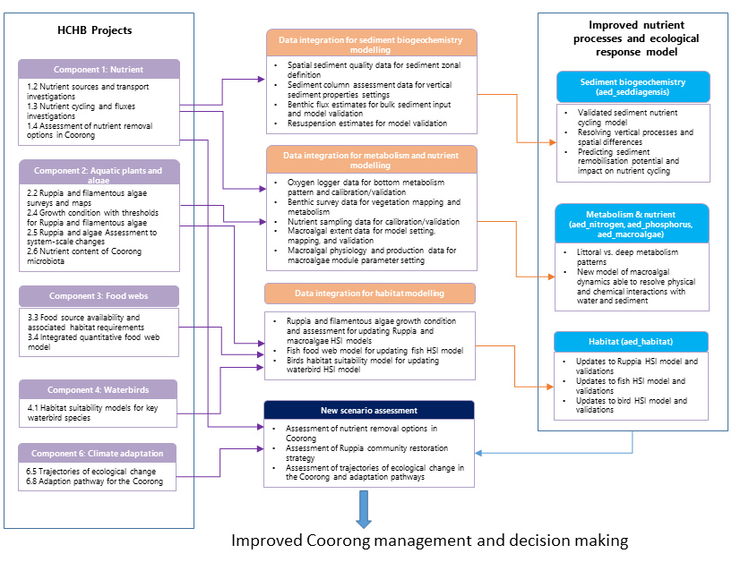

```

<br>

***	

<br>

## Waves and resuspension

### Overview

In shallow lagoons such as the Coorong, wind-induced waves at the water surface causes the bottom material to resuspend; this can dominate water quality during strong winds, due to large changes in nutrients, suspended solids, and turbidity within the water. Specifically, we seek to capture the role of wind-driven waves on water column suspended solids and organic matter concentration within Coorong.

In order to capture this effect in the Coorong, the SWAN wave model was applied. The wave model predicts the spatial pattern of significant wave height and wave periods and the output is then coupled with the TUFLOW-FV model for modelling shear stress at the seabed and the rate of sediment resuspension.  

The model settings and validation results are described below. Wave and turbidity data are available from experimental work undertaken in 2020 at some sites which is used for calibration purposes, and the particle properties such resuspension rates and settling rates are also discussed.

### Model approach

#### SWAN wave model simulation

The SWAN wave model was adopted using a Cartesian grid with 200 m resolution, and the third generation simulation mode. The model was initially forced with the Narrung weather station data and the water depth was interpolated from the existing (2008) Coorong bathymetry data. Wind data at the measurement site was also used for a period when it was available.


```{r dev-sites, echo = FALSE, out.width='100%', class = "text-image",fig.align='center', fig.cap = "Model extents for SWAN Wave Model and the TFV domains, with validation sites."}

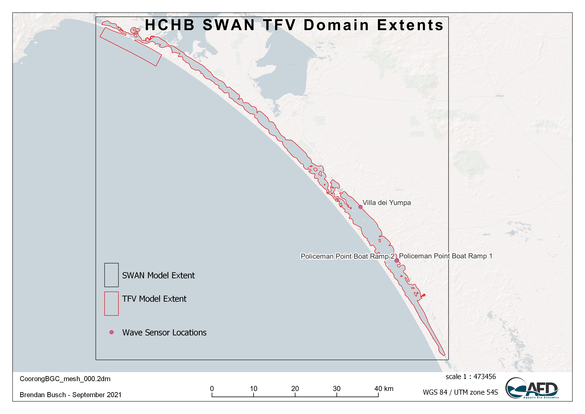

```

#### Suspended solids and light

The AED component of the simulation is configured to include light ($I$), and two suspended solids ($SS$) groups.  The TUFLOW-FV -- AED models are dynamically coupled to capture the feedbacks between $SS$, light, surface heating and (optionally) vegetation presence. 

The model accounts for incident shortwave radiation to be attenuated as it penetrates the water column. The attenuation of light is dependent on the specific bandwidth. For primary production, the shortwave (280-2800 nm) intensity at the surface ($I_0$) is partitioned to the photosynthetically active component (PAR) based on the assumption that \~45% of the incident spectrum lies between 400-700nm. PAR and other light bandwidths such as ultra-violet (UV, \~3.5%) and near-infrared (NIR, \~51%), penetrate into the water column according to the Beer-Lambert Law:

$$
I_{i} = f_{i} I_{0} \text{exp} (-K_{d_{i}} z)
(\#eq:lagoonhabitat1)
$$

where $i$ refers to the specific bandwidth range (e.g., PAR, UV, etc), $f_i$ is the fraction of light intensity within that range at the water surface and $z$ is the water depth. The light extinction coefficient $K_d$ is a variable parameter governing light attenuation, as influenced by the suspended solids ($SS$) in the water column, filamentous algae density, and vegetation leaf area index. In these simulations it is computed by assuming a background light extinction coefficient $K_w$ and the specific attenuation coefficient, $K_e$, for $SS$ and algae: 

$$
K_{d} = K_{w} + K_{e_{s}} SS + K_{e_{F}} FA
(\#eq:lagoonhabitat2)
$$

Computing turbidity from the concentration of particulates is also possible and able to be compared to routinely measured turbidity data. The relation for simulation of turbidity is able to be expressed as:

$$
\text{Turbidity} = f_{t_{ss}}\:SS + f_{t_{chl}}\: Chla
(\#eq:lagoonhabitat3)
$$

where $f_{t_{s}}$ is an empirical coefficient, determined through site specific correlations or literature. The suspended solids-turbidity ratio is currently assumed to be 1, and this relationship is based on experimental data from the March 2020 UA field assessment.

#### Resuspension

The concentration of suspended solids at any location depends on inputs from tributaries, advection of material through the lagoon, and vertical fluxes due to particle resuspension and deposition. Deposition is computed based on a prescribed settling velocity for each particle group. The rate of resuspension ($R$) varies across the system due to heterogeneity in sediment properties. It is calculated by assuming linearity with the excess shear stress at the bed (Lee et al. 2005), such that:

$$
R_i=\sum_{s=1}^{n_s}{{\ \ f}_{s,i}\ {\ \ \varepsilon}_s}\ \ \text{max}\left(\tau_b-\tau_c,\ 0\right)
(\#eq:lagoonhabitat4)
$$

where $n_s$ is the number of particle size classes, $f_{s,i}$ is the fraction of each particle size class in the  sediment material zone, $\varepsilon$ is the resuspension rate coefficient, $\tau_b$ is the bed shear stress (computed based on the current and wave orbital velocities in each cell), and $\tau_c$ is the critical shear stress for resuspension, which depends on the sediment size (Julien 2010), and optionally, the presence of vegetation. 

The resuspended particles are then subjected to settling assuming a constant settling velocity
$\omega$ of 0.2 m/day. A literature review and current CDM settings of resuspension is summarised in Table xx.


```{r dev-wavepars, echo=FALSE, message=FALSE, warning=FALSE}
library(knitr)
library(kableExtra)
library(readxl)
library(rmarkdown)
theSheet <- read_excel('tables/wave_pars.xlsx', sheet = 1)
theSheet <- theSheet[theSheet$Table == "Data",]
theSheetGroups <- unique(theSheet$Group)


kbl(theSheet[,2:6], caption = "Summary of key parameters in the resuspension model", align = "l",) %>%

row_spec(0, background = "#14759e", bold = TRUE, color = "white") %>%
  kable_styling(full_width = T,font_size = 10) %>%
    scroll_box(fixed_thead = FALSE)
```
	a Zhu et al., 2015 <br>
	b Ghose-Hajra et al., 2014<br>
	c van Rijn, 2007<br>
	d McAnally et al., 2007<br>
	e Mehta, 1991<br>
<!--
Table xx. Summary of key parameters in the resuspension model.

Parameter	Description	Unit	Literature range	Current CDM setting
$\epsilon$	Bulk resuspension rate	g/m^2^/s	0-0.01 a	0.008
$\tau_0$ Critical shear stress	N/m^2^	0.02-0.25 b, c	0.05
$tau_r$	Resuspension coefficient	-	-	1
$\omega$	Settling velocity	m/day	0.01-1 d, e 	0.2

	a Zhu et al., 2015
	b Ghose-Hajra et al., 2014
	c van Rijn, 2007
	d McAnally et al., 2007
	e Mehta, 1991
-->

### Validation and assessment

The SWAN wave model was calibrated during the periods between the UA sediment resuspension studies undertaken in December 2020 and March 2021. The comparison between the SWAN wave model outputs and the field survey data of significant wave height is shown in Figure 3.9, which indicates the wave model produced reasonable outcomes in the time variation and magnitude of the response of significant wave height.

<!-- 
 ```{r dev-pic1, echo = FALSE, out.width='60%', class = "text-image", fig.cap = "Comparison of the Coorong SWAN wave model output and the UA field survey data at two sites. Period spanning Mar 2021."}

knitr::include_graphics("images/dev/3_picture1.png") 


```
-->
```{r dev-pic101, echo = FALSE, out.width='60%', class = "text-image", fig.cap = "Comparison of the Coorong SWAN wave model output and the UA field survey data at two sites. Period spanning Dec 2020."}

knitr::include_graphics("images/dev/compare_wave_Policeman_v2_2000w.png")

```

The wave model output is then coupled to the TUFLOW-AED model to calibrate the sediment resuspension. The resulting turbidity, in comparison with the field observations and the CDM outputs without the waves, at site of A4261209 is shown in Figure 3.10. The comparison indicates the waves introduced resuspension when compared to the ‘no-waves’ scenario, and the model with the wave inputs captured the general variations in the turbidity, though more calibrations to the resuspension events under high wind conditions will be examined in next stages of model development. 


```{r dev-pic2, echo = FALSE, out.width='80%', class = "text-image", fig.cap = "Comparison of the AED turbidity model output and the DEW in situ sensor data within the South Lagoon station A4261209."}

knitr::include_graphics("images/dev/0006_A4261209.png")

```

### Lagoon scale predictions

Examples of spatial distribution of significant wave height, bottom shear stress (TAUB), resuspension rate, and TSS concentration in the water during a low wind event (Figure xx) and high wind event (Figure xx) are shown below. In general, the wind condition was shown to be the dominant factor of the sediment resuspension rate. During the calm wind condition such as in 01/11/2021 when the wind speed was < 3 m/s, the sediment resuspension rate was negligible. The resuspension rate exceeded 20 g/m^2^/day in 19/11/2020 when the wind speed reached 9 m/s, which subsequently led to increase in the water TSS concentrations. The shallow water in the littoral zones are more vulnerable to the wind-induced resuspension.

```{r dev-pic3, echo = FALSE, out.width='100%', class = "text-image", fig.cap = "An example output of modelled (a) weight height, (b) bottom shear stress, (c) resuspension rates, and (d) total suspended solid concentration in Coorong during low wind condition (< 3m/s)."}

knitr::include_graphics("images/dev/3_picture2.png")

```

```{r dev-pic4, echo = FALSE, out.width='100%', class = "text-image", fig.cap = "Same as Figure xx except for a relatively higher wind condition (>9m/s)."}

knitr::include_graphics("images/dev/3_picture3.png")

```

An animation of the wave, resuspension and turbidity conditions is shown below.

<br>
<center>
<video width="100%" height="100%" controls>
<source src="images/dev/animation_resuspension.mp4" type="video/mp4">
</video>
</center>
<br>

### Summary (Sept 2021)

The existing wave model is shown to be well calibrated, and the resuspension model performance is reasonable in terms of resuspension magnitudes and changes in the TSS concentration. However, there are also remaining knowledge gaps/limitations which are to be refined:

1.	Considering more particle groups in the sediment and TSS composition, based on assessment of the UA LISST data.
2.	Adding the Stokes Law method for the parcel setting velocity depending on the particle density and sizes;
3.	Further calibration on the sediment resuspension rates and the critical shear stress for better model performance, also including organic vs inorganic resuspension rates.

<br>

***	

<br>

## Sediment biogeochemistry

### Overview

In environments like the Coorong, where nutrient dynamics influence the rest of the ecosystem, management often focuses on reducing nutrient inputs and increasing flushing to the sea. However, it is important not to overlook the sediment as a long term source or sink of nutrients.
 
In previous versions of the Coorong model, a constant flux rate has been used for the lagoon – for example consumption of oxygen and release of ammonium. This is an efficient and simplified first step, however, the model can be improved by using the depth-resolved sediment diagenesis model. The sediment model can represent spatial heterogeneity along the lagoon, it can capture the future burial or release of nutrients and it can make use of the rich data sets measured in the field.
 
Under some conditions, the sediment stores can release nutrients to the water column, while under other conditions, the sediment can remove nutrients in the long term through burial, and the surface layers can remove nitrogen through denitrification. The fine balance that controls the conditions under which the sediment stores will store, release or remove nutrients is largely governed by the aerobic state of the sediment pore water, and the amount of reactive organic matter fuelling the reactions. The depth-resolved sediment model accounts for mixing from the hydrodynamic model into the upper sediment layers. It calculates whether organic matter is consumed aerobically, through denitrification or deeper down, through sulfate reduction or even methanogenesis.
 
The sediment model can also capture and contrast different environments in the Coorong. The model includes a depth of bioturbation and bioirrigation by macrobiota living in the sediment. The north lagoon of the Coorong has higher populations of macrobiota, which cause mixing of oxygen into deeper sediment layers, which in turn helps in removal of organic matter and reduced nitrogen. In contrast, in the south lagoon there is less bioturbation of the sediment and it is more likely that organic matter is consumed through anaerobic processes. The production of toxic H~2~S gas through sulfate reduction would lead to a further degradation of the ecosystem.  

### Model approach: CANDI-AED

The heart of this model is the reaction, diffusion, advection model of Berner (1980), which was implemented as the Carbon and Nutrient Diagenesis model of Boudreau (1996). CANDI-AED implementation however has evolved from the original code, and the main differences pertain to the treatment of organic matter, and the simulation of the geochemical conditions known to influence the diagenetic equations. However, the core organic matter breakdown equations (and their numerical solution) remains similar as the original descriptions presented in Boudreau (1996), and to other similar sediment models. An overview of the model is shown in Figure X.


```{r dev-pic00, echo = FALSE, out.width='80%', class = "text-image", fig.align='center', fig.cap = "CANDI-AED includes chemical processes of organic matter transformation and oxidation, and reduction/oxidation, crystallisation, adsorption and precipitation reactions of inorganic by-products. Most of the processes are triggered by the input of POM at the sediment-water interface."}

knitr::include_graphics("images/dev/sed_image2.png")

```


####	Sediment reactive transport model {-}

The model is based on a 1D approximation of the sediment and pore-water profiles. Each active sediment zone (or column) is discretized into a user defineable number of layers that start at thicknesses of around 1mm at the sediment-water interface and increase exponentially down to a pre-defined sediment depth. The model resolves in each layer both physical (e.g. pore-water diffusion or bioturbation) and chemical (e.g., redox transformations) processes; these are summarised next.

**Chemical reactions**

The dynamic model considers two types of reactions - the slow, kinetically controlled reactions, and the fast thermodynamically based equilibrium reactions. The latter are simulated in the sediment through appropriate configuration of the geochemistry reactions; the configuration of the equilibrium model will apply to both the water and each of the sediment layers. The kinetically controlled reactions are mostly microbially-mediated and include the reactions for organic matter breakdown and eventual oxidation, the re-oxidation of various by-products and the dynamics of the metal sulfides.

The organic matter ($OM$) degradation pathway considers labile and refractory $DOM$ components ($DOM$ and $DOM_R$ respectively) and the breakdown pathway simulated is conceptually summarized in Figure \ref{fig:sed_dynamic}. Reactions included in the kinetic component include the hydrolysis of the complex (e.g., high molecular weight) $OM$ pools ($POM_{VR}$, $POM_R$, $DOM_R$, $POM_L$) and transformation of Low Molecular Weight (LMW) $DOM_L$ by oxidants ($O_2$, $MnO_2$, $Fe(III)$ and $SO_4^{2-}$ - the so-called 'terminal metabolism'), and the release of resulting nutrients ($NO_3^-$, $NH_4^+$, $PO_4^{3-}$) and reduced by-products ($Mn^{2+}$, $Fe^{2+}$, $N_2$, $H_2S$, $CH_4$) and $CO_2$. Oxidants, nutrients and by-products are all capable of interacting, say through complexation or re-oxidation of reduced species for example.

The decay of the complex $OM$ types to the LMW $DOM$ required for the hetertrophic bacteria to utilise are all modelled with a simple first-order decay rate. The subsequent reactions that describe the breakdown of $DOM_L$ may be written as:
\begin{eqnarray}
\overbrace{(CH_2O)_{106}(NH_3)_{16}(H_3PO_4)}^{\textrm{organic matter}} &+& 138O_2 \rightarrow \nonumber
\\
&& 106CO_2 + 16HNO_3 + H_3PO_4 + 122H_2O
\\
\textrm{Free energy, } \Delta G_0 &=& -3190\:kJmol^{-1} \nonumber
\end{eqnarray}

\begin{eqnarray}
(CH_2O)_{106}(NH_3)_{16}(H_3PO_4) &+& 236MnO_2 +472H^+ \rightarrow  \nonumber
\\
&& 106CO_2 + 236Mn^{2+} + 8N_2 + H_3PO_4 + 366H_2O
\\
\textrm{Free energy, } \Delta G_0 &=& -3050\:kJmol^{-1} \nonumber
\\
\\
(CH_2O)_{106}(NH_3)_{16}(H_3PO_4) &+& 94.4HNO_3 \rightarrow  \nonumber
\\
&& 106CO_2 + 55.5N_2 + H_3PO_4 + 177H_2O
\\
\textrm{Free energy, } \Delta G_0 &=& -3030\:kJmol^{-1} \nonumber
\\
\\
(CH_2O)_{106}(NH_3)_{16}(H_3PO_4) &+& 212Fe_2O_3 +848H^+ \rightarrow  \nonumber
\\
&& 106CO_2 + 16NH_3 + H_3PO_4 + 742H_2O + 424Fe^{2+}
\\
\textrm{Free energy, } \Delta G_0 &=& -1410\:kJmol^{-1} \nonumber
\\
\\
(CH_2O)_{106}(NH_3)_{16}(H_3PO_4) &+& 53SO_4^{2-}  \rightarrow  \nonumber
\\
&& 106CO_2 + 16NH_3 + H_3PO_4 + 106H_2O + 53S^{2-}
\\
\textrm{Free energy, } \Delta G_0 &=& -380\:kJmol^{-1} \nonumber
\\
\\
(CH_2O)_{106}(NH_3)_{16}(H_3PO_4) &&  \rightarrow  \nonumber
\\
&& 53CO_2 + 53CH_4 + 16NH_3 + H_3PO_4
\\
\textrm{Free energy, } \Delta G_0 &=& -350\:kJmol^{-1} \nonumber
\end{eqnarray}

and the reaction rates for each of these are calculated dynamically based on Monod expressions which mediate the reaction rate according to the concentration of potential oxidants higher in the redox sequence, and the concentration of the available oxidant.

In addition to the primary redox reactions associated with $OM$ breakdown, the model also includes numerous secondary reactions, such as oxidation of reduced by-products (e.g., Fe or S oxidation).

**Physical processes**

Accounting for advection and diffusion reactions is fairly consistent across diagenesis models, and here we use the same methods. Porosity ($\phi$) is defined according to equation 5 - 104, which allows it to decrease with depth, and the solid fraction is defined from $\phi_s=(1-\phi)$. For bioturbation the model uses a diffusion coefficient that varies with depth ($D_{B(z)}$) as a two layer function or a Gaussian decrease (Boudreau 1996). For the porewater components, diffusion coefficients are used that are based on free-solution molecular diffusion constants corrected for sediment tortuosity, $θ$, according to equation 5 - 105.


####	Model extensions and development {-}

The above model approach is broadly used in lakes, ocean and estuarine environments, but there remain few cases in shallow lagoons (Paraska et al. 2014). Three main developments have been undertaken to adapt the code-base to the Coorong application (Figure \@ref(fig:dev-pics5)):

i.	Improved parameterisation of diffusion at the sediment-water interface
ii.	Inclusion of functionality to resolve resuspension effects
iii.	Addition of MPB

```{r dev-pics5, echo = FALSE, out.width='100%', class = "text-image", fig.cap = "Visual summary of model updates undertaken."}

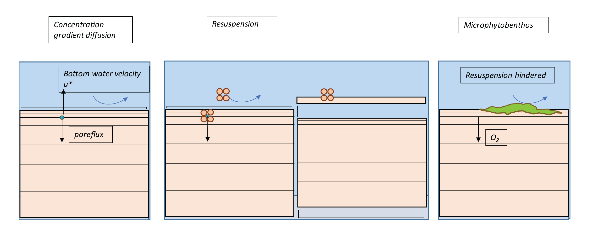

```

**SWI diffusion**

Fluxes of dissolved species occur between the sediment and water column depending on the sediment type, solute and interfacial turbulence being experienced at the sediment-water interface. Dissolved fluxes are calculated from the concentration gradient at the sediment-water interface according to Fick’s Law:

<center>
\begin{equation}
F = D_{0}\frac{\Delta C}{\Delta x} = \frac{D_{0}}{\delta} (C_{bw} - C_{1})
(\#eq:biogeochem1)
\end{equation}
</center>

where $D_{0}$ is the diffusivity, $\delta$ is the thickness of the diffusive boundary layer at the sediment-water interface,  defined as the length scale of the first sediment layer, $C_{bw}$ is the bottom water concentration and $C_{1}$ is the concentration in the top sediment layer. The diffusivity in these models typically assumes molecular diffusivity rates, which is likely to underestimate the real diffsuivity experienced in a shallow algoon such as the Coorong. We therefore add a new parameterisation to resolve diffusivity based on sediment type an water turbulence proerties, based on the metric $u_*^3$.

**Resuspension effects**

To Be Completed

**SWI Productivity**

To Be Completed


<br>


####	Resolving sediment zonation {-}

Facility also exists within the model to use sediment zones'\ which are identical to the above description but are not necessarily coincident with the grid-structure of the water. This way sed-zones may be defined for the domain, and depending on the nature of the grid, the water cells above the sediment will be averaged for the purposes of the interfacial fluxes, allowing more efficient simulations (see for example Figure \ref{fig:sed_integration}). Using zones is a practical compromise between computational efficiency and capturing spatial heterogeneity in sediment properties and their fluxes.


```{r dev-pics3, echo = FALSE, out.width='100%', class = "text-image", fig.cap = "Schematic depicting sediment zone numerical approach."}

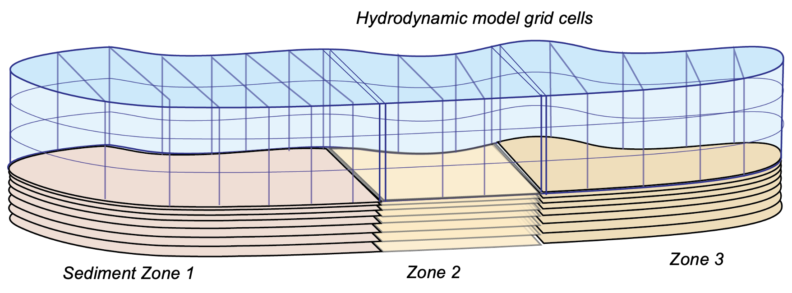

```

**3-zone experiment**

To demonstrate the zones can function independently, a model test was performed with three zones. In this simulation each model zone received a sustained 1-year surface loading of organic material, which either was maintained for throughout the simulation duration (Zone 1), or was reduced to a new lower value (Zone 2 and 3); this can conceptually be considered as a test of the sediment model to respond to 'remediation' scenarios. The results highlight the individual zones responding accordingly, as shown for NO~3~ (Figure X).

```{r dev-pics4, echo = FALSE, out.width='100%', class = "text-image", fig.cap = "Example of sediment concentration-depth-time plot for ammonia, given different organic matter influx rates in three different zones. To demonstrate capability for spatial differences, the organic matter input stayed the same in Zone 1 but decreased after 1 year in Zones 2 and 3 to different levels."}

knitr::include_graphics("images/dev/sed_picture6.png")

```

####	Sediment-water coupling {-}

The sediment and hydrodynamic models are coupled at the sediment-water interface. The AED model setup has separate functions for coupling the bottom-most cell of the TUFLOW-FV hydrodynamic model to the top-most layer of the sediment model:

-	flux of solid material onto the sediment surface
-	concentration of dissolved substances in the bottom water
-	flux of dissolved substances from the top sediment layer


```{r dev-pics2, echo = FALSE, out.width='45%', class = "text-image",fig.show='hold',fig.align='center', fig.cap = "Schematic of sediment water coupling approach."}

knitr::include_graphics(c("images/dev/sed_picture3.png","images/dev/sed_picture4.png"))

```

**Zone tracer experiment**

*To Be Completed*


### Model setup and configuration

The Coorong lagoon is divided into 10(20) sediment zones along its length. One sediment model is run for each of the ten(twenty) zones. The zone boundaries are largely based on locations of sandbars and where the lagoon channel narrows and broadens. There are measured data points in all zones except for zone 1, south of the Salt Creek inflow. Zones 1 to 4 correspond to the South Lagoon, as mentioned in the Goyder Institute nutrient budget. Zone 5 is the intermediate area and zones 6 to 10 are the North Lagoon.

```{r dev-pics1, echo = FALSE, out.width='45%', class = "text-image",fig.show='hold',fig.align='center', fig.cap = "Example sediment zonation."}

knitr::include_graphics(c("images/dev/sed_picture1.png","images/dev/sed_picture2.png"))

```

The sediment model is calibrated initially without any coupling. The sediment-water interface boundaries are based on measured bottom water data, where available, or literature values. Some parameters are tuned so that measured data matches simulated variables, for concentration depth profiles and fluxes.

The sediment model is then coupled to the water column model. Many variables are set up to be linked between the two models; however, not all variables need to be linked. The fluxes and concentrations of linked variables in the bottom water are averaged across all cells in a zone, and this average value is passed to the sediment. Similarly, the value of a dissolved flux from the sediment is given to all bottom water cells within a sediment zone.


####	Parameters and settings {-}

The assigned parameters for the model are described below in Table X.

```{r 3dev-sedpars, echo=FALSE, message=FALSE, warning=FALSE}
library(knitr)
library(kableExtra)
sediment_parameters <- read.csv("tables/sediment_parameters.csv", check.names=FALSE)
kable(sediment_parameters,"html", escape = F, align = "c", caption = "Sediment physical and transport parameters",
      bootstrap_options = "hover") %>%
  kable_styling(sediment_parameters, bootstrap_options = "hover",
                full_width = F, position = "center",
                font_size = 12) %>%
  column_spec(1, width_min = "10em") %>%
  column_spec(2, width_min = "7em") %>%
  column_spec(3, width_min = "7em") %>%
  column_spec(4, width_min = "15em") %>%
  row_spec(1:19, background = 'white') %>%
  scroll_box(width = "690px", height = "800px",
             fixed_thead = FALSE)
```

<br>

####	Validation sites and data {-}

A wide diversity of data has been collected and is documentaed in Appendix A (Data Catalogue). In summary, there are four broad categories of field data available from the University of Adelaide surveys for model setup and parameterisation.

*Grab samples – C, N, P, Mn, Fe, S* : These are available for many sites but only one or two depths. They are useful for averaging a concentration at depth within a zone. These are key variables for sediment biogeochemistry.

*Cores – Fe, S, NH4+, PO43- GHGs* : The cores are available for only around four sites, but they are used for calibrating depth profiles and sediment-water fluxes. These often have data measured in the day and the night, as well as in November and March, which all have different concentrations and fluxes. The challenge will be to capture both day and night conditions, while also capturing seasonal changes.
The GHG models are new and require testing and development. It may be a challenge to tune these models to fit GHG flux measurements.

*Sediment quality* : These measurements are used for setting the initial porosity parameters. Once these are set they are not tuned further.

*Macroinvertebrates – bioturbation parameters* : These measurements are used for setting bioturbation and bioirrigation parameters. Broadly, the North Lagoon has high bioturbation and the South Lagoon has very little bioturbation. The depth to bioturbation is important, as it is expected that there is uninhabited black ooze below a certain depth.


### Validation and assessment

*To Be Completed*


### Lagoon scale predictions

*To Be Completed*


### Summary (Sept 2021)

The sediment biogeochemistry model has been implemented that can resolve the nature of sediment condition across the Coorong lagoon. The model has been demonstrated to capture sharp vertical gradients in nutients, organic matter and sulfides, and can be applied across discrete zones within the overall lagoon to resolve spatial heterogeneity. The model is now being calibrated against T&I1 project data.

<br>

***	

<br>

## Oxygen metabolism and nutrient cycling

### Overview

### Model approach

### Data availability

### Model setup

### Validation and assessment

### Summary


<br>

***	

<br>

## Macroalgal dynamics

### Overview

Recent surveys in the Coorong South Lagoon have highlighted the challenge to ecosystem health due to the high biomass and wide extent of filamentous algae, mainly the species Ulva. The survey data highlight that the filamentous algae are tightly associated with the locations that Ruppia are present, and late in the season the smothering and deoxygenation casued by large biomass accumulations are driving poor water quality. This section describes the approach to simulating macroalgae, and development of the model to the CSL situation.   

### Model approach

Within the Coorong, the AED model has previously been set up to predict inorganic and organic nutrients, and chlorophyll-a. Whilst nutrients are not directly required for the *Ruppia* model assessment, the presence of filamentous algal blooms can compete for light and these are linked to bioavailable nutrients within the water column (in addition to other attributes).

#### Filamentous algae

We include a filamentous algae variable, $FA$, in the model that is customized to reflect the Ulva community that was been extensively described. For this case we assumed it to be attached to benthic substrate, and is therefore is not subject to advection and mixing, but can slough off under high stress conditions and become a floating variable subject to transport. Evidence from the field suggest the abundance of filaments are tightly linked to the Ruppia shoots, which the algae use to anchor too.

In general, the balance equation describes how the biomass changes over time, according to:

$$
\frac{d\left(FA\right)}{dt}=+f_{\text{uptake}}^{FA}-f_{\text{excr}}^{FA}-f_{\text{mort}}^{FA}-f_{\text{resp}}^{FA}\ -f_{\text{slough}}^{FA}
(\#eq:lagoonhabitat5)
$$
where the main growth term is resolved as:

$$
\scriptsize{f^{FA}_{\text{uptake}} = \underbrace{R^{FA}_{\text{growth}}}_{\text{max growth} \\ \text{rate at 20$^\circ$C}} \ \ \underbrace{(1-k^{FA}_{\text{pr}})}_{\text{photorespiratory} \\ \text{loss}} \ \ \underbrace{\Phi^{FA}_{\text{tem}}(T)}_{\text{temperature} \\ \text{scaling}} \text{min} \left \{\underbrace{\Phi^{FA}_{\text{light}}(I)}_{\text{light limitation}}, \underbrace{\Phi^{FA}_{\text{N}}(NO_{3},NH_{4})}_{\text{light limitation}}, \underbrace{\Phi^{FA}_{\text{P}}(PO_{4})}_{\text{P limitation}} \right \} [FA]}
(\#eq:lagoonhabitat6)
$$

An example of the above approach in practice is shown in the below animation. The results highlight, for this time period of interest, the areas where salinity exceeds the threshold and initially limits the productivity, and the shallow areas where light is abundant; along with other environmental drivers (e.g., temperature) these shape the biomass accumulation pattern seen in the top left panel. Animations like this for different periods throughout the year, or between years, can look quite different.

<br>
<center>
<video width="100%" height="100%" controls>
<source src="images/dev/MA2_JAN.mp4" type="video/mp4">
</video>
</center>
<br>


#### Macroalgae growth physiology

The original AED macroalgal biomass model previously applied and exemplified in the above example has been replaced with an updated version that includes numerous advances to light extinction within the canopy, nutrient cycling and excretion processes, and updates to the parameterisations associated with photosynthesis and biomass accumulation. The latter, in particular, are updated to better align with the experimental work reported in Waycott et al. (2019) and ...


#### Resolving seasonal life-stage dynamics

Following review of the initial data and findings from the T&I project 2, the approach to modelling macroalgae has been revised to better resolve seasonal shifts in form and physiology over the seasonal cycle.

A new ‘colony’ based model for simulating clump emergence, biomass accumulation and sloughing has been conceptualised (Figure 13). The model adopts the same underlying physiology as described in the above section, but allows for age/size specific application of these rates to better align with recent observations and monitoring.

```{r dev-pic5, echo = FALSE, out.width='100%', class = "text-image", fig.cap = "Schematic depicting a new life-stage based macroalgal “clump” model being developed to track seasonal macroalgal biomass development and late-stage decay."}

knitr::include_graphics("images/dev/macroalgae_conceptual.png")

```

This approach allows more direct links with a) the experimental data collected on biomass accumulation and photosynthesis rates in the lab, and b) the field data estimates of macroalgae density from photos and aerial imagery at different points through the growth season.

The approach essentially follows a size-class based model for resolving the filamentous algae biomass pool. According to the above conceptual schematic, four discrete life-stage (aka size) categories are included. In general they are fixed in space, but note that 'sloughed' biomass that becomes mobilised after a sloughing event can continue to be exposed to surface light irradiances and also begin decomposition should environmental conditions be inadequate for growth (e.g., as the water becomes too salty).


### Data availability

#### Environmental threshold parameter review

*To be completed*

#### Algae extent within the lagoon

A summary of the available algale extent data is summarised in Table X.

```{r 3-malgtable, echo=FALSE, message=FALSE, warning=FALSE}
library(knitr)
library(kableExtra)
library(readxl)
library(rmarkdown)
theSheet <- read_excel('tables/malgae_data.xlsx', sheet = 1)
theSheet <- theSheet[theSheet$Table == "malgae",]
theSheetGroups <- unique(theSheet$Group)
for(i in seq_along(theSheet$Identifier)){
  if(!is.na(theSheet$Identifier[i])==TRUE){
    theSheet$Identifier[i] <- paste0("**",theSheet$Identifier[i],"**")
  } else {
    theSheet$Identifier[i] <- " "
  }
}
kbl(theSheet[,3:NCOL(theSheet)], caption = "Macroalgae data availability summary", align = "l",) %>%
  pack_rows(theSheetGroups[1],
            min(which(theSheet$Group == theSheetGroups[1])),
            max(which(theSheet$Group == theSheetGroups[1])),
            background = '#ebebeb') %>%
  pack_rows(theSheetGroups[2],
            min(which(theSheet$Group == theSheetGroups[2])),
            max(which(theSheet$Group == theSheetGroups[2])),
            background = '#ebebeb') %>%
  row_spec(0, background = "#14759e", bold = TRUE, color = "white") %>%
  kable_styling(full_width = F,font_size = 11) %>%
  scroll_box(width = "680px", height = "360px",
             fixed_thead = FALSE)
```
<br>


**Historical Monitoring** A summary of historical (pre 2020) *Filamentous Algae* monitoring locations are shown in Figure \@ref(fig:dev-pic10).

```{r dev-pic10, echo = FALSE, out.width='45%', class = "text-image",fig.show='hold',fig.align='center', fig.cap = "Filamentous Algae sampling sites for monitoring program prior to 2020. Agency/program code under each map corresponds to those listed in Table 4.3. Turquoise outline represents the model boundary."}

knitr::include_graphics(c("images/dev/3_picture10a.png","images/dev/3_picture10b.png"))

```


**HCHB Monitoring** A summary of the HCHB monitoring locations are shown in Figure \@ref(fig:dev-pic11).

```{r dev-pic11, echo = FALSE, out.width='45%', class = "text-image",fig.align='center', fig.cap = "Filamentous algae sampling sites for the HCHB program (T and I 2). Agency/program code under each map corresponds to those listed in Table 4.4. Turquoise outline represents the model boundary."}

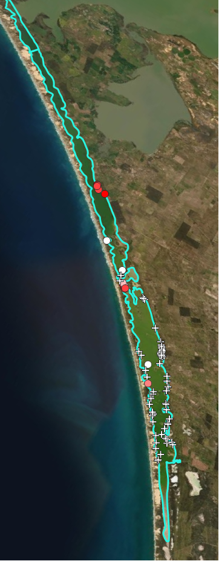

```

### Model setup


### Validation and assessment

Using the  Generation 0 model, the following assessment against Ulva biomass prediction and presence absence was recorded (Figure \@ref(fig:dev-pic12)).

```{r dev-pic12, echo = FALSE, out.width='45%', class = "text-image",fig.show='hold',fig.align='center', fig.cap = "Comparison of Observed and Simulated Ulva for 2016 (left) and 2017 (right)."}

knitr::include_graphics(c("images/dev/AlgaeDec2016vsULVAbiomass2016.png","images/dev/AlgaeMay2017vsUlvaBiomass2016.png"))

```

The modelled Ulva HSI prediction correlates well with the observed filamentous algae density, however, the correlation between predicted biomass and obsevred presence was less accurate (Figure \@ref(fig:dev-pic13)). This implies the growth controls (as embodied in the HSI) are well resolved, but the seasonal factors leading to biomass accumulation are more complicated and need further refinement. The HSI range was however quite restricted and further data from 2020-2021 is needed to assess whether the HSI calculation needs further refinement.  


```{r dev-pic13, echo = FALSE, out.width='100%', class = "text-image",fig.align='center', fig.cap = "Filamentous algae observed density and equivalent model predicted Ulva HSI (top) and Ulva Biomass (bottom)."}

knitr::include_graphics("images/dev/Algae_2016.png")

```


### Summary (Sept 2021)

The macroalgae model in AED is able to capture the broad spatial patterns in environmental drivers that control biomass. Comparison of the Generation 0 model with the pre-HCHB survey data has provided insights to the suitability of the model approach. This is being used to refine the conceptual basis of the model which will be introduced in the next model versions.

<!--chapter:end:development_and_testing.Rmd-->

# CDM Habitat Modelling

<br>

## Habitat modelling - **Ruppia**

### Overview

Whilst the Coorong is a naturally saline to hyper-saline lagoon, freshwater flows are important in maintaining estuarine habitat and ecosystem health and preventing extreme hyper-salinity (Brookes et al. 2009). *Ruppia tuberosa* is an important macrophyte in the Coorong that provides habitat for fish and food for herbivorous birds (Phillips and Muller 2006), and it can tolerate a salinity higher than natural seawater. It therefore is known to concentrate in the mid to southern regions (Figure \@ref(fig:hab-pic1)).  

The germination and growth of *R. tuberosa* is known to be governed in large part by changes in salinity and water level regimes, which are influenced by flows through the barrages (Kim et al. 2013). Other factors that influence *R. tuberosa* growth include nutrient availability, water temperature, sediment quality and interactions with algae, including shading of light and interference with flowers and fruits on the surface. Early summer flows are thought to be particularly beneficial as they delay the drop in water level in the South Lagoon and can prevent extreme salinities emerging, thereby encouraging a more complete reproductive cycle (Collier et al. 2017).

In addition, salinity has also been identified as the key driver that influences fish assemblage structure and the extent of estuarine fish habitat in the Coorong (Ye et al. 2011). This section describes how simulations of *Ruppia and* estuarine fish habitat have been configured and assessed.

```{r hab-pic1, echo = FALSE, out.width='100%', class = "text-image", fig.cap = "Conceptual diagram of Ruppia presence in the Coorong, under base case conditions=  with moderate inflows from the Barrages (North) and Salt Creek (South-east)."}

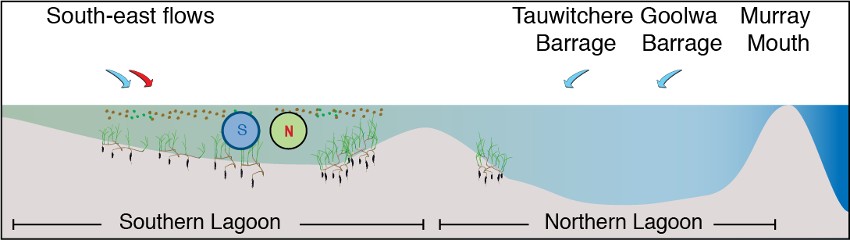

```

### Model description: Ruppia HSI

The approach adopted in the current study is to simulate "habitat suitability" based on an assessment of modelled environmental conditions relative to the known requirements of Ruppia tuberosa, for example, considering salinity, light and/or other environmental conditions. This approach was then used to define a relative index for each computational cell by overlaying the various environmental controls/limitations that have been informed based on prior experiments and surveys. The ***Habitat Suitability Index*** approach empirically defines conditions that lead to successful growth and reproduction, without simulation of processes such as photosynthesis and respiration.

For the Coorong, a similar habitat model approach was undertaken previously by Ye et al. (2014), who focused exclusively on the salinity and water level requirements of Ruppia and presented the model results as an overall probability that Ruppia plants would successfully complete their lifecycle, by accounting for the different tolerances of different life stages.

In this study, we used the hydrodynamic-biogeochemical model to predict environmental conditions at high spatial and temporal resolution for a period of multiple years, and used this to calculate the habitat suitability index (HSI) for each particular phase of the life cycle of Ruppia (Figure \@ref(fig:lagoonhabitat-pic2)). The calculation of the HSI required the integration of environmental conditions over a biologically relevant time period, based on the typical duration and seasonal timing for each life-stage. HSI results for different life stages were then combined and integrated to obtain overall HSI results for successful completion of sexual or asexual life cycles of Ruppia. For each annual cycle these model results were then summarised over the length of the Coorong, to allow estimation of the total suitable area.

```{r lagoonhabitat-pic2, echo = FALSE, out.width='75%', class = "text-image", fig.align='center', fig.cap = "Overview of the sexual and vegetative life cycles of *Ruppia tuberosa* (from Collier et al. 2017)."}

knitr::include_graphics("images/lagoon_habitat/picture2.png")
```

#### Ruppia Habitat Suitability Index calculation {-}

In each model cell ($c$), the Habitat Suitability Index (HSI) is computed based on suitability of conditions ($i$), for each of the main life-stages ($j$), by defining a fractional index, . The fractional index for each attribute is computed at each time, step and then integrated over a 90-day window, specific to the life-cycle stage.

$$
\Phi^{HSI_{j}}_{i} = \frac{1}{t_{j_{\text{start}}}-t_{j_{\text{end}}}} \sum^{t_{j_{\text{end}}}}_{t=t_{j_{\text{start}}}}\Phi^{HSI_{j}}_{i}(i)_{t}
(\#eq:lagoonhabitat7)
\\
\scriptsize{
\\ \text{whereby: $i$ = {salinity, temperature, light, depth, algae}}
\\ \text{and: $j$ = {seed, sprout, adult, flower, turion}}}
$$

The integration time for each life-stage, $j$, is set to be 90-days based on assessment of literature on the typical impact times reported following shading or disturbance. The optimum 90-day period is selected from within the available plant growth windows, as indicated in Table 2.

The above function is computed in each cell and produces maps of suitability (between 0 and 1) for each environmental attribute for each life stage within any given year. The individual functions are piecewise, based on synthesis of the available literature (Table 3). These are then overlaid to produce a final map for any given year using:

$$
\Phi^{HSI}_{c} = \text{min}\left[\Phi^{HSI_{j}}_{c} \right]_{c}
(\#eq:lagoonhabitat8)
$$

To compare the overall area of suitable habitat between years, or the relative suitability of alternate scenarios, the fractional suitability is used as a multiplier with the cell area, according to:

$$
A^{HSI} = \sum_{c} \Phi^{HSI}_{c} A_{c}
(\#eq:lagoonhabitat9)
$$

and the spatially averaged HSI in any given region (with area A) is computed as:

$$
\overline{HSI} = \frac{1}{A}\sum_{c} \Phi^{HSI}_{c} A_{c}
(\#eq:lagoonhabitat10)
$$

<br>

+------------------------------------+------------------+------------------+--------------+-----------+-------------------+
| Stage, $j$                         | Seed germination | Turion sprouting | Adult growth | Flowering | Turion production |
+====================================+==================+==================+==============+===========+===================+
| Start date, $t_{j_{\text{start}}}$ | *Apr*            | *Apr*            | *Jun*        | *Aug*     | *Aug*             |
+------------------------------------+------------------+------------------+--------------+-----------+-------------------+
| End date, $t_{j_{\text{end}}}$     | *Jun*            | *Jun*            | *Aug*        | *Oct*     | *Oct*             |
+------------------------------------+------------------+------------------+--------------+-----------+-------------------+

: Life cycle time windows over which environmental suitability is assessed. {\#tbl:table1}

### Data availability

The model approach requires empirical data for a) assignment of appropriate environmental threshold data for each life-stage, and b) validation and assessment of the approach under various conditions. The available data for this tasks is described next.

#### Environmental threshold parameter review {-}

Environmental conditions and thresholds suitable for Ruppia growth have been reviewed and summarised in Table 5.2.

+----------------------------+------------------------------------------------------------------------------------------------------------------------------------------------------------------------------------------+-----------------------------------------------------------------------------------------------------------------------------------------------------------------------------------+--------------------------------------------------------------------------------------------------------------------------------------------------------------------------------------------------+
| Environmental attribute    | Optimal                                                                                                                                                                                  | Acceptable                                                                                                                                                                        | Rationale/source                                                                                                                                                                                 |
+============================+==========================================================================================================================================================================================+===================================================================================================================================================================================+==================================================================================================================================================================================================+
| Water depth                | Adult: 0.2 -- 0.7 mAHD, Flowering and turion formation: 0.1-0.4 mAHD                                                                                                                     | Adult: 0.1 -- 1 mAHD                                                                                                                                                              | Prone to desiccation if \<0.3m, light limited if \>0.6m. Thresholds derived from pre -- 2019 studies and summarised in TI-2.1.1_TRS_20-13_Aquatic Plant Synthesis_2020-12-11_Final v2. Section 3 |
+----------------------------+------------------------------------------------------------------------------------------------------------------------------------------------------------------------------------------+-----------------------------------------------------------------------------------------------------------------------------------------------------------------------------------+--------------------------------------------------------------------------------------------------------------------------------------------------------------------------------------------------+
| Water depth                | -0.2 -- 0.2 mAHD                                                                                                                                                                         | -0.5 -- 0.3m AHD                                                                                                                                                                  | TI-2.3.2_Restoration_2021-06-15_v1.0_FINAL                                                                                                                                                       |
+----------------------------+------------------------------------------------------------------------------------------------------------------------------------------------------------------------------------------+-----------------------------------------------------------------------------------------------------------------------------------------------------------------------------------+--------------------------------------------------------------------------------------------------------------------------------------------------------------------------------------------------+
| Salinity                   | *Adult* (Jun-Sep): 25 -122g/L; *Flowering & seed set* (Sep-Dec): 40-62g/L; *Turion formation* (Sep-Dec): 128-162g/L; Seed germi (Apr-Jun): 5-60g/L; Turion sprouting (Apr-Jun): 20-75g/L | Adult (Jun-Sep): 5 -215g/L; Flowering & seed set (Sep-Dec): 12-102g/L; Turion formation (Sep-Dec): 72-228g/L; Seed germi (Apr-Jun): 0-85g/L; Turion sprouting (Apr-Jun): 0-130g/L | Thresholds derived from pre -- 2019 studies and summarised in TI-2.1.1_TRS_20-13_Aquatic Plant Synthesis_2020-12-11_Final v2. Section 3                                                          |
+----------------------------+------------------------------------------------------------------------------------------------------------------------------------------------------------------------------------------+-----------------------------------------------------------------------------------------------------------------------------------------------------------------------------------+--------------------------------------------------------------------------------------------------------------------------------------------------------------------------------------------------+
| Light                      | ? - 100%                                                                                                                                                                                 | \>5%                                                                                                                                                                              | As above                                                                                                                                                                                         |
+----------------------------+------------------------------------------------------------------------------------------------------------------------------------------------------------------------------------------+-----------------------------------------------------------------------------------------------------------------------------------------------------------------------------------+--------------------------------------------------------------------------------------------------------------------------------------------------------------------------------------------------+
| Substrate/slope            |                                                                                                                                                                                          | Non-rocky and non-sloping steeply                                                                                                                                                 | TI-2.2.1_Annual Report_AquaticPlantSurveys_2020-12-11_Final                                                                                                                                      |
+----------------------------+------------------------------------------------------------------------------------------------------------------------------------------------------------------------------------------+-----------------------------------------------------------------------------------------------------------------------------------------------------------------------------------+--------------------------------------------------------------------------------------------------------------------------------------------------------------------------------------------------+

: Summary of environmental thresholds for Ruppia growth. {\#tbl:table2}

#### Ruppia extent within the lagoon  {-}

The distribution and abundance of Ruppia has been regularly monitored in the Coorong since 1998. However, the types of data collected, the sampling season, location and methods varied between programs. An overview of the available historical and HBHC datasets is shown in Figure 5.3.

```{r hab-pic4, echo = FALSE, out.width='100%', class = "text-image", fig.cap = "Overview of Ruppia survey datasets showing sampling periods and types of data collected (purple boxes), versus habitat model output (HSI, blue boxes) on a timeline. Datasets from the HCHB project are highlighted in yellow."}

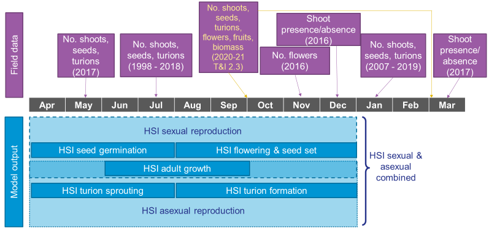
```

**Historical Monitoring** A summary of historical Ruppia monitoring datasets (pre-2020) is shown in Table 5.3. Locations of sampling sites are shown in Figure 5.4.

```{r hab-pic5, echo = FALSE, out.width='100%', class = "text-image", fig.cap = "Ruppia sampling sites for various monitoring program prior to 2020. Agency/program code under each map corresponds to those listed in Table 5.3. Turquoise outline represents the model boundary. Note that sampling sites of the last dataset listed in Table 5.3 are the same as UA MDBA_2."}

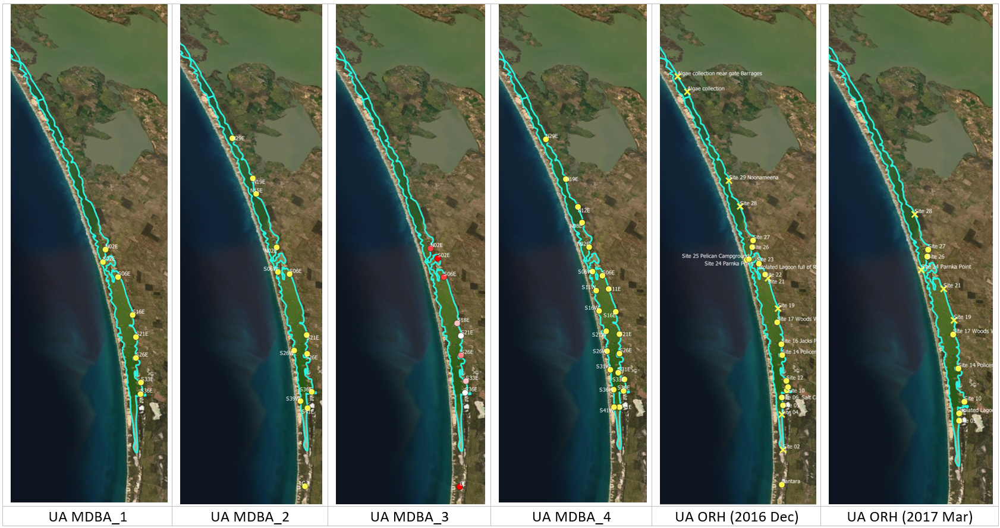

```

**HCHB Monitoring** A summary of the HCHB monitoring datasets is shown in Table 5.4. Locations of sampling sites are shown in Figure 5.5.

```{r hab-pic6, echo = FALSE, out.width='40%', class = "text-image", fig.cap = "Ruppia sampling sites for the HCHB program (T and I 2). Agency/program code under each map corresponds to those listed in Table 5.4. Turquoise outline represents the model boundary."}

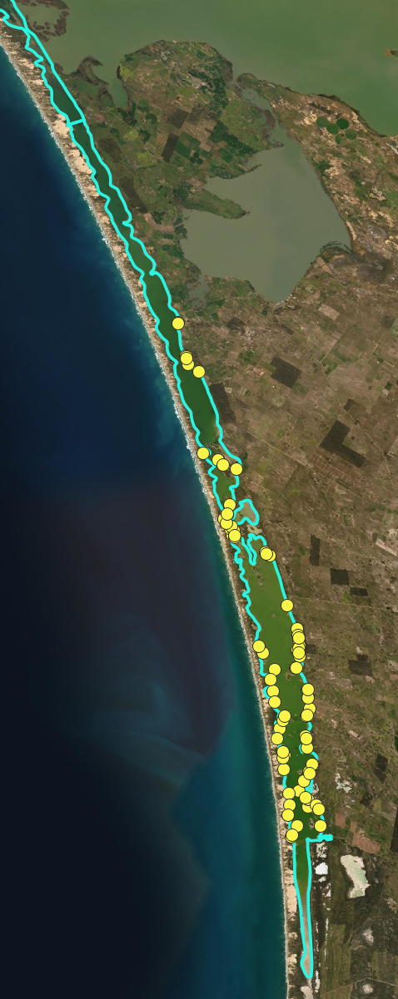

```

### Model application

The hydrodynamic-biogeochemical model TUFLOW-FV -- AED is used to simulate the hydrodynamic conditions (velocity, salinity, temperature and water level), water clarity (light and turbidity) and the potential for filamentous algae (nutrients and algae). Specifically, the HCHB V0.1 model was applied, configured using the specification of AED parameters (....). The Coorong has a long residence time and to account for the longer timescales of water and solute flux, multi-year simulations must be performed.

The habitat suitability functions for each environmental variable of each Ruppia life-stage were determined based on literature review and expert judgement (Table 5.5), and used for the calculation of overall habitat suitability indices (Section 5.1.2). In these tests, the model was run from May 2013 to March 2019 using the base case condition.

```{r hab-pic7, echo = FALSE, out.width='100%', class = "text-image", fig.cap = "Suitability functions for Ruppia life stages (based on literature review presented in Table 5.2 and expert judgement). Note that optimal = 1, unsuitable = 0, and sub-optimal is linearly interpolated between these values. Note: for Salinity, Temperature, Light and Algal biomass, use 90-day rolling mean values for the respective periods to interrogate the model outputs against these thresholds."}

knitr::include_graphics("images/lagoon_habitat/Table4.5.ruppia suitability functions.png")
```

\* provided that the wet days are not followed by \>8 dry days (= unsuitable)

The outputs of the model are maps of habitat suitability of critical life stages (Figure 5.6a, showing only the flowering stage in 2018), in response to light, depth, salinity and temperature, which in the end results in a combined probability of sexual or asexual life-cycle completion (Figure 5.6b, showing only the overall HSI for a completion of the sexual life cycle in 2018). The requirements for each life stage are quite different, and when each is superimposed together, the areas where life-cycle completion are limited to the margins of the main lagoons, and the shallow areas around Parnka. From year to year, the area of good habitat changes, depending on that year's eco-hydrodynamic regime.

By comparing scenarios with different flows into the Lagoon, we can see that there is an expansion of good habitat in the north of the South Lagoon, and along the South Lagoon margins, when extreme salinity values are avoided (Figure 11).

<center>

```{r lagoonhabitat-pic4, echo = FALSE, out.width='60%', class = "text-image", fig.cap = "Habitat suitability (HSI) for the adult plant phase of *Ruppia tuberosa* in the Coorong as a function of salinity, light, water level and presence of filamentous algae for the Base Case (2015)."}

knitr::include_graphics("images/lagoon_habitat/picture4.png")
```

```{r lagoonhabitat-pic5, echo = FALSE, out.width='60%', class = "text-image", fig.cap = "Overall Habitat Suitability (HSI) for a successful completion of the asexual life cycle by *Ruppia tuberosa* in the Coorong, calculated by integrating the HSI results for adult plants, turion formation and turion sprouting for the Base Case (2015)."}

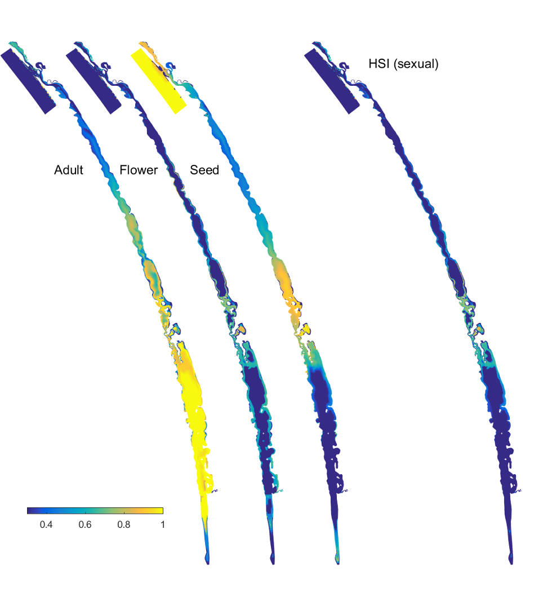

```

```{r lagoonhabitat-pic6, echo = FALSE, out.width='60%', class = "text-image", fig.cap = "Overall Habitat Suitability (HSI) for a successful completion of the sexual life cycle by *Ruppia tuberosa* in the Coorong, calculated by integrating the HSI results for adult plants, flowering (incl. seed formation) and seed germination (incl. seedling survival) for the Base Case (2015)."}

knitr::include_graphics("images/lagoon_habitat/picture6.png")

```

</center>

### Model results and assessment

To assess the accuracy of model predictions, the habitat suitability maps produced above were compared with Ruppia field survey results for both distribution and abundance, including several types of plant materials (e.g., shoot, seed, turion) which were used to validate HSI of different life-stages.

#### Historical validation  {-}

<br> **i. Field seed/flower count (obs) vs. HSI flowering and seed set (model)**

Average number of seeds per core sampled in January from 2017 to 2019 were compared with HSI flowering and seed set of the previous year (2016 -- 2018) (Figure 5.7 -- 5.10), which is a result of integrated average condition between August and December in each year (Figure 5.3). Number of flowerheads was sampled in November 2016 only, and was compared with HSI flowering and seed set of the same year.

Both of these validation methods are relatively straight forward and should reflect a close link between model output and field observations i.e. if the habitat suitability for flowering and seed set was suitable for existing Ruppia to flower and set seed between August and December, the flower count in November the same year should largely reflect this. Seed count conducted in January the following year should also be a good indicator as the Ruppia that had flowered in the previous year should have set seed by January. However, as it may take several years for the seed bank to deplete, number of seeds recorded each year could potentially be a 'cumulative' result of the sexual reproduction success of Ruppia in preceding years. This means there could be a lag between the actual seed count, and the HSI which largely reflects the environmental conditions of the current year only.

Surveys conducted during other times of the year, such as May or July, are more complicated to validated against, as during this period some of the seeds that were produced during last spring would have had germinated. Therefore, the seed abundance at this time is a combined result of previous year's seed production success, and current year's seed germination rate.

In general, the spatial distribution of seeds and flowers in the field agreed with model outputs (Figure 5.7 -- 5.10). For example, higher number of seeds and flowers were often found in the middle lagoon, overlapping with areas where higher HSIs are concentrated. In comparison, north and/or south lagoons recorded lower density of seeds and/or flowers, matching the lower HSIs or limited suitable habitat extent in these regions. However, there were some disagreements between the modelled HSI and field data in the relative abundance of seeds recorded in the south and north lagoons. Specifically, seeds appeared to be mostly absent in the north lagoon between 2017 and 2019, while they had been in higher abundance in the south consistently. Current model predictions however, predicted that the south and north lagoon had similar habitat suitability for flowering and seed set.

In addition to the visual comparison between model outputs and field observations, a quantitative validation was conducted between seed abundance in 2019 and HSI flowering and seed set in 2018 (Figure 5.9). A 600-meter radius buffer was created around each sampling site, and HSI value in each cell that falls within this buffer were averaged and compared with seed count at each site.

```{r hab-pic11, echo = FALSE, out.width='100%', class = "text-image", fig.cap = "Average seed count per core in **2017 January** (circles) overlaid on HSI model output for flowering and seed set in 2016. Inset on top right shows the overall habitat suitability for the flowering and seed set phase of Ruppia as a function of salinity f(S), light f(l), water level f(WL), and presence of filamentous algae f(FA). An HSI of 0 (dark purple) represents unsuitable habitat conditions, while an HSI of 1 represents optimal conditions (yellow)."}

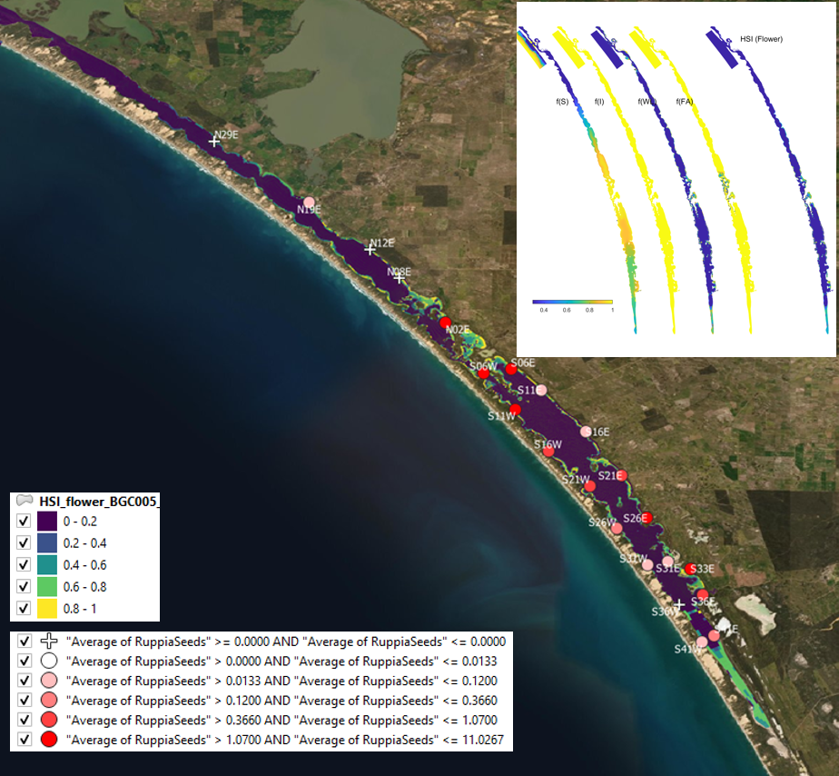

```

```{r hab-pic12, echo = FALSE, out.width='100%', class = "text-image", fig.cap = "Average seed count per core in **2018 January** (circles) overlaid on HSI model output for flowering and seed set in 2017. Inset on top right shows the overall habitat suitability for the flowering and seed set phase of Ruppia as a function of salinity f(S), light f(l), water level f(WL), and presence of filamentous algae f(FA). An HSI of 0 (dark purple) represents unsuitable habitat conditions, while an HSI of 1 represents optimal conditions (yellow)."}

knitr::include_graphics("images/lagoon_habitat/fig4.8.seed2018vsHSI2017.png")

```

```{r hab-pic13, echo = FALSE, out.width='100%', class = "text-image", fig.cap = "Average seed count per core in **2019 January** (circles) overlaid on HSI model output for flowering and seed set in 2018 (left). A HSI of 0 (dark purple) represents unsuitable habitat conditions, while an HSI of 1 represents optimal conditions (yellow). Inset shows the size of the buffers created around sampling sites. Scatter plot shows the relationship between average seed count per core in 2019 January and averaged HSI for flowering and seed set in 2018 (right). Text on top of each data point indicates site name."}

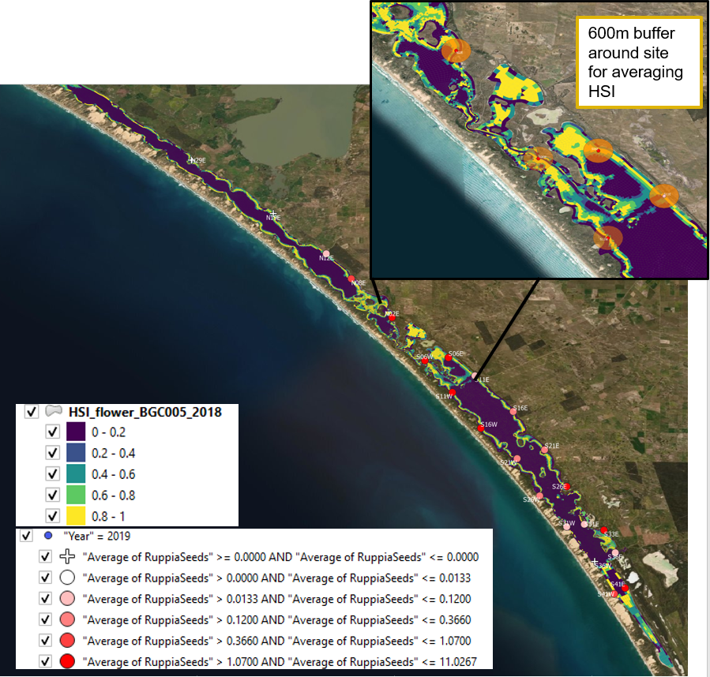
```

```{r hab-pic14, echo = FALSE, out.width='100%', class = "text-image", fig.cap = "Average flowerhead count per square meter quadrat in 2016 November (circles) overlaid on HSI model output for flowering and seed set in 2016. Inset on top right shows the overall habitat suitability for the flowering and seed set phase of Ruppia as a function of salinity f(S), light f(l), water level f(WL), and presence of filamentous algae f(FA). An HSI of 0 (dark purple) represents unsuitable habitat conditions, while an HSI of 1 represents optimal conditions (yellow)."}

knitr::include_graphics("images/lagoon_habitat/fig4.10.flower2016vsHSI2016.png")

```


The modelled Ruppia HSI prediction for flowers correlates reasonably well with the observed seed count measured at the beginning of the following season, particularly in the South Lagoon (Figure \@ref(fig:hab-pic21)). 


```{r hab-pic21, echo = FALSE, out.width='100%', class = "text-image",fig.align='center', fig.cap = "Filamentous algae observed density and equivalent model predicted Ruppia HSI for the entire lagoon (top) and restricted to just the South Lagoon (bottom)."}

knitr::include_graphics("images/lagoon_habitat/Ruppia_flowerHSI2018_seed2019Jan.png")

```


**ii. Field turion count (obs) vs. HSI turion formation (model)**

Average number of turions (type I and II) per core sampled in January in 2016, 2017 and 2019 were compared with HSI turion formation of the previous year (2015, 2016 and 2018) (Figure 5.11 -- 5.13), which is a result of integrated average condition between August and December in each year (Figure 5.3).

As number of turions recorded in January should reflect the habitat conditions for turion formation in the preceding months when HSI for turions were calculated (August to December), this validation method is relatively straight forward, compared to if model outputs were to be validated against surveys conducted during other times of the year such as May or July, as some of the turions formed during previous spring should have had sprouted in May or July in the current year. Such validation will be more complicated as turion abundance in the field is a combined result of previous year's turion formation success and current year's turion sprouting rate.

Visual validation of turions showed mixed results (Figure 5.11 -- 5.13). HSIs for turion formation in 2015 were generally consistent with turion distribution and abundance in 2016 January, where south lagoon observed more suitable environmental conditions than the north, and field records showed a similar pattern (Figure 5.11). However, the model seemed to underpredict habitat suitability in the south lagoon in 2016 and 2018 (Figure 5.12 and 5.13).

```{r hab-pic15, echo = FALSE, out.width='100%', class = "text-image", fig.cap = "Average turion count (type I and II) per core in **2016 January** (circles) overlaid on HSI model output for turion formation in 2015. Inset on top right shows the overall habitat suitability for the turion formation phase of Ruppia as a function of salinity f(S), light f(l), water level f(WL), and presence of filamentous algae f(FA). An HSI of 0 (dark purple) represents unsuitable habitat conditions, while an HSI of 1 represents optimal conditions (yellow)."}

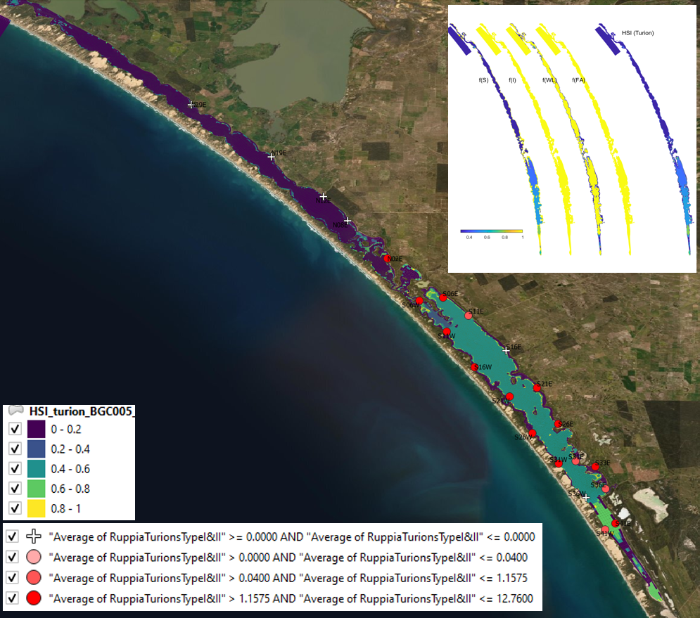

```

```{r hab-pic16, echo = FALSE, out.width='100%', class = "text-image", fig.cap = "HSI turion Average turion count (type I and II) per core in **2017 January** (circles) overlaid on HSI model output for turion formation in 2016. Inset on top right shows the overall habitat suitability for the turion formation phase of Ruppia as a function of salinity f(S), light f(l), water level f(WL), and presence of filamentous algae f(FA). An HSI of 0 (dark purple) represents unsuitable habitat conditions, while an HSI of 1 represents optimal conditions (yellow)."}

knitr::include_graphics("images/lagoon_habitat/fig4.12.turion2017vsHSI2016.png")

```

```{r hab-pic17, echo = FALSE, out.width='100%', class = "text-image", fig.cap = "Average turion count (type I and II) per core in **2019 January** (circles) overlaid on HSI model output for turion formation in 2018. Inset on top right shows the overall habitat suitability for the turion formation phase of Ruppia as a function of salinity f(S), light f(l), water level f(WL), and presence of filamentous algae f(FA). An HSI of 0 (dark purple) represents unsuitable habitat conditions, while an HSI of 1 represents optimal conditions (yellow)."}

knitr::include_graphics("images/lagoon_habitat/fig4.13.turion2019vsHSI2018.png")

```

**iii. Field shoot count (obs) vs. HSI sexual and asexual combined (model)**

Average number of shoots (green and brown) per core sampled in January in 2018 and 2019 were compared with combined overall HSI for successful completions of sexual or asexual life cycle in the previous year (2017 and 2018) (Figure 5.14 -- 5.15), which is a result of integrating the HSI results for adult plants, flowering and seed set, seed germination, turion sprouting and turion formation (Figure 5.3).

Although a proportion of Ruppia might have died off in January, the total shoot count including green and brown materials should be a relatively good indicator of environmental conditions experienced in the previous year. Presence of shoots could be a result of sexual or asexual reproduction success, and hence HSI sexual and asexual were integrated for validation.

Similar to turion predictions, the HSI model seemed to relatively underpredict the habitat suitability in the south lagoon, and overpredict in the north in both years (Figure 5.14 -- 5.15). Since the model result is an integration of all life stages of Ruppia, this mismatch may be stemmed from a particular life stage, such as the turion formation stage described in the above section.

```{r hab-pic18, echo = FALSE, out.width='100%', class = "text-image", fig.cap = "Average shoot count (green and brown) per core in **2018 January** (circles) overlaid on HSI model output for combined sexual and asexual cycle in 2017. Inset on top right shows the overall habitat suitability for the completion of sexual and asexual life cycle of Ruppia by integrating the HSI results for each life stage. An HSI of 0 (dark purple) represents unsuitable habitat conditions, while an HSI of 1 represents optimal conditions (yellow)."}

knitr::include_graphics("images/lagoon_habitat/fig4.14.shoot2018vsHSI2017.png")

```

```{r hab-pic19, echo = FALSE, out.width='100%', class = "text-image", fig.cap = "Average shoot count (green and brown) per core in **2019 January** (circles) overlaid on HSI model output for combined sexual and asexual cycle in 2018. Inset on top right shows the overall habitat suitability for the completion of sexual and asexual life cycle of Ruppia by integrating the HSI results for each life stage. An HSI of 0 (dark purple) represents unsuitable habitat conditions, while an HSI of 1 represents optimal conditions (yellow)."}

knitr::include_graphics("images/lagoon_habitat/fig4.14.shoot2018vsHSI2017.png")

```

#### HCHB validation {-}

...To be completed...

### Summary (Sept 2021)

We undertook an extensive review of the Ruppia monitoring data availability dating back to 1998 within the Coorong lagoon, including distribution and abundance of several types of plant materials (i.e. shoot, seed, turion, flowers) during different seasons. Habitat Suitability Index outputs from the existing model were compared against available field observations to assess model accuracy with a primary focus in recent years (post-2015).

In general, model predictions aligned with the general distribution pattern of Ruppia seeds, but turions and shoots produced mixed results. Detailed investigation is needed to pinpoint potential ways to improve model accuracy. Ruppia environmental thresholds need further refinement as new data become available. 


<br><br> 

---

<br>

## Habitat modelling - **Fish**

### Overview

The high salinity values experienced in times of low freshwater flows challenges the fish populations that inhabit the lagoon. As an indicator of suitable conditions, the fish model calculates probabilities of habitat suitability for juveniles of seven key species, mulloway (*Argyrosomus japonicus*), black bream (*Acanthopagrus butcheri*), greenback flounder (*Rhombosolea tapirina*), yelloweye mullet (*Aldrichetta forsteri*), congolli (*Pseudaphritis urvillii*), Tamar goby (*Afurcagobius tamarensis*) and smallmouth hardyhead (*Atherinosoma microstoma*), based on laboratory experiment-derived salinity thresholds (Table 2. Ye et al. 2016a).

### Model description: Fish HSI


The model adopts a seasonal effect by account for temperature sensitivity to the salinity thresholds (higher salinity tolerance at lower temperatures), according to functions and parameters described in Table 1 and Table 2. It is computed as:

\begin{equation}
  Fish\: HSI =\left\{
  \begin{array}{@{}ll@{}}
    1, & 0 \le S \lt S_{c10} \\
    \frac{S_{c50}-S}{S_{c50}-S_{c10}}, & S_{c10} \le S \lt S_{c50}\\
    0 & S\ge S_{c50}\\
  \end{array}\right.
\end{equation} 

where $S$ is salinity $S_{c50}$ is the temperature-corrected concentration of salinity that kills 50% of the test animals and $S_{c10}$ is the temperature-corrected concentration of salinity that kills 10% of the test animals. These are based on lethal concentration tests at specific temperatures, and calculated according to:

\begin{equation}
  S_{c10} =\left\{
  \begin{array}{@{}ll@{}}
    LC_{10}^{14}, & 0 \le \bar{T} \lt 14 \\
    \frac{LC_{10}^{23}-LC_{10}^{14}}{23-14}(T-14) +LC_{10}^{14} , & 14 \le \bar{T} \lt 23 \\
    LC_{10}^{23}, & \bar{T} \ge 23 \\
  \end{array}\right.
\end{equation} 
\begin{equation}
  S_{c50} =\left\{ 
  \begin{array}{@{}ll@{}}
    LC_{50}^{14}, & 0 \le \bar{T} \lt 14 \\
    \frac{LC_{50}^{23}-LC_{50}^{14}}{23-14}(T-14) +LC_{50}^{14} , & 14 \le \bar{T} \lt 23 \\
    LC_{50}^{23}, & \bar{T} \ge 23 \\
  \end{array}\right.
\end{equation} 

where $\bar{T}$ is the monthly average water temperature and the $LC$ are the experimentally determined  salinity concentrations that removed 10 and 50% of the population for the denoted temperatured.

Figure 5 shows an example three-dimensional plot of the HSI functions for mulloway. In addition, habitat is deemed unsuitable if water is less than 0.1m deep. The computed habitat suitability index (HSI) ranges between 0 and 1, where 0 represents least suitable and 1 represents most suitable.

```{r hab-pic20, echo = FALSE, out.width='100%', class = "text-image", fig.cap = "Fish Habitat Suitability Index (HSI) surface plot (3D) as a function of salinity tolerance for mulloway, where a HSI value of 1 represents the most suitable conditions and 0 the least suitable. The salinity thresholds are specified as a function of water temperature where fish is able to tolerate higher salinities at lower temperatures. The red lines (2D) show the effect of salinity on HSI at two fixed temperatures"}

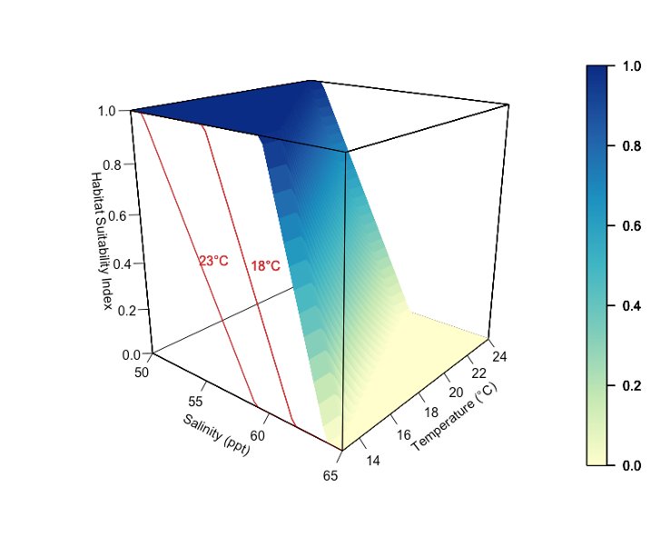
```


### Data availability

####	Environmental threshold parameter review {-}

The following parameters have been assigned as the temperature and salinity thresholds (Table X).

Table X. Summary of $LC_{50}$ and $LC_{10}$ estimates of salinity (expressed as ppt) for six species at 14°C ($LC^{14}$) and 23°C ($LC^{23}$) temperatures.

+--------------------------+------------------+------------------+----------------+----------------+
| Common name              | $LC^{14}_{50}$   | $LC^{23}_{50}$   | $LC^{14}_{10}$ | $LC^{23}_{10}$ |
+==========================+==================+==================+================+================+
| Mulloway                 | 64               | 59               | 60             | 51             |
+--------------------------+------------------+------------------+----------------+----------------+
| Tamar goby               | 73               | 71               | 68             | 66             |
+--------------------------+------------------+------------------+----------------+----------------+
| Black bream              | 85               | 88               | 79             | 82             |
+--------------------------+------------------+------------------+----------------+----------------+
| Greenback flounder       | 88               | 79               | 81             | 73             |
+--------------------------+------------------+------------------+----------------+----------------+
| Yelloweye mullet         | 91               | 82.4\*           | 84             | 68             |
+--------------------------+------------------+------------------+----------------+----------------+
| Congolli                 | 100              | 94               | 90             | 87             |
+--------------------------+------------------+------------------+----------------+----------------+
| Smallmouth hardyhead     | 108              | 108              | 100            | 97             |
+--------------------------+------------------+------------------+----------------+----------------+


####	Fish data  {-}

-   Overview
-   Historical monitoring
-   HCHB monitoring

### Model application

The Generation 0 model was run between 2013 - 2019.

### Model results and assessment

The estuarine fish species that inhabit the Coorong vary slightly in their tolerance to salinity with yellow-eye mullet and small mouth hardyhead able to tolerate more saline conditions. Salinity varies in response to tides, season and river flow. Fish can move to in response to the expansion and contraction of appropriate salinity conditions.

To summarise the suitable habitat area for each species, the sum of HSI-weighted area (i.e. HSI \* area) in each grid cell for each scenario was computed.

### Summary (Sept 2021)

The fish habitat model has been applied with the Generation 0 model and has demonstrated its usefulness in comparing how different hydrologic conditions can impact on biota. The approach will be further tested with T & I 3 project data using results from the next model simualtions.

<!--chapter:end:habitat_modelling.Rmd-->

# Integrated Assessment of the CDM

<br>

## Overview

The previous chapters have detailed the nature of the model setup, additions and areas of development. In this section, the model is assessed in its entirety, using the fully-coupled model, against the complete data-set. A range of metrics are used for a large number of predicted variable and different sites.

<br>

## Integrated simulations

A summary of the different simulations used through the model life cycle of model development:

<span style="color:teal">**Generation 0** model</span> : Original mesh, 2D hydrodynamics, no surface wave coupling, 5 sediment zones with statically assigned flux rates based on assumed parameters.

<span style="color:orangered">**Generation I** model</span> : Original mesh, 3D hydrodynamics, surface wave coupling, 20 sediment zones with statically assigned flux rates, updared based on observed estimates.

<span style="color:brown">**Generation I - rapid** model</span> : Coarse mesh, 2D hydrodynamics, surface wave coupling, 5 sediment zones with statically assigned flux rates based on assumed parameters.

<span style="color:darkblue">**Generation II** model</span> : Habitat optimised mesh, 3D hydrodynamics, surface wave coupling, 20 sediment zones with dynamically resolved sediment zones, and revised life-stage specific macroalgae model.

<!--
### Setup

### Simulation periods
-->

<br>

## Model assessment approach

The approach to assess the model loosely follows the [CSPS framework](https://www.sciencedirect.com/science/article/pii/S1364815219309727?via%3Dihub) of Hipsey et al (2020). The framework considers: Level 0, conceptual evaluation; Level 1, simulated state variables; Level 2, process rates; and Level 3, system-level patterns and emergent properties. Within each level a range of ways of interrogating he model are possible to demonstrate the level of performance. The specific data available for validation and the assessment metrics used are described next.  

### Summary of validation data

The field observation data available for the model validation and assessment include a diversity of historical data (collected pre 2020), and a large volume of data generated by recent monitoring and HCHB research projects. Relevant data for validation include:

- In situ water quality sensors; high frequency measurements at fixed locations.
- Water quality grab samples
- Biotic surveys
- Strategic experimental data.

All the data relevant to model calibration and validation are included in the *CDM Data Catalogue* (see Section 3.2) and detailed in Appendix A. The data spans a wide range of locations and time-periods; the most intense period of monitoring is however between 2020-2021 and this serves as our primary model assessment focus period. Long-term assessments are also undertaken for different versions of the model, as outlined next.


### Performance assessment metrics

The modelling results are compared against historical data collected within the Coorong (where available), using both traditional statistical metrics of model error, and other metrics relevant to model function. The approach is applied to each model generation with the aim to identify areas for further improvement and ongoing calibration effort. 

Initially, the model performance in predicting a range of relevant variables including salinity, temperature, nitrogen, phosphorus and total chlorophyll-a are assessed with a set of statistical metrics, and the calculations of statistical metrics was performed for each observation site where the number of field observations was >10 in the assessment period. 

The core statistical metrics considered consist of:

  +	$r$: regression coefficient, Varies between -1 and 1, with a score of 1 indicating the model varies perfectly with the observations and a negative score indicating the model varies inversely with the observations. A consistent bias may be present even when high score of r is obtained. 
  +	$BIAS$: bias of average prediction to the average observation during the assessing period. This method presents a magnitude for the discrepancy between the model results and the observational data. 
  +	$MAE$: mean absolute error: Similar to RMSE except absolute value is used. This reduces the bias towards large events. Values near zero indicate good model skill.
  +	$RMS$: root mean squared error, Measures the mean magnitude, but not direction, of the difference between model data and observations, and hence can be used to measure bias. Values near zero are desirable. This method is not affected by cancellation of negative and positive errors, but squaring the data may cause bias towards large events. 
  +	$nash$: the Nash-Sutcliffe metric (also called $NSE$ or $MEF$ is a matrix of modelling efficiency, measures the mean magnitude of the difference between model data and observations. This method compares the performance of the model to that only uses the mean of the observed data. A value of 1 would indicate a perfect model, while a value of zero indicates performance similar to simply using the mean of observed data.

<br>

\* *Other metrics used for specific areas* \*


<br>

## Validation focus period: 2020-2021

\* *Pending Gen I and II model calibration* \*


<br>

## Long-term simulation performance

With the <span style="color:teal">*Generation 0* model</span> compiled boundary conditions (tide, barrages, Salt Ck inflows) and BARRA weather forcing, the performance of the model in reproducing the long-term nutrient pools has been examined.
<!--
Example model outcomes against the field observations of TN and TP are shown in Figure 10 & 11, and a summary of model performance is provided in Table 1. In summary, the model predicted well the temporal and spatial variations in TN and TP concentrations. However, the model has been shown to poorly predict the phytoplankton concentration in the South Coorong. A reason for this may be due to the current CDM being in in 2D mode which assumes the water column is fully mixed; whilst the phytoplankton samples were taken in the surface water where the phytoplankton can accumulate. The release of bioavailable nutrients is also subject to change once the sediment modelling is completed and the accuracy resolving bioavailable nutrients is still weak. A further examination of phytoplankton and nutrient data is underway, and a 3D Coorong model is under development to capture the vertical distribution of phytoplankton biomass.
-->
A summary of model performance is provided in Table 6.1. The full set of time-series validation plots against comparing the model with field observations of salinity, temperature, phytoplankton, and nitrogen/phosphorus species are included in Appendix B1. In summary, the <span style="color:teal">*Generation 0* </span> model predicted well the temporal and spatial variations in TN and TP concentrations. However, this version of the model poorly predicted the phytoplankton concentration in the South Lagoon. A reason for this may be due to the fact that this version is run in 2D mode which assumes the water column is fully mixed; whilst the phytoplankton samples were taken in the surface water where the phytoplankton can accumulate.


```{r ass-pic0, echo = FALSE, out.width='100%', class = "text-image", fig.cap = "Performance summary of CDM (Gen 0) simulating long-term TCHLA, TN and TP concentrations."}

knitr::include_graphics("tables/error.png")

```

The release of bioavailable nutrients is also subject to change once the sediment modelling is completed and the accuracy resolving bioavailable nutrients is still weak. Examination of phytoplankton and nutrient data (see CDM sensitivity assessment to internal loading in appendix B2), and implmentation of 3D dynamics is under development with the Generation I model to capture the vertical distribution of phytoplankton biomass.  

<br>

## Nutrient budget assessment

A methodology for nutrient flux and budget analysis has been developed. For the nutrient budget analysis, all of the nutrient pools (dissolved and particulate carbon, nitrogen and phosphorus, macroalgae and Ruppia) can be summarized for different regions of the estuary (north, south etc.). As an example of this method, the results from a period of three years (July 2017 to July 2020) were summarized for each region (Figure 5). Fluxes into and out of a region are shown. For the nutrient flux analysis we have developed script for calculating the salt and nutrient fluxes through selected node-string. 


```{r ass-pic1, echo = FALSE, out.width='100%', class = "text-image", fig.cap = "South Lagoon regional nutrient input/output loads for carbon, nitrogen and phosphorus for the e-water simulation July 2017 to July 2020. Negative fluxes are material leaving the region to Upper Salt Creek region. There is a high build-up of macroalgae predicted after the winter release and nutrient pulse (Gen 0 simulation)."}

knitr::include_graphics("images/assessment/5_nutrient_budget.png")

```

<br>

## Habitat condition assessment

\* *Pending Gen II model calibration* \*

<br>

## Summary (Sept 2021)

The following assessments have been undertaken:

- Development of integrated CDM assessment toolbox able to:

    - Accomodate data from different sources/campaigns (see Appendix A)
    - Flexible plotting of time-series outputs at points and integrated over polygons
    - Plotting of transects
    - Map outputs integrated over selected time-windows (e.g. month or season)
    - Nutrient budget on defined polygon regions
    - Error metric assessment
    - Habitat area calculation
    
- Gen 0 calibration over the period 2013 - 2019.

    - The model accurately captures water level and salinity in both the North and South lagoon.
    - The model accurately captures TN and TP within both the North and South lagoon, based on low-frequency sampling.
    - The model captues Chl-a reasonably well in the North lagoon but underpredicts in the South lagoon.
    - Dissolved nutrients are not predicted accurately.
    - The Ruppia HSI shows reasonable performance against pre 2020 data.
    - The macroalgae biomass is poorly predicted across the length of the lagoon, but the Ulva HSI captures the spatial distribution of filamentous algae well. 

These results show the promise of the model and give direction to focus areas for development (see Chapter 4)  and calibration. Further work to undertake the integrated assessment includes:

+ Application of the assessment toolbox on Gen I and Gen II models.
+ Further nutrient budget analyses and interpretation

    
    

<!--chapter:end:integrated_assessment.Rmd-->

\backmatter

`r if (knitr::is_html_output()) '
# References {-}
'`

<!--chapter:end:references.Rmd-->

# Appendix A : Data Catalogue {-}

## Coorong data catalogue (Sept 2021) {-}

A summary of the available data categorised by data type and agency/supplier is shown below (Table \@ref(tab:A-datacatalogue)). Data is categorised in the general areas of :

+ *Bathymetry*
+ *Meteorology*
+ *Hydrology*
+ *Water Quality*
+ *Sediment*
+ *Biota*

These are defined in Table (Table \@ref(tab:A-dataclasses)).

```{r A-datacatalogue, echo=FALSE, message=FALSE, warning=FALSE}
library(knitr)
library(kableExtra)
library(readxl)
library(rmarkdown)
theSheet <- read_excel('tables/data_catalogue.xlsx', sheet = 2)
theSheet <- theSheet[theSheet$Table == "Data",]
theSheetGroups <- unique(theSheet$Group)

kbl(theSheet[,4:10], caption = "CDM simulated variable summary", align = "l",) %>%
  pack_rows(theSheetGroups[1],
            min(which(theSheet$Group == theSheetGroups[1])),
            max(which(theSheet$Group == theSheetGroups[1])),
            background = '#ebebeb') %>%
  pack_rows(theSheetGroups[2],
            min(which(theSheet$Group == theSheetGroups[2])),
            max(which(theSheet$Group == theSheetGroups[2])),
            background = '#ebebeb') %>%
  pack_rows(theSheetGroups[3],
					  min(which(theSheet$Group == theSheetGroups[3])),
					  max(which(theSheet$Group == theSheetGroups[3])),
					  background = '#ebebeb') %>%
  pack_rows(theSheetGroups[4],
          	min(which(theSheet$Group == theSheetGroups[4])),
          	max(which(theSheet$Group == theSheetGroups[4])),
          	background = '#ebebeb') %>%
  pack_rows(theSheetGroups[5],
            min(which(theSheet$Group == theSheetGroups[5])),
            max(which(theSheet$Group == theSheetGroups[5])),
            background = '#ebebeb') %>%
  pack_rows(theSheetGroups[6],
            min(which(theSheet$Group == theSheetGroups[6])),
            max(which(theSheet$Group == theSheetGroups[6])),
            background = '#ebebeb') %>%

row_spec(0, background = "#14759e", bold = TRUE, color = "white") %>%
  kable_styling(full_width = F,font_size = 10) %>%
  column_spec(2, width_min = "7em") %>%
  column_spec(3, width_max = "19em") %>%
  column_spec(4, width_min = "10em") %>%
  column_spec(5, width_min = "5em") %>%
    scroll_box(width = "700px", height = "4600px",
             fixed_thead = FALSE)
```

<br>

```{r A-dataclasses, echo=FALSE, message=FALSE, warning=FALSE}
library(knitr)
library(kableExtra)
library(readxl)
library(rmarkdown)
theSheet <- read_excel('tables/CDM_Classes.xlsx', sheet = 2)
theSheet <- theSheet[theSheet$Table == "Data",]
theSheetGroups <- unique(theSheet$Group)

kbl(theSheet[,3:4], caption = "CDM Data Classification", align = "l",) %>%

row_spec(0, background = "#14759e", bold = TRUE, color = "white") %>%
  kable_styling(full_width = T,font_size = 10) %>%
    scroll_box(fixed_thead = FALSE)
```

<br>


<!--chapter:end:appendix_a.Rmd-->

# Appendix B : Results Archive {-}

## Long term assessment of model performance (2013 – 2019)  {-}
 
### HCHB *Generaton 0* {-}

The aims of this section are to statistically compare the modelling results against historical data collected within the Coorong (where available) in the period of 2013-2019, with outputs of CDM. The model performance in predicting a range of relevant variables including salinity, temperature, nitrogen, phosphorus and total chlorophyll-a are assessed with a set of statistical matrix consist of: 

  +	$R$ : regression coefficient; 
  +	$BIAS$ : bias of average prediction to the average observation; 
  +	$RMS$ : root mean square; and 
  +	$NRMS$ : normalized root mean square calculated as $RMS$ normalized by the average of observed values.

The calculations of statistical matrix was performed for each site where the number of field observations was >10 in the assessment period (6 year). The validation plots including the statistics values for each site are presented in the below table (Table 7.3), with links to each assessed water quality variable.
           
          
           
```{r A-testing, echo=FALSE, message=FALSE, warning=FALSE}
library(knitr)
library(kableExtra)
library(readxl)
library(rmarkdown)

theSheet_Names <- list.files(path = "HTML/longterm_performance_2013_2019", pattern = NULL, all.files = FALSE,
           full.names = FALSE, recursive = FALSE,
           ignore.case = FALSE, include.dirs = FALSE, no.. = FALSE)

theSheet <- paste("<",'a href="HTML/longterm_performance_2013_2019/',theSheet_Names,'"',">",theSheet_Names,"<",'/a',">", sep = "")

#theSheet <- append(theSheets,'Validation 2013 2016',0)

kbl(theSheet, caption = "Model results for longterm_performance_2013_2019", align = "l",escape = F,col.names = 'Validation 2013 2019', ) %>%

row_spec(0, background = "#14759e", bold = TRUE, color = "white") %>%
  kable_styling(full_width = T,font_size = 10) %>%
    scroll_box(fixed_thead = FALSE)
```
<br>


## Sensitivity assessment {-}

### Sensitivity to internal nutrient loading  {-}

This section includes the sensitivity assessment results to a selected range of sediment nutrient flux rates, based on the latest report on the field observations and laboratory experiments on nutrient cycling in the Coorong (Mosley et al., 2021, Annual Investigations Report: Sediment quality, nutrient cycling and fluxes). In the prior versions of CDM, the sediment flux rate of ammonium (`Fsed_amm`), nitrate (`Fsed_nit`), phosphate (`Fsed_frp`), and oxygen demand (`Fsed_oxy`) were set based on literature review of similar coastal sites due to absence of relative data in the Coorong. In this sensitivity assessment, the CDM was updated with the finding from Mosley et al. (2021) (Table 7.4), with a series of sediment flux settings as listed in Table 7.5, compared to the HCHB Generation 0 version of CDM (CIIP phase 1).

The results from the sensitivity scenarios with comparison to the prior version of CDM are presented in the below appendix table (Table 7.6), with links to each assessed water quality variable. Key preliminary findings from the sensitivity assessment include:

  +	The laboratory experiment revealed a relatively strong sediment oxygen demand, ammonium flux, and phosphate flux, and weak nitrate sediment flux under dark condition; Compared to the laboratory experiment results, the prior CDM relatively overestimated the sediment nitrate flux, and under-estimated the sediment oxygen demand, and ammonium and phosphate sediment fluxes;
  +	The scenario results showed complex interactions between the phytoplankton dynamics and the sediment nutrient fluxes. In scenario 1 with relatively low Fsed_nit/Fsed_amm and high Fsed_frp, the model showed to overestimate the FRP concentration in the water while underestimate the phytoplankton biomass; whilst in scenario 2-4 with increasing Fsed_nit/Fsed_amm and Fsed_frp, improvement of the model performance, especially the phytoplankton prediction in the south lagoon are observed;
  +	The north lagoon especially the area around the Murray Mouth and barrage inputs showed a relatively low sensitivity to the changes in the sediment nutrient fluxes, while in the south lagoon the water quality changes were more dominated by the sediment nutrient fluxes.
The findings from the sensitivity assessment to the internal nutrient loads will form a base for the next stage of CDM development, and to be integrated into the CDM with other developments such as wave and resuspension and oxygen metabolism of the CDM;

<br>


```{r A-sentbl2, echo=FALSE, message=FALSE, warning=FALSE}
library(knitr)
library(kableExtra)
library(readxl)
library(rmarkdown)
theSheet <- read_excel('tables/CIIP_phase2_scenarios.xlsx', sheet = 3)
theSheet <- theSheet[theSheet$Table == "Data",]
theSheetGroups <- unique(theSheet$Group)


kbl(theSheet[,3:6], caption = "T&I 1 Sediment flux data", align = "l",) %>%
  pack_rows(theSheetGroups[1],
            min(which(theSheet$Group == theSheetGroups[1])),
            max(which(theSheet$Group == theSheetGroups[1])),
            background = '#ebebeb') %>%
  pack_rows(theSheetGroups[2],
            min(which(theSheet$Group == theSheetGroups[2])),
            max(which(theSheet$Group == theSheetGroups[2])),
            background = '#ebebeb') %>%
  pack_rows(theSheetGroups[3],
          min(which(theSheet$Group == theSheetGroups[3])),
          max(which(theSheet$Group == theSheetGroups[3])),
          background = '#ebebeb') %>%
  pack_rows(theSheetGroups[4],
          min(which(theSheet$Group == theSheetGroups[4])),
          max(which(theSheet$Group == theSheetGroups[4])),
          background = '#ebebeb') %>%
row_spec(0, background = "#14759e", bold = TRUE, color = "white") %>%
  kable_styling(full_width = T,font_size = 11) %>%
  scroll_box(fixed_thead = FALSE)
```
<br>


```{r A-sentbl, echo=FALSE, message=FALSE, warning=FALSE}
library(knitr)
library(kableExtra)
library(readxl)
library(rmarkdown)
theSheet <- read_excel('tables/CIIP_phase2_scenarios.xlsx', sheet = 1)
theSheet <- theSheet[theSheet$Table == "Data",]
theSheetGroups <- unique(theSheet$Group)


kbl(theSheet[,3:8], caption = "Summary of sediment nutrient flux sensitivity scenarios", align = "l",) %>%
  pack_rows(theSheetGroups[1],
            min(which(theSheet$Group == theSheetGroups[1])),
            max(which(theSheet$Group == theSheetGroups[1])),
            background = '#ebebeb') %>%
  pack_rows(theSheetGroups[2],
            min(which(theSheet$Group == theSheetGroups[2])),
            max(which(theSheet$Group == theSheetGroups[2])),
            background = '#ebebeb') %>%
  pack_rows(theSheetGroups[3],
          min(which(theSheet$Group == theSheetGroups[3])),
          max(which(theSheet$Group == theSheetGroups[3])),
          background = '#ebebeb') %>%
  pack_rows(theSheetGroups[4],
          min(which(theSheet$Group == theSheetGroups[4])),
          max(which(theSheet$Group == theSheetGroups[4])),
          background = '#ebebeb') %>%
row_spec(0, background = "#14759e", bold = TRUE, color = "white") %>%
  kable_styling(full_width = T,font_size = 11) %>%
  scroll_box(fixed_thead = FALSE)
```
<br>


```{r A-nutsen, echo=FALSE, message=FALSE, warning=FALSE}
library(knitr)
library(kableExtra)
library(readxl)
library(rmarkdown)


theSheet_Names <- list.files(path = "HTML/Sed_Nut_flux_sensitivity", pattern = NULL, all.files = FALSE,
           full.names = FALSE, recursive = FALSE,
           ignore.case = FALSE, include.dirs = FALSE, no.. = FALSE)

theSheet <- paste("<",'a href="HTML/Sed_Nut_flux_sensitivity/',theSheet_Names,'"',">",theSheet_Names,"<",'/a',">", sep = "")

#theSheet <- append(theSheets,'Nutrient Sensitivity',0)


kbl(theSheet, caption = "Model results for nutrient flux sensitivity tests", align = "l",escape = F,col.names = 'Nutrient Sensitivity', ) %>%

row_spec(0, background = "#14759e", bold = TRUE, color = "white") %>%
  kable_styling(full_width = T,font_size = 10) %>%
    scroll_box(fixed_thead = FALSE)
```


<!--chapter:end:appendix_b.Rmd-->

