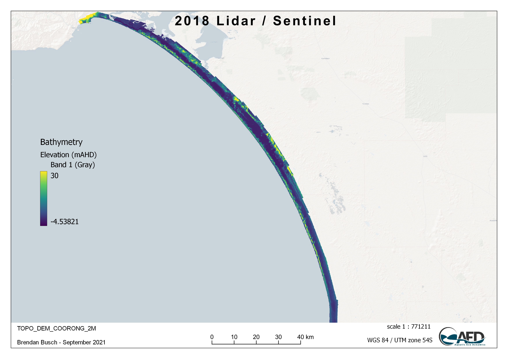
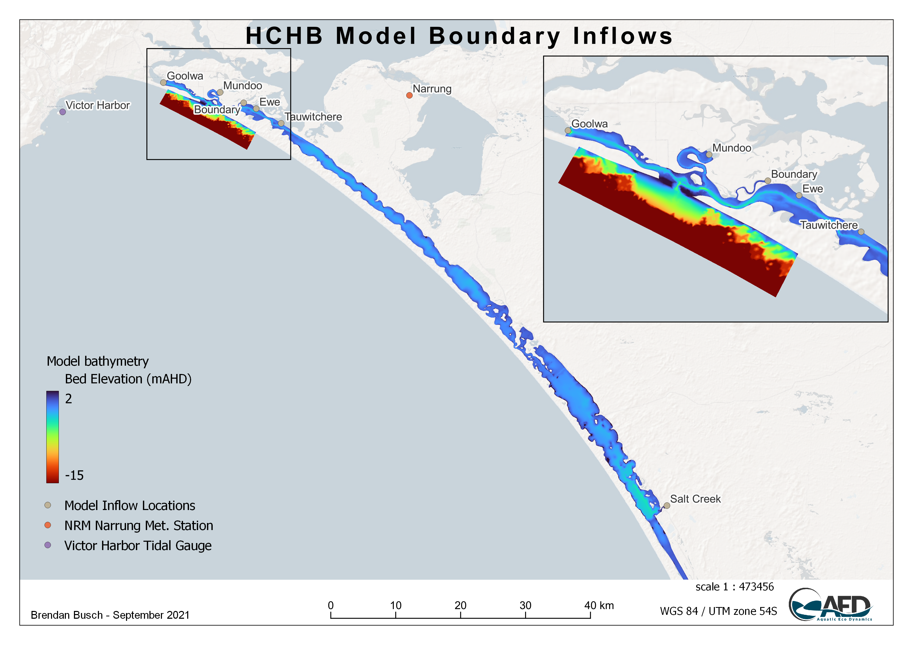
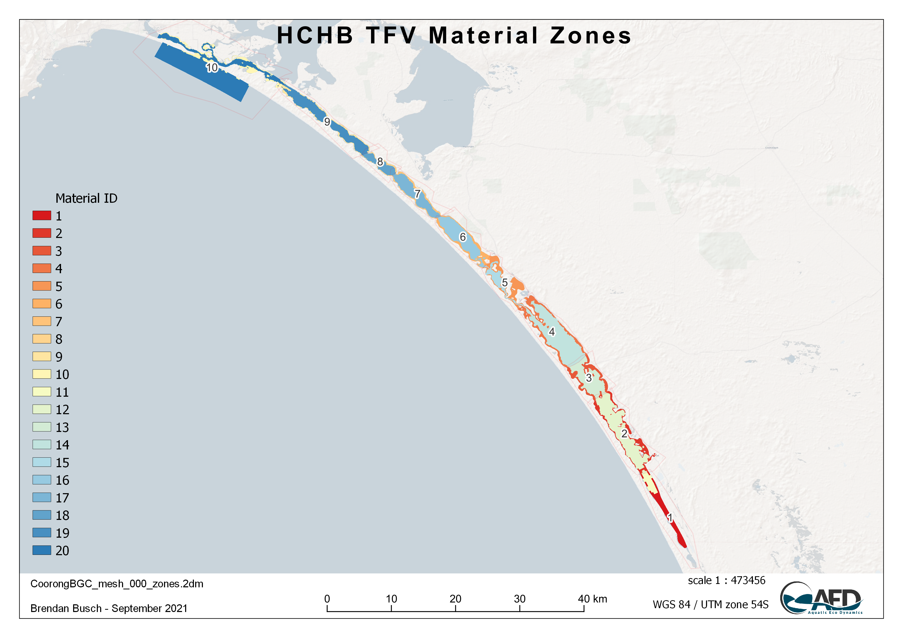
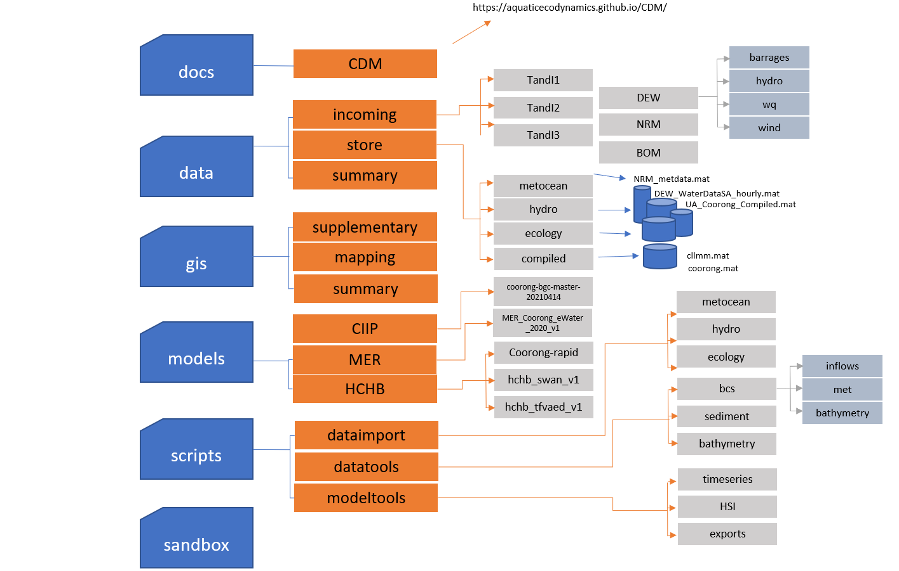
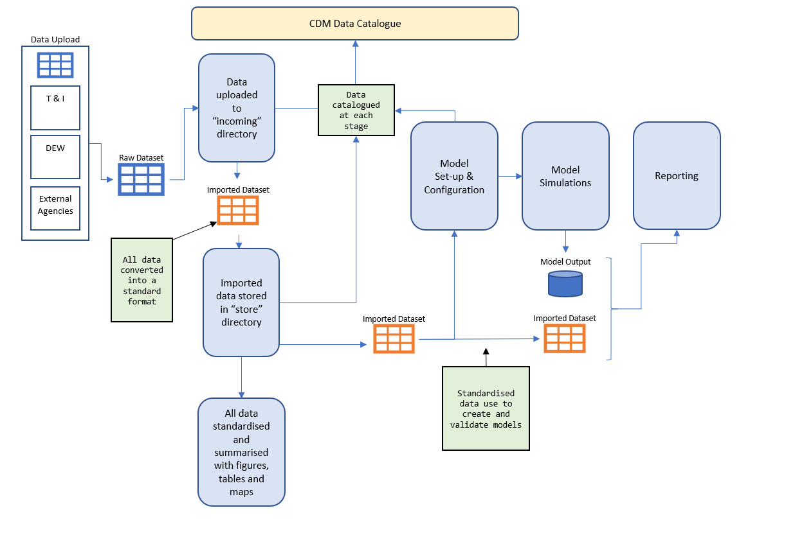
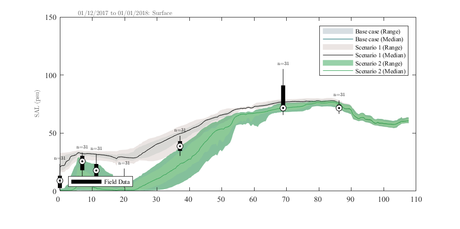

# The Coorong Dynamics Model

## Overview

The Coorong Dynamics Model (CDM) is not a single model, but a system of models that can be configured and applied in various ways for different purposes.

At its core, it consists of the hydrodynamic model TUFLOW-FV and the water quality model AED, which can be optionally linked with the SWAN wave model. Different model domain resolution can be selected and/or time-periods of interest simulated. Different levels of model complexity (i.e., biogeochemical or ecological components) can be engaged all within an environment with common input files and output analysis workflows. The flexibility allows a common approach to be used in different use-cases; for example, a long-term low-resolution simulation vs a high-resolution habitat restoration can share common model settings, parameters and parameterisations.

In general, the models are configured to resolve hydrodynamics and flushing, water temperature and salinity, and numerous water quality attributes including oxygen, nutrients (organic and inorganic), phytoplankton, macroalgae, and suspended sediment. The outputs from these modules are used to predict ecological attributes of interest, including seagrass, fish and benthic macro-invertebrates.

The CDM is also more the then individual models. The model links a large volume of data from historical surveys, real-time data streams and recent experimental work. Complex integration workflows are implemented to process data for model inputs (e.g., boundary conditions) or model assessment (e.g., calibration or validation).
The CDM is therefore a model-data ‘ecosystem’. Model and data provenance is therefore of high priority and all data and model products that are developed are under strict version control within a shared analytics platform to ensure traceability and transparency in model use and assumptions.

The following sections describe the model platforms, detail the CDM configuration, and outline the data-model integration and management framework.

## Model platform

### Hydrodynamics: TUFLOW-FV

[TUFLOW-FV](https://www.tuflow.com/products/tuflow-fv/) is a finite volume hydrodynamic model, developed by BMT Global Pty Ltd (BMTWBM, 2019). It has flexible-mesh and accounts for variations in water level, salinity, temperature, and density in response to tides, inflows and surface thermodynamics. The current version has various use-ability features including integration with QGIS and optimisiation for operation on desktop GPU resources.

The TUFLOW-FV has been used extensively in the region for hydrological assessments. Within the CDM two(three) different model domains are applied with different levels of spatial resolution, including both 2D and 3D implementations.

### Waves: SWAN

The Simulating WAves Nearshore ([SWAN](https://www.tudelft.nl/en/ceg/about-faculty/departments/hydraulic-engineering/sections/environmental-fluid-mechanics/research/swan/)) model is a numerical wave model used to obtain realistic estimates of surface wave parameters in coastal areas, lakes, and estuaries from given wind, bottom, and current conditions. The model is based on the wave action balance equation (or energy balance in the absence of currents) with sources and sinks. SWAN is a third-generation wave model with first-, second-, and third-generation options.

### Water quality and habitat: AED

The Aquatic EcoDynamics ([AED](http://aed.see.uwa.edu.au/research/models/aed/) ) water quality model is a community-driven library of modules and algorithms for simulation of "aquatic ecodynamics" - water quality, aquatic biogeochemistry, biotic habitat and aquatic ecosystem dynamics, developed by the AED research group of UWA (Hipsey et al., 2019). Each module aims to be based on state-of-the-art science sourced from a wide variety of scientific literature, making the library one of the most advanced available to aquatic ecosystem modellers.

## CDM setup and configuration

### Simulation domains

The CDM modelling domain spans from the Murray Mouth region to the south end of the Coorong, with a length of ~116 km and a total area of ~237 km^2^.

Two types of model mesh were developed to support different research purposes. The first is a fine-resolution mesh (26250 cells with mean cell size of ~1×10^4^ m^2^, Figure 2.1, left); this mesh was used for resolving the spatial heterogeneity of the water quality response, especially for the habitat predictions; the second is a relatively coarse resolution mesh (2202 cells with mean cell size of  ~1.3×10^5^ m^2^, Figure 2.1, right) for faster simulations of investigating water balance and other modelling experiments. The fine- and coarse-mesh models share the same boundary conditions and have been bench-marked with each other, and can be used in different stages of model development.


```{r cdm-pic1, echo = FALSE, out.width='100%', class = "text-image",fig.align='center', fig.cap = "Plan view of the Coorong Dynamics Model fine (left) and coarse (right) mesh."}

knitr::include_graphics("images/cdm/2_picture1.png")

```

```{r CDM-grid, echo=FALSE, message=FALSE, warning=FALSE}
library(knitr)
library(kableExtra)
library(readxl)
library(rmarkdown)
theSheet <- read_excel('tables/grids.xlsx', sheet = 1)
theSheet <- theSheet[theSheet$Table == "Data",]
theSheetGroups <- unique(theSheet$Group)


kbl(theSheet[,3:8], caption = "Grid Specifications", align = "l",) %>%
  pack_rows(theSheetGroups[1],
            min(which(theSheet$Group == theSheetGroups[1])),
            max(which(theSheet$Group == theSheetGroups[1])),
            background = '#ebebeb') %>%
  pack_rows(theSheetGroups[2],
            min(which(theSheet$Group == theSheetGroups[2])),
            max(which(theSheet$Group == theSheetGroups[2])),
            background = '#ebebeb') %>%
row_spec(0, background = "#14759e", bold = TRUE, color = "white") %>%
  kable_styling(full_width = F,font_size = 11) %>%
	column_spec(2, width_min = "7em") %>%
	column_spec(3, width_max = "19em") %>%
	column_spec(4, width_min = "10em") %>%
	column_spec(5, width_min = "5em") %>%
  column_spec(6, width_min = "10em") %>%
  scroll_box(width = "700px",
             fixed_thead = FALSE)
```
<br>


A range of bathymetry data is available and specified within the model(s).

- 2008 survey
- 2018 1m Lidar / Sentinel DEM
- 1999 - 2019 Murray Mouth Surveys

```{r cdm-2018DEM, echo = FALSE, out.width='100%', class = "text-image",fig.align='center', fig.cap = "2018 Coorong DEM"}



```


```{r cdm-pic2, echo = FALSE, out.width='100%', class = "text-image",fig.align='center', fig.cap = "Coorong bathymetry."}

knitr::include_graphics("images/cdm/HCHB 2dm.png")

```


### Boundary conditions

Regardless of the model domain / mesh option that is chosen, then CDM system manages several standard boundary conditions to allow the model to be forced by tidal, meteorological and inflow information, which is brought together from various data sources.

-	**Tidal conditions:** Set on the ocean side of the Murray Mouth, an open water level boundary is specified based on Barker Knoll / Victor Harbour tidal data, which are available at 10 minute resolution.
-	**Salk Creek inflow:** Inflow to the South Lagoon from the local catchment via Salt Creek was set based on available flow data from [water.data.sa.gov.au](water.data.sa.gov.au) (curated by the South Australian Department of Environment and Water). The nutrient boundary condition inputs are extrapolated based on field measurements at Salt Ck.
-	**Barrage flows:** Modelled inflow boundary conditions are based off historical daily-interval measurements of flow rate, temperature, salinity. The nutrient boundary condition inputs are extrapolated based on field measurements at Lake Alexandrina, close to the barrages.
-	**Meteorology:** Meteorological conditions were based on data from Narrung weather station nearby the Coorong (Figure **). The spatially -resolved Bureau of Meteorology Atmospheric High-Resolution Regional Reanalysis for Australia (BARRA) climate model is also available and can be been used, but we note this product is discontinued beyond 2019.


```{r cdm-pic4, echo = FALSE, out.width='100%', class = "text-image",fig.align='center', fig.cap = "Summary locations where relevant boundary condition data is collected and/or applied."}



```

For each of the flow boundaries, the model requires specification of inflow nutrient and salt concentrations, to resolve the external loading into the domain. This is depicted in Figure X. Details on the specific simulated variables that must be specified are summarised in further detail below.

```{r cdm-pic6, echo = FALSE, out.width='100%', class = "text-image",fig.align='center', fig.cap = "Summary of inflow files used for boundary specification and the required input constituents."}

knitr::include_graphics("images/cdm/HCHB_Inflows.png")

```


### Hydrodynamic settings

The key hydrodynamic settings controlling the water transportation and mixing in the TUFLOW-FV model include:

-	**Bottom drag**: For hydrodynamic simulations the bed boundary resistance is described using a $K_S$ bottom drag model, which assumes a log-law velocity profile and requires specification of a surface roughness length-scale. A background roughness length-scale of 0.018 was applied in the CDM (*update to reflect zones*);
-	**Horizontal momentum mixing**: the Smagorinsky scheme was applied for the horizontal momentum mixing modelling, with default Smagorinsky coefficient of 0.2;
-	**Horizontal scalar mixing**: the horizontal non-isotropic scalar diffusivity is calculated according to the Elder model, with Global Horizontal Scalar Diffusivity was set to 250 m^2^/s and the coefficient was set to 25;
-	**Tidal input**: a `WL` (water level) boundary condition was applied to the Murray Mouth tidal input;
-	**Inflow input**: a `Q` (nodestring flow) boundary condition was applied to the barrage flows, and a `QC` (cell inflow) boundary condition was applied to the Salt Ck inflow;
-	**Meteorology**:
    -	The background shortwave radiation extinction coefficients was set to 2.0, with feedback from the AED model of TSS concentration altering the extinction coefficient;
    -	Longwave radiation heat transfer model was using the net downward long wave radiation input, based on cloud cover;
    -	The wind stress was calculated using the Wu (1982) wind stress model;


### Water quality modules

The water quality model AED has been dynamically linked with TUFLOW-FV to simulate the mass balance and redistribution of carbon, nutrients and sediment, including partitioning between organic and inorganic forms and resolution of the relevant biotic components. This includes turbidity (including particle resuspension and sediment redistribution), chlorophyll a (chl-a), and filamentous algae (Ulva), plus habitat quality of Ruppia. Benthic and pelagic properties have been resolved.

A summary of simulated model variables is shown in Table 1. For detailed scientific documentation the reader is referred to the [AED Science Manual](https://aquaticecodynamics.github.io/aed-science/index.html).


```{r 2-varstable, echo=FALSE, message=FALSE, warning=FALSE}
library(knitr)
library(kableExtra)
library(readxl)
library(rmarkdown)
theSheet <- read_excel('tables/variable_summary.xlsx', sheet = 1)
theSheet <- theSheet[theSheet$Table == "Variable",]
theSheetGroups <- unique(theSheet$Group)


for(i in seq_along(theSheet$Symbol)){
  if(!is.na(theSheet$Symbol[i])==TRUE){
    theSheet$Symbol[i] <- paste0("$$",theSheet$Symbol[i],"$$")
  } else {
    theSheet$Symbol[i] <- " "
  }
}
for(i in seq_along(theSheet$Units)){
  if(!is.na(theSheet$Units[i])==TRUE){
    theSheet$Units[i] <- paste0("$$\\small{",theSheet$Units[i],"}$$")
  } else {
    theSheet$Units[i] <- NA
  }
}

kbl(theSheet[,3:NCOL(theSheet)], caption = "CDM simulated variable summary", align = "l",) %>%
  pack_rows(theSheetGroups[1],
            min(which(theSheet$Group == theSheetGroups[1])),
            max(which(theSheet$Group == theSheetGroups[1])),
            background = '#ebebeb') %>%
  pack_rows(theSheetGroups[2],
            min(which(theSheet$Group == theSheetGroups[2])),
            max(which(theSheet$Group == theSheetGroups[2])),
            background = '#ebebeb') %>%
  pack_rows(theSheetGroups[3],
					  min(which(theSheet$Group == theSheetGroups[3])),
					  max(which(theSheet$Group == theSheetGroups[3])),
					  background = '#ebebeb') %>%
  row_spec(0, background = "#14759e", bold = TRUE, color = "white") %>%
  kable_styling(full_width = F,font_size = 11) %>%
	column_spec(2, width_min = "7em") %>%
	column_spec(3, width_max = "19em") %>%
	column_spec(4, width_min = "10em") %>%
	column_spec(5, width_min = "5em") %>%
  scroll_box(width = "700px", height = "2000px",
             fixed_thead = FALSE)
```
<br>


The model allows for saptial variability in sediment properties, and this is captured through the definition of several material zones. This is explored in some detail in Chapter 3; though an example default material zone setup is shown below in Figure X.

```{r cdm-pic3, echo = FALSE, out.width='100%', class = "text-image",fig.align='center', fig.cap = "Different sediment zones used within the domain."}



```


## Coorong model-data ecosystem

The data requirements for the modelling are diverse and varied, spanning hydrological, meteorological, water and sediment quality (long-term monitoring, data from intensive campaigns and in situ sondes), plus ecological survey data. This creates an integration challenge for model setup, parameterisation and assessment (calibration and validation).

```{r cdm-pic5, echo = FALSE, out.width='100%', class = "text-image",fig.align='center', fig.cap = "Conceptual approach to model-data integration, accomodating data diversity and varied model requirements."}

knitr::include_graphics("images/cdm/2_picture2.png")

```

To enable the ongoing use and development of the CDM in this context, we have developed a model-data integration framework able to be used by DEW staff and project partners to co-ordinate the reference datasets - and standardise the data integration workflows. The below sections how the CDM is organised, the tools and approaches used for model provenance and managing data streams and model versions.


### CDM structure and organisation

The CDM has been designed is such a way to both facilitate the sharing of data and models across various agencies and researchers, as well as providing a formalised structure to store, catalogue and process complex and unique datasets. Comparmentalised data structures have been implemented to allow for tracking and version control of data and models as they are utilised and upgraded throughout the project.

Data cataloguing via the "CDM Data Catalogue" (described below in section 2.4.2) has been designed with cross-agency usage in mind. Integration with the HCHB MEK Catalogue is essential to allow for the tracking of data changes and upgrades throughout the project. The "Point of Truth", "MEK Catalogue Classification" and "Status Notes" catagories have been included in the CDM Data Catalogue to track a dataset's evolution throughout the project.

Github has been chosen to house the repository based on it's mature version control systems and cross platform program support to aid all stakeholders accessing the data and models (https://github.com/). In addition, there is a wide variety of documentation online to assist users new to github (https://guides.github.com/activities/hello-world/). 


-	**Repository folder structure (folder address and access)**

The folders structure follows the logic of data types and resources as shown in Figure 2.7. 

```{r cdm-pic7, echo = FALSE, out.width='100%', class = "text-image",fig.align='center', fig.cap = "CDM online data storage folder structure"}



```

The root directories are listed and described below: 

```{r A-folders, echo=FALSE, message=FALSE, warning=FALSE}
library(knitr)
library(kableExtra)
library(readxl)
library(rmarkdown)
theSheet <- read_excel('tables/folders.xlsx', sheet = 1)
theSheet <- theSheet[theSheet$Table == "data",]
theSheetGroups <- unique(theSheet$Group)


kbl(theSheet[,2:3], caption = "CDM Root Folder Descriptions", align = "l",) %>%

row_spec(0, background = "#14759e", bold = TRUE, color = "white") %>%
  kable_styling(full_width = T,font_size = 10) %>%
    scroll_box(fixed_thead = FALSE)
```

-	**Folder address and access**

The data and model files are stored in Github (https://github.com/AquaticEcoDynamics/CDM) and shared with HCHB research partners.

-	**High level workflows**


The raw data collected from previous works and current HCHB component outcomes are stored in the ```data/incoming``` folder and classified by their sources. These raw data are then post-processed using standard scripts (stored in the ```scripts``` folder) to convert the raw data into ‘standard’ data format (stored in the ```data/store``` folder) for model configuration, calibration/validation, and reporting (see 2.4.2 Data organisation for more details). The data-model workflow is shown in Figure 2.9. 

```{r cdm-pic8, echo = FALSE, out.width='100%', class = "text-image",fig.align='center', fig.cap = "CDM conceptual diagram showing the flow of data through the system"}



```


### Data repository and management

- **Data catalogue**

All data that is uploaded to the CDM github repository is logged in the CDM Data Catalogue. The catalogue (found in the data directory) is comprised of a main data sheet ("CDM Data Catalogue") as well as summary sheets for all processed data. Every raw datafile is logged with the following information:

```{r A-metadata, echo=FALSE, message=FALSE, warning=FALSE}
library(knitr)
library(kableExtra)
library(readxl)
library(rmarkdown)
theSheet <- read_excel('tables/CDM_Classes.xlsx', sheet = 1)
theSheet <- theSheet[theSheet$Table == "Data",]
theSheetGroups <- unique(theSheet$Group)


kbl(theSheet[,3:4], caption = "CDM Catalogue Metadata", align = "l",) %>%

row_spec(0, background = "#14759e", bold = TRUE, color = "white") %>%
  kable_styling(full_width = T,font_size = 10) %>%
    scroll_box(fixed_thead = FALSE)
```
<br>


A catalogue of all data under management of the CDM is provided in Appendix A.

- **Data organisation**

All raw data in initially uploaded into the ```data/incoming``` directory is filed under either it's Trials and Investigations (T & I) component, or the agency responsible for supplying the data.

Data is then imported into a common format via the scripts found in the ```scripts/dataimport``` directory and stored in the ```data/store``` directory. Although some imported data may contain extra fields, all imported data contains the following fields:

```{r CDM-datastore, echo=FALSE, message=FALSE, warning=FALSE}
library(knitr)
library(kableExtra)
library(readxl)
library(rmarkdown)
theSheet <- read_excel('tables/data_store_info.xlsx', sheet = 1)
theSheet <- theSheet[theSheet$Table == "Data",]
theSheetGroups <- unique(theSheet$Group)


kbl(theSheet[,3:4], caption = "CDM Stored Data", align = "l",) %>%
  pack_rows(theSheetGroups[1],
            min(which(theSheet$Group == theSheetGroups[1])),
            max(which(theSheet$Group == theSheetGroups[1])),
            background = '#ebebeb') %>%
  pack_rows(theSheetGroups[2],
            min(which(theSheet$Group == theSheetGroups[2])),
            max(which(theSheet$Group == theSheetGroups[2])),
            background = '#ebebeb') %>%
row_spec(0, background = "#14759e", bold = TRUE, color = "white") %>%
  kable_styling(full_width = T,font_size = 11) %>%
  scroll_box(fixed_thead = FALSE)
```
<br>

Once imported, the data is then summerised via a script in the ```scripts/dataimport/summary``` directory to create a standard set of plots and summary tables that can be found in the ```data/summary``` directory. ESRI shapefiles are also automatically produced and saved into the ```gis/summary``` directory to be used to create a stardarised site map of the data's sampling locations.

```{r cdm-pic10, echo = FALSE, out.width='100%', class = "text-image",fig.align='center', fig.cap = "Example GIS Map showing the sampling locations for the Water Data SA online data "}

knitr::include_graphics("images/cdm/DEW WaterDataSA Locations.png")

```

- **Data processing workflows**

The data processing scripts for the CDM are all contained within the ```scripts/``` directory, which has three subfodlers:

  + dataimport: All scripts that import data into the CDM, or process data into a common format
  + datatools: All scripts that use processed data to create additional datasets or model files
  + modeltools: All scripts that use processed data and model output to create additional datasets, images or analysis

Scripting has been predominately carried out utilising the Matlab programming language (https://au.mathworks.com/?s_tid=gn_logo), however there are scripts within the ```scripts``` directory using both R (https://www.r-project.org/about.html) and Python (https://www.python.org/). The user is free to add scripts in their preferred language, however the repository does rely heavily on Matlab for data storage.
  
Below is an example workflow outlining how a meteorological boundary condition file for the TFV model was created. Data is first downloaded and processed by two separate scripts in the ```dataimport``` directory. Then a series of matlab functions found in the ```datatools``` directory read in the processed data (found in the ```data/store``` directory) to create the require meteorological boundary condition file. Both Matlab and R scripts were used in this example.


```{r cdm-pic9, echo = FALSE, out.width='100%', class = "text-image",fig.align='center', fig.cap = "CDM work flow diagram for met data"}

knitr::include_graphics("images/cdm/2.4.1_Met_Workflow.png")

```


### Model repository and management


- **Model catalogue**

The model files are stored in the ‘models’ folder. As the model is developed based on early applications, and being updated with the HCHB progress, the model files are classified with project names. The ‘MER’ folder contains the model files being used for the ‘eWater’ project; the ‘CIIP’ folder contains the model files developed for the CIIP project, and the ‘HCHB’ folder contains the new CDM files being updated in the HCHB project. 

Models within each project directory are separated via both generation and model type. Within the HCHB model folder there are currently 3 distinct models.

+ coorong-rapid
+ hchb_swan_v1
+ hchb_tfvaed_v1

The ```coorong-rapid``` simulation folder and the ```hchb_tfvaed_v1``` simulation folder both contain TUFLOW-FV simulations, but are kept separate as they constitute different generations, using different grids, simulation periods and BC files.

The ```hchb_swan_v1``` is the first generation of the Coorong Swan Wave model being developed at UWA. 

Each model folder may contain multiple simulation scenarios, but they will all rely on the same model base configuration, with minor tweaks. Major changes to a models configuration will constitute a change in generation and will be stored in a separate folder. Note, models uploaded to the CDM repository will have been created by different agencies and researchers and will not maintain a consistent naming convention.


- **TUFLOW-FV Model organisation**
Each version of TUFLOW-FV models in the CIPP and HCHB project folders are organised with the following structure:

  + Bc_dbase (or BCs): boundary condition files, including tide and inflow boundary files; meteorological boundary files, and initial condition files;
  + External: AED model files linked with the TUFLOW-FV, and optionally the ‘GOTM’ vertical mixing model if the CDM is in 3D mode;
  + Model: TUFLOW-FV model structure files, including geometry and mesh files, and GIS files controlling the nodestrings and material zones;
  + Run: model control/configuration files;

The TUFLOW-FV model found in the MER project folder was created prior to the above structure being implemented and contains the following folder structure:

  + BCs: boundary condition files, including tide and inflow boundary files; meteorological boundary files, and initial condition files;
  + External: AED model files linked with the TUFLOW-FV, and optionally the ‘GOTM’ vertical mixing model if the CDM is in 3D mode;
  + GEO: TUFLOW-FV model structure files, including geometry and mesh files, and GIS files controlling the nodestrings and material zones;
  + INPUT: model control/configuration files;
  + Plotting: Directory to store model output images;
    
- **SWAN Wave Model organisation**

The SWAN Wave models found in the HCHB model directory all have the folowing format:

  + 01_geometry: Contains the bathymetry input files as well as a automatically generated image of the bathymetry and a matlab .mat file containing the bathymetry information;
  + 02_bc_dbase: Contains the processed wind input files
  + 03_simulation: Contains the INPUT control file required to run the simulation
  + 04_results: Model output directory
  
The script required to create and configure a new SWAN wave model can be found in the ```scripts/datatools/wave``` directory.


- **Model Processing**

The processing of any model output is predominately written and run in Matlab. Scripts that have been specifically developed for this project are contained within the ```scripts/modeltools``` directory. Scripts that have created figures 3.9, 3.11 and 5.2 (among others) can be found here. Examples include:

  + Ruppia HSI Processing & DelMaps;
  + Fish HSI Processing & Plotting;
  + Wave Model Plotting;
  + Nutrient Budgets;

In addition, the AED group also maintains another publicly available github repository called aed_matlab_modeltools (https://github.com/AquaticEcoDynamics/aed_matlab_modeltools) which contains a wide variety of matlab scripts and functions that are frequently used to process and visualise model output. Plottfv_polygon and plottfv_transect are two such functions that will be frequently used. Tables 7.3 and 7.6 in Appendix B are examples of output generated via the plottfv_polygon function found in the aed_matlab_modeltools repository. This plotting function uses data and gis files stored in the CDM repository, in addition to model output to create timeseries plots of the model (averaged within a polygon region) compared against field data. The plotting function will also automatically calculate a range of error statistics based on model output and field measured data.

```{r cdm-plottfvpolygon, echo = FALSE, out.width='100%', class = "text-image",fig.align='center', fig.cap = "Example output from plottfv_polygon with error matrix"}

knitr::include_graphics("images/cdm/0006_A4261209.png")

```

Additionally, plottfv_transect can also be found in the aed_matlab_modeltools repository. Unlike plottfv_polygon, plottfv_transect plots model data extracted along a transect line during a specified plotting period, and compares against the range of field data found within that period.

```{r cdm-plottfvtransect, echo = FALSE, out.width='100%', class = "text-image",fig.align='center', fig.cap = "Example output from plottfv_transect with distance from Goolwa Barrage (km) along the x-axis"}



```


Information on how to clone a publicly available github repository can be found here (https://docs.github.com/en/github/creating-cloning-and-archiving-repositories/cloning-a-repository-from-github/cloning-a-repository).


