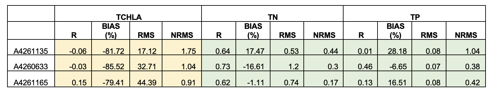

# Integrated assessment of the CDM

## Overview

The previous chapters have detailed the nature of the model setup, additions and areas of development. In this section, the model is assessed in its entirety, using the fully-coupled model, against the complete data-set. A range of metrics are used for a large number of predicted variable and different sites.

## Integrated simulations

**Generation I** model

**Generation II** model


### Setup

### Simulation periods

## Model assessment approach

### Summary of validation data

The field observation data available for the model validation and assessment include historical data collected prior the HCHB project, and data become newly available with the HCHB progress. All the validation data were managed as detailed in chapter 2.4 “Coorong model-data ecosystem” and converted into AED format that were ready to compare with the CDM model outputs. A site map of field observation sites available or long-term model assessment at the time of the report (September 2021) is shown in the figure below. This site map as well as the CDM validation results are being updated with the HCHB progress. 

```{r ass-pic2, echo = FALSE, out.width='100%', class = "text-image", fig.cap = "Water Data SA field data locations"}

knitr::include_graphics("images/assessment/DEW WaterDataSA Locations.png")

```


### Assessment metrics

The modelling results were statistically compared against historical data collected within the Coorong (where available), with aims of evaluating the performance of the model, and identifying areas for further improvement and ongoing calibration effort. The model performance in predicting a range of relevant variables including salinity, temperature, nitrogen, phosphorus and total chlorophyll-a are assessed with a set of statistical matrix, and the calculations of statistical matrix was performed for each observation site where the number of field observations was >10 in the assessment period. 
The statistical matrix considered in this report consist of:

  +	r: regression coefficient, Varies between -1 and 1, with a score of 1 indicating the model varies perfectly with the observations and a negative score indicating the model varies inversely with the observations. A consistent bias may be present even when high score of r is obtained. 
  +	BIAS: bias of average prediction to the average observation during the assessing period. This method presents a magnitude for the discrepancy between the model results and the observational data. 
  +	MAE: mean absolute error: Similar to RMSE except absolute value is used. This reduces the bias towards large events. Values near zero indicate good model skill.
  +	RMS: root mean squared error, Measures the mean magnitude, but not direction, of the difference between model data and observations, and hence can be used to measure bias. Values near zero are desirable. This method is not affected by cancellation of negative and positive errors, but squaring the data may cause bias towards large events. 
  +	nash: a matrix of modelling efficiency, measures the mean magnitude of the difference between model data and observations. This method compares the performance of the model to that only uses the mean of the observed data. A value of 1 would indicate a perfect model, while a value of zero indicates performance similar to simply using the mean of observed data.


## Validation focus period: 2020-2021

To Be Completed

## Long-term simulation performance

With the *Generation I* compiled boundary conditions (tide, barrages, Salt Ck inflows) and BARRA weather forcing, the performance of the model in reproducing the long-term nutrient pools has been examined.
<!--
Example model outcomes against the field observations of TN and TP are shown in Figure 10 & 11, and a summary of model performance is provided in Table 1. In summary, the model predicted well the temporal and spatial variations in TN and TP concentrations. However, the model has been shown to poorly predict the phytoplankton concentration in the South Coorong. A reason for this may be due to the current CDM being in in 2D mode which assumes the water column is fully mixed; whilst the phytoplankton samples were taken in the surface water where the phytoplankton can accumulate. The release of bioavailable nutrients is also subject to change once the sediment modelling is completed and the accuracy resolving bioavailable nutrients is still weak. A further examination of phytoplankton and nutrient data is underway, and a 3D Coorong model is under development to capture the vertical distribution of phytoplankton biomass.
-->
A summary of model performance is provided in Table 1. Full validation plots against the field observations of salinity, temperature, phytoplankton, and nitrogen/phosphorus species are included in Appendix B1. In summary, the model predicted well the temporal and spatial variations in TN and TP concentrations. However, the model has been shown to poorly predict the phytoplankton concentration in the South Coorong. A reason for this may be due to the current CDM being in in 2D mode which assumes the water column is fully mixed; whilst the phytoplankton samples were taken in the surface water where the phytoplankton can accumulate. The release of bioavailable nutrients is also subject to change once the sediment modelling is completed and the accuracy resolving bioavailable nutrients is still weak. A further examination of phytoplankton and nutrient data is underway (see CDM sensitivity assessment to internal loading in appendix B2), and a 3D Coorong model is under development to capture the vertical distribution of phytoplankton biomass.  

```{r ass-pic0, echo = FALSE, out.width='100%', class = "text-image", fig.cap = "Performance summary of long-term CDM in TCHLA, TN and TP concentrations."}



```


## Nutrient budget assessment

A methodology for nutrient flux and budget analysis has been developed. For the nutrient budget analysis, all of the nutrient pools (dissolved and particulate carbon, nitrogen and phosphorus, macroalgae and Ruppia) can be summarized for different regions of the estuary (north, south etc.). As an example of this method, the results from a period of three years (July 2017 to July 2020) were summarized for each region (Figure 5). Fluxes into and out of a region are shown. For the nutrient flux analysis we have developed script for calculating the salt and nutrient fluxes through selected node-string. This method is e ideal for comparing hydrology and water quality response in different operational scenarios.


```{r ass-pic1, echo = FALSE, out.width='100%', class = "text-image", fig.cap = "South Lagoon region nutrient input/output loads for carbon, nitrogen and phosphorus for the e-water simulation July 2017 to July 2020. Negative fluxes are material leaving the region to Upper Salt Creek region. There is a high build-up of macroalgae predicted after the winter release and nutrient pulse."}

knitr::include_graphics("images/assessment/5_nutrient_budget.png")

```

## Habitat condition assessment

## Summary
