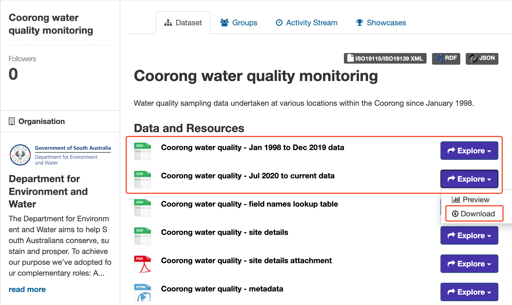

# Coorong Water Quality Data from DataSA

This repository contains scripts for importing water quality data from DataSA into MATLAB.

## Prerequisites

- MATLAB
- Python
- Access to data.sa.gov.au

## Data Collection

1. Navigate to [data.sa.gov.au](https://data.sa.gov.au/data/dataset/coorong-water-quality-monitoring)
   
2. Data Selection:
   - Select the "Coorong Water Quality Monitoring" dataset.
   - Click "Explore", then click "Download".
   

3. Save the downloaded data to:
   ```
   CDM/data/incoming/DEW/wq/WQ_HCHB_2024/Coorong Water Quality Jan 1998 to Dec 2019.csv
   CDM/data/incoming/DEW/wq/WQ_HCHB_2024/Coorong Water Quality Jul 2020.csv
   ```

## Data Processing

### Import Raw Data into .mat File
1. Run the Python script (remember to navigate to the respective directory before running the code):
   ```
   CDM/scripts/dataimport/ecology/DataSA_WQ/import_DataSA.py
   ```

   This script will:
   - Process and convert raw data from DataSA into a MATLAB .mat file
   - Save the output as:
     ```
     CDM/data/store/ecology/wq_hchb_2024.mat
     ```

2. Run the Python script (remember to navigate to the respective directory before running the code):
   ```
   CDM/scripts/dataimport/ecology/DataSA_WQ/import_DataSA_agency.py
   ```

   This script will:
   - Process and convert raw data from DataSA into two separate MATLAB .mat files for ALS and AWQC
   - Save the output as:
     ```
     CDM/data/store/ecology/ALS_wq_hchb_2024.mat
     CDM/data/store/ecology/AWQC_wq_hchb_2024.mat
     ```

> [!IMPORTANT]
> Adjustment made to downloaded data before converted into tfv_unit to match up with historical data:
> - Ammonia_as_N_mg_L / 2000
> - Nitrate_Nitrite_as_N_mg_L / 2000
> - Silica_Reactive_mg_L / 3.15
> - Dissolved_Organic_Carbon_mg_L * 2.4
> - Total_Organic_Carbon_mg_L * 2.9
> - Nitrogen_Total_as_N_mg_L * 2
>
> Then, variables are renamed to match TFV standards, and converted to TFV units using the conversion factors listed in the table `CDM/scripts/dataimport/ecology/DataSA_WQ/Var_Conv.csv`.

3. Run the Python script (remember to navigate to the respective directory before running the code): 
   ```
   CDM/scripts/dataimport/ecology/DataSA_WQ/import_DataSA_1998_2019.py
   ```

   This script will:
   - Process and convert raw data from DataSA into a MATLAB .mat file
   - Save the output as:
     ```
     CDM/data/store/ecology/wq_hchb_1998_2019.mat
     ```

   > [!NOTE]
   > Variables are renamed to match TFV standards, and converted to TFV units using the conversion factors listed in the table `CDM/scripts/dataimport/ecology/DataSA_WQ/Var_Conv_1998_2019.csv`.