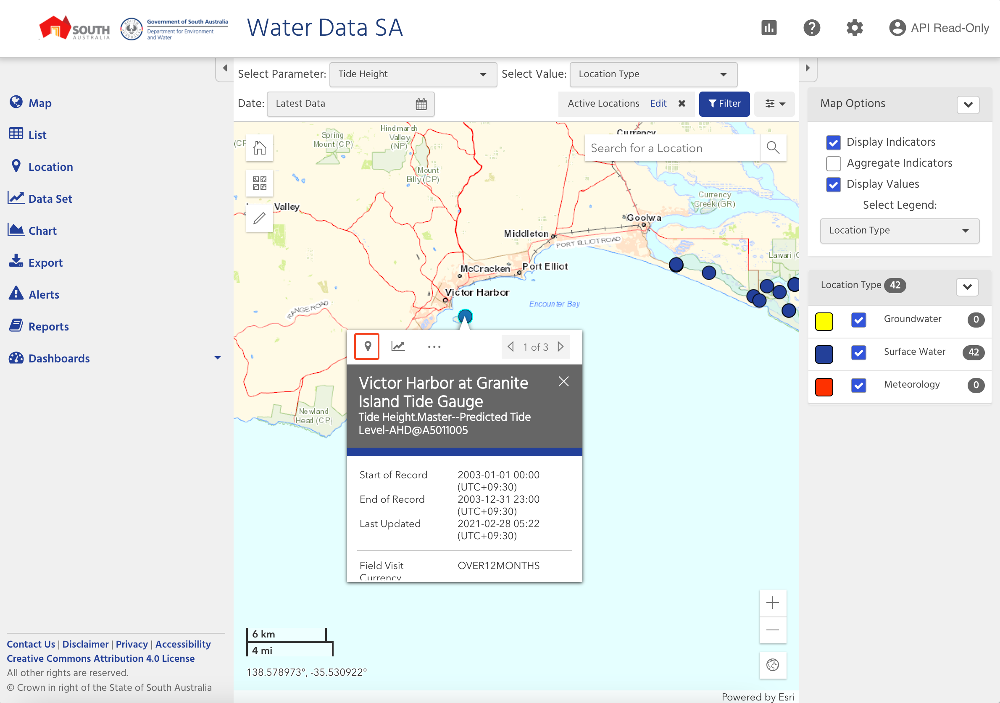
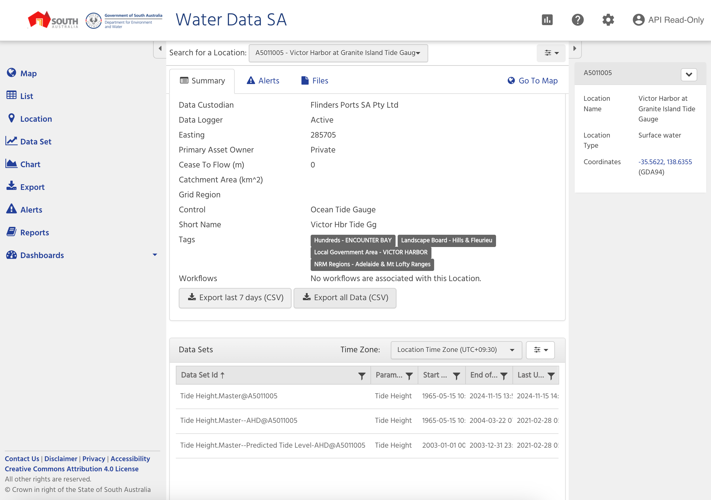

# Coorong Tidal Data Update Process

This repository contains scripts and instructions for updating tidal data from the DEW Tidal Gauge for the Coorong project.

## Prerequisites

- MATLAB
- Python
- Access to water.data.sa.gov.au

## Data Collection

1. Navigate to [water.data.sa.gov.au](https://water.data.sa.gov.au/)

2. Login using your credentials:
   - Username: <your username>
   - Password: <your password>

3. Data Selection:
   - In the Select Parameter dropdown, select "Tide Height"
   - Zoom in to locate the "Victor Harbor at Granite Island Tide Gauge"
   - Click on the location symbol
   
   - On the summary page, scroll to the bottom, click "Export all Data (CSV)"
   
   
4. Save the downloaded data (Tide Height.Master@A5011005) to:
   ```
   CDM/data/incoming/DEW/hydrology/compile/VH_Tide_2024.csv
   ```

## Data Processing
### Python Processing
1. Run the Python script in python:
   ```
   CDM/scripts/dataimport/hydro/Tidal/process_tidal_prediction_Claire.py
   ```

   This script will:
   - Fill in missing data using a linear interpolation method using the predicted tide levels (CDM/data/incoming/DEW/hydrology/compiled/Tide_Level_Prediction_Jan2023-Jun2024.csv) from Claire's model.
   - Generate `VH_Tide_2024_filled.csv` into:
     ```
     CDM/data/incoming/DEW/hydrology/compiled/
     ```

### MATLAB Processing
1. Run the MATLAB script in matlab:
   ```
   CDM/scripts/dataimport/hydro/Tidal/import_tidal_data_VH_WDSA.m
   ```

2. The script will generate `dew_tide_VH_2024.mat` into:
   ```
   CDM/data/store/hydro/tidal/VH
   ```