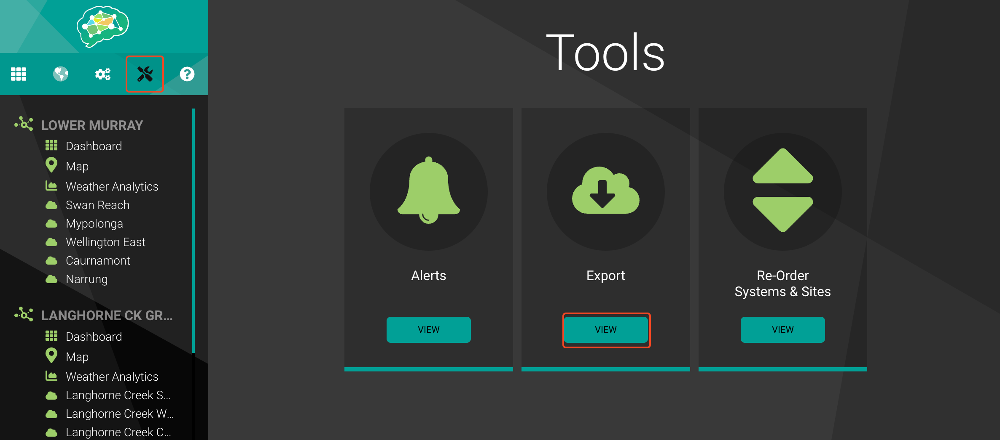
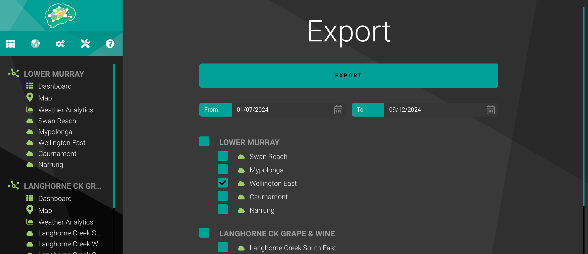

# Coorong Meteorological Data Update Process

This repository contains scripts and instructions for updating meteorological data from the Narrung Automatic Weather Station for the Coorong project.

## Prerequisites

- Python 3.x
- MATLAB
- Access to water.data.sa.gov.au

## Data Collection

### Water Data SA

1. Navigate to [water.data.sa.gov.au](https://water.data.sa.gov.au/)

2. Login using your credentials:
   - Username: <your username>
   - Password: <your password>

3. Data Selection:
   - In the Location Type tab, select only "Meteorology"
   - Zoom in to locate the "Narrung Automatic Weather Station"
   - Click on the location symbol
   
   - On the summary page, scroll to the bottom, click "Export all Data (CSV)"
   

4. Save the downloaded data to:
   ```
   CDM/scripts/dataimport/metocean/NRM_Import_py/narrung_met_raw_data
   ```

### GreenBrain portal

> [!NOTE]
> GreenBrain API access only allow to download data for the last 3 months. Thus, we need to download data manually from the portal.

1. Navigate to [GreenBrain portal](https://greenbrain.net.au/)

2. Login using your credentials:
   - Username: <your username>
   - Password: <your password>

3. Data Selection:
   - Navigate to Tools -> Export
   
   - Tick the sites you want to download data. In this case, we are downloading data for Wellington East.
   - Select date range (download half year data at a time to prevent system overload).
   - Click "EXPORT".
   
   - Repeat for other periods.

4. Save the downloaded data to:
   ```
   CDM/scripts/dataimport/metocean/NRM_API_py/GreenBrain_WellingtonEast_2023
   CDM/scripts/dataimport/metocean/NRM_API_py/GreenBrain_WellingtonEast_2024
   ```

## Data Processing

### Python Processing
1. Run the processing script (remember to navigate to the respective directory before running the code):
   ```
   CDM/scripts/dataimport/metocean/NRM_API_py/import_greenbrain_data.py
   ```

   This script will:
   - Process the raw data downloaded from GreenBrain portal and save it in the required format to:
     ```
     CDM/scripts/dataimport/metocean/NRM_API_py/
     ```

3. Run the processing script (remember to navigate to the respective directory before running the code):
   ```
   CDM/scripts/dataimport/metocean/NRM_Import_py/process_narrung_met_data.py
   ```

   This script will:
   - Process the raw data, fill up the unavailable variables with the data from Wellington East, do interpolation, and save it in the required format to:
     ```
     CDM/data/incoming/NRM/Narrung
     ```

> [!NOTE]
> Solar Radiation data from 2022-11-07 01:30:00 onwards is estimated from the median solar radiation values for each datetime from historical data.

### MATLAB Processing
1. Run the MATLAB script in matlab:
   ```
   CDM/scripts/dataimport/metocean/NRM_Import_M/process_all_met_sites_new.m
   ```

> [!NOTE]
> - The script is currently adapted for MacOS path structure.
> - On line 32, the loop starts from 4 (`for i = 4:length(dirlist)`) to skip `.DS_store`.
> - For other operating systems, modify to start from 3.

2. The script will generate `NRM_metdata.mat` into:
   ```
   CDM/data/store/metocean
   ```
