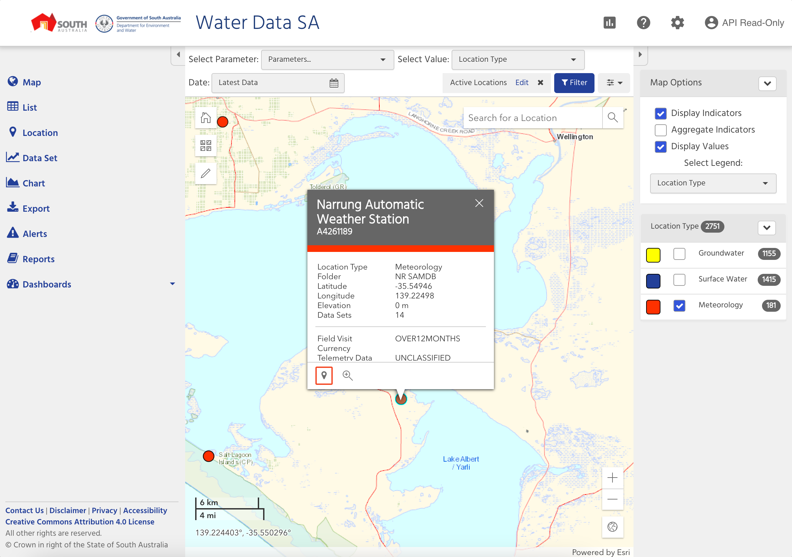
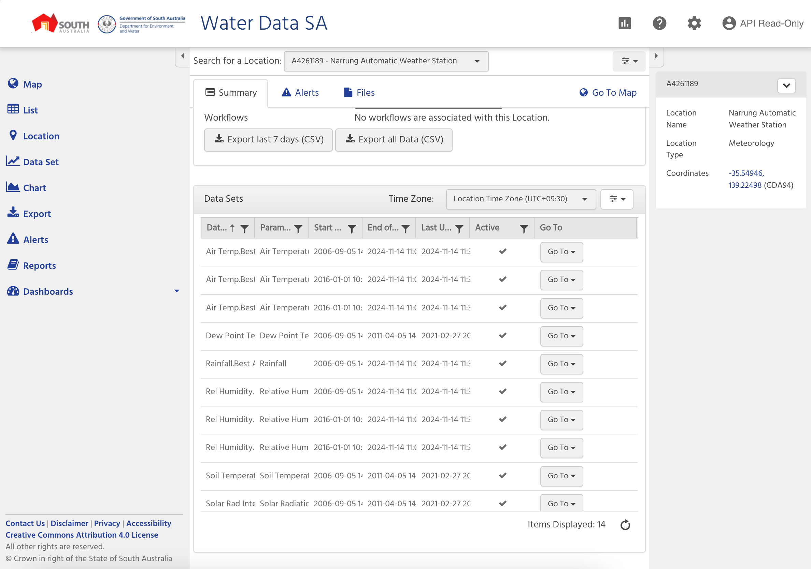

# Coorong Meteorological Data Update Process

This repository contains scripts and instructions for updating meteorological data from the Narrung Automatic Weather Station for the Coorong project.

## Prerequisites

- Python 3.x
- MATLAB
- Access to water.data.sa.gov.au

## Data Collection

1. Navigate to [water.data.sa.gov.au](https://water.data.sa.gov.au/)

2. Login using your credentials:
   - Username: <your username>
   - Password: <your password>

3. Data Selection:
   - In the Location Type tab, select only "Meteorology"
   - Zoom in to locate the "Narrung Automatic Weather Station"
   - Click on the location symbol
   
   - On the summary page, scroll to the bottom, click "Export all Data (CSV)"
   

4. Save the downloaded data to:
   ```
   CDM/scripts/dataimport/metocean/NRM_Import_py/narrung_met_raw_data
   ```

## Data Processing

### Python Processing
1. Navigate to the Python processing directory:
   ```bash
   cd CDM/scripts/dataimport/metocean/NRM_Import_py
   ```

2. Run the processing script:
   ```bash
   python3 process_narrung_met_data.py
   ```
   This will process the raw data and save it in the required format to:
   ```
   CDM/data/incoming/NRM/Narrung
   ```

### MATLAB Processing
1. Run the MATLAB script in matlab:
   ```
   CDM/scripts/dataimport/metocean/NRM_Import_M/process_all_met_sites_new.m
   ```

   > [!NOTE]
   > - The script is currently adapted for MacOS path structure
   > - On line 32, the loop starts from 4 (`for i = 4:length(dirlist)`) to skip `.DS_store`
   > - For other operating systems, modify to start from 3

2. The script will generate `NRM_metdata.mat` into:
   ```
   CDM/data/store/metocean
   ```