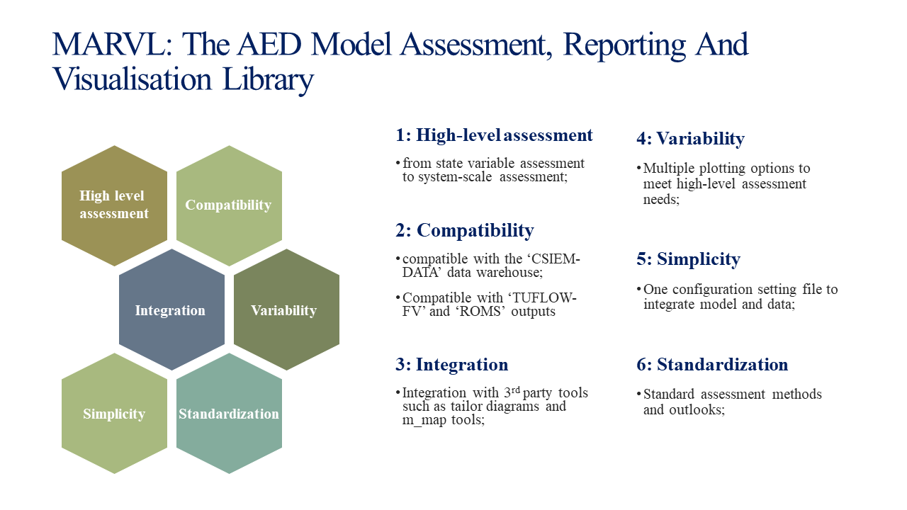

[](https://www.repostatus.org/#wip)

# CDM-marvl



## Overview
CDM-marvl (Coorong Dynamics Model - Model Assessment, Reporting and Visualisation Library) is an integrated software package for visualizing the model outputs and observational datasets, and evaluating the model performance. CDM-marvl uses the `aed-marvl` as the core functions for plotting and evaluating model outputs. For the key features and modules of `aed-marvl` the readers are refered to https://github.com/AquaticEcoDynamics/aed-marvl 

## Repository Organisation
- `aed-marvl`: core plotting and model performance evaluating scripts and libraries for MARVL; 
- `config`: site-specific configurations for CDM;
- `gis`: shape files for defining polygons, transect, and sites for plotting;
- `data`: place-holder for storing observed/modelled datasets;
- `scripting`: place-holder for storing other scripts relating to model assessment and reporting;

## Execution Instruction
- Colone the `CDM-marvl` repository onto local computer
- Open Matlab (version 2020 or later versions), go to the local `CDM-marvl` folder and add the paths to tools/libraries by entering
 ```
 addpath(genpath('./'))
 ```
- Go to `config` folder, edit the `MARVL.m` to configure the plots (use the 'MARVL.m' under example folder as templates);
- Under the `config` path, start the plotting by entering
 ```
  run_AEDmarvl('./MARVL.m','matlab')
 ```
   or if you wish to use YAML style configuration
 ```
   run_AEDmarvl('./MARVL.m','yaml')
 ```

## MARVL Configuration
- The MARVL user instruction documentation is available in `aed-marvl` repository (under docs/MARVL user instruction.docx).
 
